---
context_room:
  id: research.verification-engine.architecture
  depends_on:
    - research.verification-engine.assurance-model
---

# Architecture options and recommended system

## Summary

The recommended first architecture is a pragmatic hybrid with one canonical
transactional store, an immutable evidence vault, and disposable read
projections. A relational database owns claim identity, versions, workflows,
reviews, policies, certificates, rights, and audit events. Content-addressed
object storage owns retained evidence bytes. Lexical, vector, graph, and RDF
views are derived and can be rebuilt; none can grant assurance.

This recommendation deliberately rejects three premature commitments: a native
graph database as the first system of record, full event sourcing as the only
representation of state, and a multi-database architecture before measured
queries require it. It preserves a path to each without paying its consistency
and operational cost during the falsification phase.

## Defines

The architecture alternatives, recommendation, component boundaries, canonical
data responsibilities, end-to-end workflow, trust boundaries, API principles,
failure semantics, Parallax boundary, and promotion criteria.

## Does not define

An approved implementation, cloud vendor, schema migration, exact endpoint
syntax, production capacity, legal basis, or user-interface design.

## Decision drivers

The architecture must make these properties easier to prove than to bypass:

1. one exact claim and one exact evidence version are evaluated at a time;
2. no public outcome can exceed the applicable claim-family ceiling;
3. certificate visibility, lifecycle state, audit event, and publication request
   become visible atomically after signing has succeeded outside the database
   transaction;
4. artifacts and deterministic transformations remain identifiable after a
   source, model, or index changes;
5. valid time and system-record time remain distinct;
6. derived search or graph state may be stale without corrupting canonical
   truth;
7. every asynchronous operation is idempotent, observable, retryable, and able
   to end in explicit abstention or failure;
8. private evidence, public summaries, restricted audit data, and deletion
   obligations are separate concerns;
9. Parallax and other clients depend on a versioned, tenant-scoped contract
   rather than the engine's internal schema; and
10. the first vertical slice can be run by a small team and removed if the
    evidence does not justify a larger system.

## Alternatives compared

Scores below are architectural judgments against this project's stated needs,
not benchmark measurements. `Strong`, `mixed`, and `weak` mean relative fit for
the first falsifiable product.

| Criterion | A. Relational core only | B. Native property-graph core | C. Event-sourced core | D. Relational core + vault + projections |
| --- | --- | --- | --- | --- |
| Transactional workflow and constraints | Strong | Strong within one graph transaction; ecosystem-specific constraints vary | Mixed: command rules can be strong, but correct projections and event evolution add work | Strong |
| Bitemporal current and historical queries | Strong with explicit temporal tables | Mixed; natural relationships but application conventions still required | Strong historical narrative; weak current reads without projections | Strong |
| Multi-hop dependency and origin traversal | Mixed for deep variable paths | Strong | Mixed; requires a graph projection | Strong once a derived graph is justified |
| Exact evidence-byte retention | Weak if large binaries live in rows | Weak if binaries live in the graph | Weak unless paired with object storage | Strong through a content-addressed vault |
| Audit and replay | Strong for recorded state and domain events | Strong for state; audit needs an explicit event model | Strongest when every transition is fully deterministic and event schemas remain usable | Strong enough through transactional events plus replay packages |
| Search and embeddings | Available, but can overload the authority store | Available in several products, but couples search lifecycle to graph ownership | Requires projections | Derived, replaceable, and isolated from authority |
| Operational simplicity | Strongest | Mixed: an additional specialist datastore and operating model | Weakest initially: event store, projections, rebuilds, schema evolution, and replay tooling | Mixed but bounded: database, object store, workers; optional projections later |
| Portability and open export | Strong | Mixed; Cypher/property-graph portability is improving but product details remain | Mixed; the event contract becomes the hardest compatibility surface | Strong through neutral JSON/JSON-LD/PROV exports |
| Failure containment | Mixed if search and ingestion share the database | Mixed if graph writes and workflow share the same core | Mixed: corrupt events have wide impact | Strong: untrusted ingestion and stale projections cannot directly publish |
| First-slice fit | Viable but loses durable artifact separation and future graph freedom | Premature unless traversal is already the dominant measured workload | Premature unless event replay is the product's primary proof | Best balance |

### A. Relational core only

One PostgreSQL database can express strong keys, foreign keys, transactions,
row security, JSON, and full-text search. PostgreSQL 18 also adds temporal
`WITHOUT OVERLAPS` and `PERIOD` constraints, useful for non-overlapping validity
windows
([PostgreSQL 18 release notes](https://www.postgresql.org/docs/18/release-18.html)).
Its built-in full-text search can support an initial corpus
([PostgreSQL full-text search](https://www.postgresql.org/docs/18/textsearch.html)).

This is the smallest viable option. It becomes the wrong option if it stores
large evidence blobs, vector/search ranking, graph analysis, and public/private
views as equally authoritative rows. Those workloads have different retention,
rebuild, access, and failure semantics.

### B. Native property-graph core

A graph database is attractive because claims, evidence uses, derivations,
origins, objections, and dependencies are graph-shaped. Mature products provide
ACID transactions and graph-oriented traversal; for example, Neo4j documents
ACID transaction support and a write-ahead transaction log
([Neo4j transaction behavior](https://neo4j.com/docs/operations-manual/current/database-internals/)).

Graph shape alone is not proof that the graph should own workflow truth. The
first slice is dominated by uniqueness, review queues, policy checks,
bitemporal validity, rights, access, and atomic issuance. A native graph should
be promoted only after representative workloads show that derived projections
cannot meet critical traversal latency or maintenance requirements.

### C. Event-sourced core

In full event sourcing, the event stream is the canonical state and every read
model is rebuilt from it. This is compelling for audit history, but it makes
event compatibility, deterministic reducers, snapshots, projection lag, and
replay recovery part of the trusted computing base. An audit log is necessary;
making it the only state representation is not.

This option should be reconsidered only if reconstructing state at any prior
policy version becomes a dominant contractual requirement and a prototype
proves full replay, recovery time, event migration, and operator comprehension.

### D. Relational core, evidence vault, and derived projections

This option keeps one authority while separating data by lifecycle:

- normalized relational records and transactionally appended domain events are
  canonical;
- exact evidence artifacts are immutable objects addressed by digest;
- an outbox feeds search, graph, notifications, and monitoring;
- search indexes, embeddings, graph views, and RDF are derived;
- signed certificates are immutable snapshots with later status events; and
- an optional external transparency service records certificate statements,
  not the evidence corpus itself.

It introduces more components than option A, but each boundary corresponds to
a materially different trust or retention contract. It does not require an
independently operated graph or event database at the start.

## Recommended trust architecture

This diagram explains how untrusted material can become a certificate without
any retrieval or model component obtaining publication authority.

```mermaid
flowchart LR
    submitter["Submitter or source"] --> broker["Fetch broker"]
    broker --> sandbox["Isolated parsers and media tools"]
    sandbox --> quarantine["Quarantine and artifact manifest"]
    quarantine --> vault["Content-addressed evidence vault"]
    quarantine --> intake["Canonical intake record"]

    intake --> compiler["Claim compiler"]
    compiler --> workflow["Assurance workflow"]
    vault --> workflow
    search["Derived search and graph projections"] --> workflow
    models["Versioned AI tools"] -->|proposals only| workflow
    reviewers["Independent reviewers and experts"] --> workflow
    policy["Versioned method and publication policies"] --> kernel["Small assurance kernel"]
    workflow --> kernel
    kernel -->|any typed terminal decision| prepare["Prepare terminal-object DB transaction"]
    prepare --> intent["Non-visible issuance intent and payload digest"]
    intent -->|outside DB transaction| signer["KMS or HSM signer"]
    signer --> finalize["Verify and finalize DB transaction"]
    finalize --> core
    finalize -->|outbox; outside DB transaction| statusSigner["Finalization receipt signer"]
    statusSigner --> activate["Recheck and activate DB transaction"]
    activate --> core["Canonical relational core"]
    activate --> certificate["Externally active signed certificate snapshot"]
    certificate --> transparency["Optional external transparency receipt"]
    certificate --> clients["Parallax and other consumers"]

    core --> outbox["Transactional outbox"]
    outbox --> search
    outbox --> monitor["Freshness, correction, and dependency monitors"]
    monitor -->|never flips a verdict| workflow
```

The textual trust rule is stricter than the diagram: the kernel reads only
canonical, validated records and declared policy versions. It never executes a
document, follows a model instruction, or trusts a search rank as evidence.

## Components and authority

| Component | Owns | Must not own |
| --- | --- | --- |
| Submission gateway | Authentication, rate limit, submission receipt, idempotency key | Source trust or claim status |
| Fetch broker | URL policy, DNS/IP validation, redirect checks, byte limits, retrieval receipt | Parsing, model access, internal-network access |
| Ingestion sandbox | File identification, safe extraction, OCR/transcription proposals, malware and parser telemetry | Credentials, canonical writes, publication |
| Evidence vault | Immutable retained bytes or encrypted restricted objects, digest, storage class | Meaning, truth, public visibility decision |
| Claim compiler | Proposed structured claim, semantic-difference checks, clarification tasks | Final meaning approval for material cases |
| Search orchestrator | Recorded support and refutation searches, candidates, coverage ledger | Evidence admissibility or final outcome |
| Origin-lineage service | Publication, dataset, observation, funding, transformation and syndication relationships | A scalar source-reliability score |
| Workflow engine | State machine, task assignment, deadlines, retries, escalations | Bypassing method-profile gates |
| AI adapters | Versioned proposal calls with frozen inputs and outputs | Direct certificate transition or tool authorization |
| Review service | Independent assessments, qualifications, conflicts, dissent, adjudication | Silent record replacement |
| Assurance kernel | Deterministic invariant checks, ceiling enforcement, transition authorization, certificate manifest | Open-world factual judgment |
| Certificate service | Immutable issued snapshot, signatures, supersession and withdrawal references | Editing an issued certificate in place |
| Monitor | Dependency, source, retraction, law, TTL, key, policy and model changes | Automatic inversion of a conclusion |
| Projection builders | Lexical, vector, graph, analytics, public views and exports | Canonical authority |
| Appeal and correction service | Standing, grounds, evidence, independent routing, decisions and receipts | Mutation of the challenged snapshot |

## Canonical domain model

An aggregate is a consistency boundary, not a mandate for one table or one
microservice. Every aggregate has an opaque local ID, `tenant_id`, monotonically
increasing aggregate version, creation transaction, and issuer namespace where
issuance or exchange is relevant. References always include the immutable
revision they consumed; a convenient “current” pointer is only a derived view.

### Aggregate taxonomy and cardinalities

| Aggregate | Required contents and cardinality | Boundary rule |
| --- | --- | --- |
| `Claim` | One stable truth condition; one or more immutable `ClaimRevision` records; zero or more reviewed `ClaimExpression` records per language. | A material truth-condition change creates another `Claim`, never a revision. |
| `ClaimIdentityAssertion` | One immutable, versioned assertion between exactly two claim IDs, with relation, direction, evidence, authority, valid/system time, and status. A stable assertion series has one or more revisions. | It may propose equivalence or aliasing; it never deletes either claim or transfers a certificate. |
| `Artifact` | One conceptual source item with one or more immutable `ArtifactVersion` records. | Bytes and capture metadata are version-specific; a source URL is not identity. |
| `EvidenceUse` | One dossier-scoped, claim-specific relationship with one or more immutable `EvidenceUseRevision` records. | A dossier revision pins one exact evidence-use revision, never a mutable edge. |
| `EvidenceDossier` | Exactly one `ClaimRevision`, exactly one `MethodProfileVersion`, one research question and harm/tenant boundary; one or more immutable `EvidenceDossierRevision` records. | A different claim revision or method-profile family starts a new dossier; an ordinary evidence or workflow update creates a dossier revision. |
| `VerificationRequest` | One schema-valid, authenticated request envelope with intended use, requested scope/visibility, policy inputs, and immutable request digest. It may produce zero or one `VerificationRun`. | Admission can refuse it before a run exists. Request existence never implies that epistemic work began. |
| `VerificationRun` | Exactly one frozen `EvidenceDossierRevision`, policy version, trust snapshot, visibility request, and input manifest. One dossier revision has zero or more runs. | A retry may add an attempt to the same run only while frozen inputs are identical; any input or policy change creates a new run. |
| `Certificate` | Exactly one successful `VerificationRun`, `EvidenceDossierRevision`, `ClaimRevision`, outcome, assurance vector, policy/method versions, replay manifest, disclosure policy, and signature envelope. | Per issuer namespace and certificate profile, a run can finalize at most one local certificate. A refresh or correction uses a new run and, if issued, a new certificate linked by events. |
| `AbstentionAttestation` | Exactly one terminal `VerificationRun` whose `run_disposition` is `abstained`; typed primary reason, failed predicates, completed checks, missing requirement, scope/time cutoffs, and smallest next action. | Immutable and signed under the assurance contract. It has no `epistemic_outcome`, certificate lifecycle, badge, or current pointer and cannot be converted into a certificate in place. |
| `PreRunRefusalReceipt` | Exactly one schema-valid `VerificationRequest` that admission policy prohibited before any run was created; policy/version, authority, prohibited operation/use category, disclosure class, reconsideration route, and recorded time. | Immutable signed boundary receipt with no `VerificationRun` and therefore no `run_disposition`. It has no `epistemic_outcome`, certificate lifecycle, badge, or current pointer and implies nothing about the claim. |
| `RefusalReceipt` | Exactly one terminal `VerificationRun` whose `run_disposition` is `refused`; refusal policy/version, authority, reason, permitted disclosure, review/appeal route, and recorded time. | Immutable protocol receipt, not evidence about the claim. It has no `epistemic_outcome`, certificate lifecycle, badge, or current pointer. |
| `FailureRecord` | Exactly one failure scope selected by `failure_scope`: `boundary` binds the malformed or integrity-invalid request/envelope and has no run; `run` binds exactly one terminal `VerificationRun` whose `run_disposition` is `failed`. Both carry failure class, stage/attempt where one exists, observed error, affected input digests, retry safety, incident reference, and recorded time. | Immutable signed record. A boundary failure has no `run_disposition`; a run failure has exactly `failed`. Neither has `epistemic_outcome`, certificate lifecycle, badge, or current pointer, and technical/integrity failure never implies absence, contradiction, or insufficiency. |
| `AppealCase` or `CorrectionCase` | Exactly one immutable target revision or certificate digest; one or more submissions and decisions; zero or more notices and delivery receipts. | The case can change lifecycle state or cause a successor; it cannot mutate its target. |

`ClaimRevision` changes representation, structured explanation, or non-semantic
metadata without changing the truth condition. Any material change to polarity,
quantifier, metric, threshold, population, geography, time, modality, causal
force, or assumption creates a new `Claim` linked through a
`ClaimIdentityAssertion`. Similarity search may propose such an assertion; it
cannot accept it.

Claim relationships are non-destructive. A reviewed assertion can state
`same_truth_condition`, `alias_expression`, `corrects`, `supersedes`,
`specializes`, `generalizes`, `contradicts`, or `related_to`. It carries
`supported`, `disputed`, `unknown`, or `rejected` status plus the exact
assertion revision. Old IDs remain resolvable, no row is merged away, and no
certificate, evidence use, appeal, or status is inherited across a relationship.
If two claims are later judged equivalent, clients may receive a versioned
redirect hint while both histories remain intact.

### Evidence, use revisions, and origin

`ArtifactVersion` identifies exact captured bytes or, when retention is not
permitted, the exact lawfully retained metadata, external locator, and digest.
`ObservationOrigin` represents the experiment, witness, measurement, register
entry, dataset, or event that generated information. `Publication` represents a
communicative source that may derive from one or more origins.
`Transformation` records OCR, translation, transcription, aggregation,
calculation, extraction, and model operations.

`EvidenceUse` is a stable n-ary relationship; `EvidenceUseRevision` is its
immutable content. A revision pins at least:

- claim and dossier revisions;
- exact `ArtifactVersion` and locator;
- excerpt or structured-selection digest plus the context window needed to
  interpret it;
- polarity, applicability, scope mapping, limitations, and exclusion reason if
  applicable;
- transformation chain and validation status; and
- author/reviewer authority, valid time, and system-record time.

Changing a locator, excerpt, context window, polarity, applicability,
limitation, transformation, or material rationale creates a new
`EvidenceUseRevision`. The old revision remains referenced by its historical
dossiers and certificates. A dependent dossier cannot silently follow the new
revision: it must enter review and create a successor dossier revision.

`OriginAssertion` is likewise immutable and versioned. Its status is one of
`supported`, `disputed`, `unknown`, or `rejected`, with supporting evidence and
review authority. Only `supported` assertions can satisfy an origin-independence
gate. A material `disputed`, `unknown`, or `rejected` assertion blocks any
assurance dimension that relies on the asserted independence; URL, publisher,
or model-count differences never compensate for that block.

### Protocol, work, and decisions

`MethodProfile` defines admissibility, required checks, reviewer roles,
ceilings, TTLs, lifecycle triggers, and abstention rules for one claim family
and harm tier. `SearchPlan`, `SearchRun`, `SearchCandidate`, and
`SelectionDecision` preserve the bounded research path. `Evaluation` records
one actor's judgment on one assurance dimension. `ReviewAssignment`,
`Qualification`, `ConflictDisclosure`, and `Adjudication` make human authority
inspectable.

The following fields are orthogonal and must never share an enum or column:

| Field | Meaning | Examples and exclusions |
| --- | --- | --- |
| `epistemic_outcome` | Immutable, profile-scoped conclusion in an issued certificate. | The closed registry is owned by the [assurance model](assurance-model.md#epistemic-outcome-enum): `demonstrated_in_system`, `reproduced_on_inputs`, `confirmed_in_bounded_source`, `absent_from_bounded_source`, `attribution_confirmed`, `integrity_or_provenance_validated`, `measured_or_estimated_with_uncertainty`, `reproduced_on_dataset`, `observed_at_time`, `strongly_supported`, `supported`, `mixed`, `contradicted`, `counterexample_found`, `no_counterexample_found`, `official_text_in_force_at_time`, `interpretation_supported`, `calibrated_forecast`, `attributed`, or `position_documented`. It never contains `stale`, `withdrawn`, `disputed`, or a workflow failure. |
| `run_disposition` | Terminal result of attempting the protocol; null while non-terminal workflow remains. | Exactly one of `certificate_issued`, `abstained`, `refused`, or `failed`; `needs_work` is a workflow state, not a terminal disposition. An abstention has a typed reason from the assurance registry, such as `insufficient_evidence`, `scope_unresolved`, `not_truth_apt`, or `qualified_review_unavailable`. An abstention record is not a certificate. |
| `certificate_lifecycle` | Current reliance state derived from immutable `CertificateEvent` records. | `current`, `needs_review`, `stale`, `restricted`, `superseded`, or `withdrawn`. Only `current` can occupy an active current pointer. `restored` is an event that returns a reviewed certificate to `current`, not an epistemic outcome. |
| `challenge_status` | State of a structured objection or appeal. | `none`, `open`, `resolved_upheld`, `resolved_changed`, or `dismissed`. “Contested” is a presentation of an open challenge, not evidence against the claim by itself. |
| `visibility` | Who may discover or receive a representation. | `private`, `restricted`, or `public`, interpreted with a versioned access policy. Visibility never raises assurance, changes lifecycle, rewrites, nulls, or prunes the signed `epistemic_outcome`. If the outcome itself cannot be disclosed, the certificate representation is withheld and only a typed access/non-publication receipt is served. |

A consumer-visible state is a tuple of these fields plus scope and time. For
example, a `supported` certificate may be `needs_review`, have an `open`
challenge, and remain `restricted`. Flattening that tuple into one global truth
label is a contract violation.

### Structured appeals and corrections

An `AppealCase` contains a case ID, tenant, appellant authority and standing
decision, exact target type/ID/revision/digest, typed grounds, submitted
evidence-use revisions, requested remedy, conflict disclosures, assigned
independent decision authority, state transitions, deadlines, and decisions.
Every decision identifies its policy, rationale, predecessor, successor if any,
and the certificate-status event it authorized.

A `CorrectionCase` additionally identifies the alleged field, statement,
artifact metadata, identity relationship, or method defect; the proposed
replacement; whether the change is semantic; and all affected dependencies.
`Notice` and `DeliveryReceipt` are structured child records with recipient,
channel, payload digest, attempt, sent/received/acknowledged time, and terminal
failure. Free-text fixtures may supplement these fields but cannot be the only
appeal, correction, or propagation record.

### Bitemporal and operational time contract

Every factual, policy, identity, rights, provenance, and lifecycle assertion
that can change has two independent semi-open intervals:

- `valid_period = [valid_from, valid_to)`: when the assertion applies in the
  represented world; and
- `system_period = [system_recorded_at, system_superseded_at)`: when that exact
  revision was part of the engine's recorded belief.

All stored instants are normalized to UTC and retain supplied time-zone and
precision metadata when material. `system_recorded_at` and
`system_superseded_at` are assigned by the authority database transaction, not
accepted from a client clock. A finite endpoint, an explicitly unbounded
endpoint, and an unknown endpoint are three different values. Unknown must
never be encoded as PostgreSQL infinity; each endpoint carries an explicit
`endpoint_knowledge = known | unbounded | unknown | not_applicable` state, and
an imprecise known instant additionally carries its precision/range.
An open system interval means “not superseded as of this database record,” not
“true forever.”

Retroactive correction appends a new revision at a later system time whose
valid period may begin earlier. It identifies `corrects_revision_id`; the old
revision and its original system interval remain queryable. A bitemporal query
therefore always accepts both `valid_at` and `recorded_as_of`. “What do we
currently believe applied then?” and “what did we believe then about that
time?” must produce distinct, reproducible answers.

Operational cutoffs are separate instants or intervals, never aliases for
valid time: `observed_at`, `captured_at`, `searched_through`,
`integrated_through`, `evaluated_at`, `system_recorded_at`, `issued_at`,
`expires_at`, and `served_at`. PostgreSQL temporal constraints may enforce
non-overlap where the profile requires it, but the schema, import logic, and
tests must preserve unknown, unbounded, retroactive, and precision semantics.

For terminal sealing, the prepared payload records `prepared_at` and a stable
issue-intent sequence assigned by the prepare transaction. It never predicts a
later finalization time. `finalized_at` is the authority database's record time
assigned by the finalization statement inside the terminal transaction; for a
certificate this is the sole semantic `issued_at`. It is deliberately not
described as the unknowable future wall-clock instant at which PostgreSQL will
commit. The transaction also records its transaction identifier and WAL/commit
ordering reference when available; an optional post-commit observation can bind
the actual commit timestamp separately without changing `finalized_at`.

Because `finalized_at` is necessarily outside the already signed terminal
payload, the finalization transaction emits an immutable `FinalizationEvent`
and outbox row binding terminal-object type/ID, payload and signature-envelope
digests, issue-intent sequence, `finalized_at`, transaction/order references,
initial lifecycle/visibility/challenge facts, and audit event IDs.

A separate signer seals that event after commit;
public serving or requester delivery is activated only after the resulting
`FinalizationReceipt` validates. Consumers of an externally visible terminal
object need both its payload signature and that receipt. Expiry is either a
duration from `finalized_at` or a predeclared absolute upper bound; finalization
rejects an already-expired envelope.

## Transactional invariants

The first implementation specification must make at least these invariants
mechanical:

1. an issued certificate references immutable versions of the claim, profile,
   policy, evidence uses, evaluations, and replay manifest;
2. a certificate outcome cannot exceed the profile ceiling;
3. every retained excerpt resolves to an exact artifact version and locator;
4. every artifact version has a digest and a rights/visibility record;
5. every automatic transformation identifies tool, version, input, output,
   time, and validation status;
6. one actor cannot satisfy two review roles declared independent;
7. unresolved disqualifying conflicts prevent issue;
8. a material objection or invalidated dependency creates `needs_review` or
   `restricted`, never an automatic opposite outcome;
9. final certificate, initial lifecycle event, internal current pointer,
   disclosure policy, `public_seal_pending` state, and outbox entry commit in one
   final transaction after the payload signature has been obtained and locally
   verified; a later receipt-validation transaction alone enables public
   serving;
10. an issued object is superseded, restricted, or withdrawn, never edited;
11. missing access policy is deny-by-default; and
12. an expired certificate cannot appear as current in a conforming public API;
13. changing an evidence use, identity assertion, metadata assertion, or
    provenance assertion creates a revision and a dependency-review event; it
    never retargets a frozen dossier;
14. only supported, version-pinned origin assertions can satisfy a declared
    independence requirement; and
15. one issuer namespace, certificate ID, and finalized payload digest maps to
    one immutable certificate, with uniqueness enforced in the authority store.

PostgreSQL row-level security can provide deny-by-default row filtering, but
owners and `BYPASSRLS` roles can bypass it and referential checks may leak
information; it is one control, not the complete authorization boundary
([PostgreSQL row security](https://www.postgresql.org/docs/current/ddl-rowsecurity.html)).

## Terminal-object sealing: prepare, sign, finalize, and activate

Database correctness and external key service availability cannot be made one
ACID transaction. Every signed terminal object therefore uses five explicit,
idempotent phases. `Certificate` uses the issue-authority profile;
`AbstentionAttestation`, `PreRunRefusalReceipt`, `RefusalReceipt`, and
`FailureRecord` use their typed terminal-receipt profiles. No KMS, HSM,
timestamp, transparency, or other network call is permitted while a database
transaction is open.

### 1. Prepare inside a short database transaction

For a run terminal, the kernel locks or compare-and-swaps the exact
`VerificationRun` revision and rechecks the applicable deterministic gates. For
a pre-run refusal or boundary failure, the trusted boundary component locks or
compare-and-swaps the immutable `VerificationRequest` or raw-envelope digest.
It serializes the typed unsigned terminal object with a declared
canonicalization/schema version and computes `terminal_payload_digest`. It
creates an immutable `TerminalObjectIntent` with:

- terminal object type, signer/trust profile, issuer namespace, tenant and
  intended object ID;
- exact request and optional run, dossier, claim, stage and attempt revisions
  only where those objects exist;
- payload bytes or their canonical storage reference and digest;
- method, policy, trust, rights, visibility, and key-policy snapshots;
- prepare-transaction `prepared_at`, stable issue-intent sequence, and expiry
  rule or absolute upper bound, but never a predicted `issued_at`/`finalized_at`;
- caller-scoped idempotency key and expected aggregate versions; and
- state `prepared`, with no terminal disposition, certificate pointer, public
  event, or publishable terminal response.

A uniqueness constraint on terminal type, issuer namespace, intended object ID,
payload digest, and signer-profile version makes repeated preparation return the
same intent. Certificate uniqueness remains additionally constrained by run and
issuance profile. A changed input produces a different run, request revision, or
intent rather than reusing the key.

### 2. Sign outside the database transaction

A signer leases the prepared intent, constructs the exact COSE `Sig_structure`
from the frozen canonical payload and protected headers, and sends either those
bytes or the algorithm-specified prehash to the approved KMS/HSM. It records
which signing input form and digest algorithm were used. Its stable
signing-request identifier is derived from issuer namespace, payload and
protected-header digests, signing-policy version, and key generation. Provider
retries may yield more than one cryptographically valid byte sequence;
compare-and-swap selects one result, and all others remain non-authoritative
attempt records.

The result records the signature/envelope digest, algorithm, key ID and
generation, signer receipt, and exact `TrustSnapshot` needed for offline
verification. A signing timeout leaves the intent `prepared` or
`signing_unknown`; it never creates a finalized or publicly discoverable
terminal object.

Non-certificate terminal-payload signing uses a separately scoped availability
and key profile from certificate issue. It cannot depend solely on the key,
provider, or permission whose failure it may need to record. If every approved
terminal-payload signer is unavailable or its trust is indeterminate, the
intent remains durable as `terminal_sealing_pending` and the run/request
projection exposes only `pending_terminal_receipt` to authorized operators. It
is not terminal, public, or evidence about the claim. Recovery may sign and seal
the exact frozen payload later; it may never fabricate a failure using the
unavailable trust path.

### 3. Finalize inside a short database transaction

Finalization reloads the prepared bytes, verifies their digest and signature
locally against the frozen trust snapshot, and rechecks every expected aggregate
version. Certificate finalization additionally rechecks that the run, policy,
rights, dependencies, expiry, and issue authority remain eligible. One
transaction then:

1. inserts the immutable typed terminal object and selected signature envelope;
2. for a run terminal, installs exactly one terminal `run_disposition`; for a
   boundary object, records no run disposition;
3. only for a certificate, appends the `issued` event and initial `current`
   status, creates the internal current pointer and any `DisclosureManifest`;
4. assigns database-authoritative finalization-statement record time as
   `finalized_at` (`issued_at` for a certificate), records the transaction/order
   reference, and inserts an immutable `FinalizationEvent` plus
   `public_seal_pending` state binding that time and initial facts to the
   payload/signature digests;
5. marks the `TerminalObjectIntent` `finalized`; and
6. appends the type-appropriate audit, dependency-watch, notification, and
   projection outbox rows atomically with that object.

Nothing outside this transaction may represent the intent as finalized. The
first successful commit is authoritative; retries return the same terminal
object by type, payload digest and idempotency key.

If a certificate-eligibility gate becomes stale before finalization, the issue
intent is aborted. The same kernel-boundary cause deterministically starts an
`AbstentionAttestation` (`dependency_invalid`,
`temporal_requirements_unmet`, or another mapped epistemic gate) or a
`RefusalReceipt` (rights, safety, requested visibility or issue authority no
longer permits the operation), or a `FailureRecord` (integrity/technical
defect). The old run becomes terminal only
when that typed object's payload is signed and its finalization commit installs
the corresponding disposition; any changed substantive input then requires a
new successor run.

A non-certificate terminal-object intent may be replaced only by another intent
over the same frozen cause when its payload signer or trust profile is
invalidated, with the predecessor retained. A crash before commit leaves no
terminal object; a crash after commit is recovered
from the outbox. The terminal result is authoritative inside the canonical
store, but it is not yet externally servable or deliverable.

### 4. Seal the finalization event outside the transaction

A separately scoped status/receipt signer consumes the committed outbox row and
constructs exact versioned canonical unsigned `FinalizationReceiptPayload`
bytes. They contain the finalization-event ID/digest, terminal object ID/type,
terminal payload and signature-envelope digests, issue-intent sequence,
database `finalized_at`, initial state facts, and audit/outbox event IDs. The
signer computes the algorithm-tagged receipt-payload digest and covers those
bytes in a detached `FinalizationSignatureEnvelope`; it cannot alter any field.
The complete `FinalizationReceipt` layers payload bytes, digest, signature
envelope and frozen signer-trust snapshot. The payload contains none of its own
digest, signature or later activation facts. Retries use a stable request ID;
orphan or duplicate responses remain attempt records. Signer outage leaves
`public_seal_pending`, never an unsigned public result or a recursive failure
object.

### 5. Activate external visibility inside a short transaction

The activation transaction validates the finalization-receipt payload digest,
signature envelope and frozen trust snapshot, then rechecks the current
lifecycle, challenge, rights/safety, visibility, expiry, dependency and trust
watermarks. Any change that narrows, invalidates or makes one of them unknown
aborts activation and routes the already-finalized internal object through the
normal restriction/review/withdrawal event contract; an older receipt cannot
resurrect an earlier state. Only then does it compare-and-swap
`public_seal_pending`, store the complete receipt and enable the exact
disclosure/delivery routes still authorized. This transaction itself creates
the complete authoritative `ActivationRecord`; it requires no third external
signature round.

The `ActivationRecord` contains activation ID, schema version, terminal object
ID/type, finalization-event, finalization-receipt-payload and
finalization-signature-envelope digests,
aggregate sequence and expected pre-activation state, activated service state,
actual visibility, disclosure-policy/version, exact `DisclosureManifest` and
served-view digests, current lifecycle/challenge/rights/dependency/trust
watermarks, activation authority, database record time, transaction/order
reference and audit/outbox event IDs. Its integrity and authority derive from
the canonical database transaction, immutable audit chain and the already
validated signed `FinalizationReceipt`; it is not independently witnessed and
must not claim to be. The transaction appends audit and outbox rows atomically.
A crash before commit keeps the
object internal; after commit the outbox safely retries delivery. This gives
atomic *external visibility* without claiming that either external signature
was part of a database transaction.

## End-to-end workflow

| Stage | Success | Explicit failure or abstention | Recovery |
| --- | --- | --- | --- |
| 1. Submit | Receipt binds actor, request, risk declaration, and idempotency key. | Rejected scope, quota, or unsafe/private claim. | Appeal intake decision or resubmit a corrected scope. |
| 2. Acquire | Broker returns bytes and retrieval metadata; sandbox emits a manifest. | Network policy, malware, unsupported format, excessive size, paywall, or prohibited retention. | Use an authorized connector, metadata-only record, or human acquisition. |
| 3. Preserve and admit | Staged bytes pass digest and rights checks, become durable in the permitted key domain, and are admitted by a canonical database transaction. | Digest/storage mismatch, unresolved rights, lost durable object, or orphaned stage. | Retry the saga idempotently; reconcile or garbage-collect unattached objects; quarantine rather than publish. |
| 4. Compile claim | Structured claim is complete and meaning-approved. | `scope_unresolved`, compound claim, non-truth-apt claim, unsafe allegation. | Clarification, decomposition, or refuse verification. |
| 5. Select profile | Claim family, harm tier, ceiling, TTL, reviewers, and closure semantics resolve. | No validated method profile. | `out_of_scope_or_human_required`; never fall back to a generic profile. |
| 6. Plan search | Support, refutation, correction, retraction, language, archive and stop criteria are recorded. | Coverage target cannot be defined or necessary access is unavailable. | Lower the requested tier or abstain with the gap. |
| 7. Execute research | Every query and candidate is recorded; evidence uses are proposed. | Provider failure, poisoning signal, saturation, or budget stop. | Retry a bounded step; switch provider; preserve partial coverage visibly. |
| 8. Validate evidence | Integrity, fidelity, scope, methods, lineage, and rights pass applicable gates. | Mismatch, shared origin, inaccessible context, invalid artifact, or method defect. | Exclude with reason or request a stronger source. |
| 9. Independent review | Required roles decide independently before seeing one another where prescribed. | Disagreement, conflict, competence gap, or missed deadline. | Adjudicate, reassign, narrow, or abstain. |
| 10. Kernel decision | All deterministic invariants pass and proposed wording is under the ceiling. | A required check fails or replay manifest is incomplete. | Return a typed defect; policy cannot be waived silently. |
| 11. Seal terminal object | `prepare → sign payload → finalize internally → sign finalization event → activate external visibility` completes by bound digests; finalization atomically creates canonical state and `public_seal_pending`, while activation alone enables delivery. | Stale prepared state, unknown signing result, invalid signature, finalization conflict, finalization-receipt outage, or activation conflict. | Resume the exact phase idempotently; never call a signer inside a database transaction; keep the object internal while the public seal is pending; create a new run if an eligibility input changed. |
| 12. Publish/export | Activated view contains only authorized fields, validated payload/finalization receipts, and current status. | Seal pending, projection lag, or downstream outage. | Serve an activated canonical certificate/status or explicit unavailable state; never expose a pending/unsealed or silently stale object. |
| 13. Monitor | Dependency watches and deadlines create review tasks. | Monitor uncertainty or inaccessible source. | Mark monitoring gap; do not imply freshness. |
| 14. Contest/correct | Appeal and new evidence are independently decided; notices propagate. | Abuse, no standing, or unresolved investigation. | Rate-limit abuse while preserving a documented route for substantive challenge. |

## Asynchrony and idempotence

Every command receives a caller-scoped idempotency key and records a stable job
ID. Workers lease tasks, checkpoint bounded progress, and write results only if
the expected dossier revision still matches. A stale worker result becomes a
recorded rejected proposal, not a last-write-wins update.

The transactional outbox is the sole source for projection updates. Consumers
deduplicate by event ID and record the canonical revision they have applied.
Lag is observable per projection. Rebuilding a projection must never require a
model call or change a canonical decision.

### Certificate-event and status sealing

Post-issue lifecycle, visibility, challenge, correction and supersession
changes use a separate event saga because their new sequence and record time
are assigned by the authority database. A short transaction compare-and-swaps
the prior stable `CertificateState`, immediately removes a non-current
certificate from every active pointer when the transition is restrictive, and
commits the immutable unsigned `CertificateEventPayload`, resulting stable
state digest, audit/outbox rows and `status_seal_pending`.

A separately scoped
status signer covers those exact bytes outside the transaction. A second short
transaction validates and stores the signed event at its immutable aggregate
sequence. It installs a signed `StatusProjectionEnvelope` over the stable state
plus its `served_at` only when that sequence is still current. If a newer event
already exists, the older signature remains part of the event chain and the
newest pending event is sealed next; it never overwrites the newer state.

Until sealing completes, the restrictive canonical database state governs and
no older signed projection may be served as current; the API returns an
authenticated `status_pending_or_unavailable` response with the last trusted
watermark. A signer outage therefore fails closed without rolling back
restriction. Non-restrictive restoration or visibility expansion is not
externally active until its signed event and status projection validate. Event
payloads contain neither their own digest/signature nor delivery receipts;
delivery acknowledgements remain later events bound to the signed event digest.
Retries are idempotent by certificate ID, aggregate sequence, transition type
and event-payload digest. This saga never re-signs the immutable certificate.

### Event ordering and schema evolution

Each domain event contains `event_id`, `event_schema_version`, aggregate type
and ID, aggregate sequence, database transaction ID, database-assigned
`system_recorded_at`, tenant, authorization-policy reference, actor, causation
ID, correlation ID, and payload digest. A uniqueness constraint enforces one
event per aggregate sequence. Optimistic commands name the expected aggregate
version; gaps and duplicates fail closed.

Ordering is guaranteed only within an aggregate. A transaction ID and explicit
causal references can prove that several aggregate events committed together,
but an outbox offset or wall-clock timestamp is not treated as a universal
semantic order. Delivery is at least once. A consumer persists its applied
aggregate sequence and source watermark before acknowledging an event.

Event schemas are immutable once emitted. Compatible additions receive a new
schema version; semantic changes require a new event type or an explicit,
versioned upcaster whose input/output fixtures are retained. An unknown event
version stops or quarantines the affected projection partition. It is never
silently dropped or interpreted with the newest schema.

### Projection rebuild contract

A rebuild is authorized and reproducible only if it records:

1. a repeatable-read canonical snapshot or equivalent database transaction
   cutoff and its outbox high watermark;
2. projection code, schema, tokenizer/model where applicable, and configuration
   digests;
3. the access-policy and key-domain snapshot used to decide which rows may
   enter the projection;
4. source counts, per-aggregate maximum sequences, manifest digests, and
   authorization-deletion counts; and
5. independent checksum comparison before an atomic alias/pointer switch.

Events after the high watermark are then applied in aggregate order. A failed
checksum, sequence gap, unknown schema, or authorization mismatch leaves the
old projection active with visible lag or makes the projection unavailable; it
never publishes a partially rebuilt view. Rebuilds start empty rather than
merging with an old index, and authorization revocation is tested both as an
event-driven removal and as an absence after a full rebuild.

Retry classes are explicit:

- deterministic validation failures are not retried automatically;
- transient transport failures use bounded retries and backoff;
- model/provider changes create a new transformation attempt;
- human timeouts escalate or abstain; and
- poisoning, privacy, or integrity signals quarantine the case.

## Search and graph projections

The first slice uses relational filtering and full-text search over authorized
metadata and extracted text. Semantic search may propose candidates, but the
query, embedding model/version, index snapshot, ranking, and retrieved IDs are
recorded. An embedding never defines claim identity, source independence, or
evidence support.

A derived property graph should include claims, origins, publications,
artifact versions, evidence uses, transformations, dependencies, certificates,
and objections. It is promoted to a separate graph database only if all of the
following are measured:

- representative critical multi-hop queries cannot meet the agreed latency or
  cost in the relational projection;
- the workload is frequent enough to justify another stateful service;
- rebuild from canonical records is deterministic and tested;
- projection lag and stale results are safe and visible; and
- backup, restore, authorization, and operator ownership are funded.

RDF/PROV-O and JSON-LD are export profiles at first. JSON-LD 1.1 is a W3C
Recommendation designed as a JSON serialization of linked data and can bridge
ordinary JSON and RDF consumers
([JSON-LD 1.1](https://www.w3.org/TR/json-ld/)).

## Evidence vault and cryptographic layer

The vault is content-addressed for integrity but does not expose a global hash
oracle. A protected manifest records media type, byte length, retrieval
channel, capture time, declared rights, tenant, encryption/key domain, storage
class, and every transformation. Mutable publisher metadata points to immutable
artifact versions and append-only metadata revisions.

### Vault admission saga

Object storage and PostgreSQL do not share a transaction, so artifact admission
uses an idempotent saga rather than a fictional two-phase commit:

1. **Stage:** upload into a non-discoverable temporary namespace using an
   opaque random staging ID, tenant, intended rights class, expiry, and
   idempotency key. Staged bytes are never evidence.
2. **Digest and validate:** a trusted admission worker streams the bytes,
   computes the algorithm-qualified digest, validates length/type/safety, and
   compares any declared digest. A mismatch quarantines the stage.
3. **Make durable:** copy or promote the object into the permitted tenant and
   key domain, enable the configured durability/versioning controls, and verify
   the stored bytes by digest. This still does not make the object canonical.
4. **Admit in PostgreSQL:** one database transaction inserts
   `ArtifactVersion`, storage locator, digest, rights/retention/access policy,
   encryption-key reference, admission event, and outbox row. Only this commit
   makes the object usable by a dossier.
5. **Attach and reconcile:** mark the stage attached idempotently. A reconciler
   compares durable-object inventory with admitted manifests, alerts on an
   admitted-but-missing object, and garbage-collects unattached objects only
   after the retention grace period and legal-hold check.

A crash after durability but before database admission creates a recoverable
orphan, not evidence. A crash after database commit is recovered from the
canonical manifest even if the final staging marker was missed. Missing or
digest-divergent bytes force affected evidence and certificates into the
declared restriction/review path; the system never substitutes a same-named
object.

### CAS privacy and metadata correction

Physical object keys are opaque or keyed, not publicly enumerable raw hashes.
Deduplication is permitted only within the same tenant, encryption/key domain,
rights class, and retention compatibility boundary. Cross-tenant reuse requires
an explicit authorization decision and normally produces a separately encrypted
object/reference. Neither the public API nor an unauthorized tenant receives a
global `HEAD by digest`, timing distinction, or “already exists” response that
could reveal possession of private content.

Captured bytes and their original metadata never change in place. A typo,
publisher update, classification change, or later-discovered metadata defect
creates an immutable `ArtifactMetadataRevision` or `MetadataCorrection` with
`corrects_revision_id`, author, reason, valid/system periods, and affected
dependency set. The effective metadata view applies those overlays at the
requested `recorded_as_of`; historical queries retain the original assertion.
A lawful payload erasure destroys or removes protected bytes/key material and
leaves only the minimal permitted tombstone and correction/status events. It is
not disguised as an ordinary metadata edit.

### Minimum signature profile and later strengthening

The minimum executable roadmap Phase 2 cryptographic profile is deliberately
small and corresponds to the P0 deterministic-integrity layer in the
[cryptographic trust design](provenance-and-cryptographic-trust.md#staged-maturity):

- an algorithm-qualified collision-resistant digest for byte identity;
- one strict `CertificatePayload` JSON schema serialized with RFC 8785 JSON
  Canonicalization Scheme and digested under a domain-separated profile
  ([RFC 8785](https://www.rfc-editor.org/rfc/rfc8785.html));
- a COSE `Sign1` envelope over or detached from those canonical bytes, with
  protected algorithm, issuer namespace, key ID, schema version, and payload
  digest fields, following the COSE structures in
  [RFC 9052](https://www.rfc-editor.org/rfc/rfc9052.html);
- a managed signing key, frozen `TrustSnapshot`, local signature verification,
  compromise boundary, and revocation/replacement status outside the immutable
  certificate; and
- golden fixtures proving independent verification and byte-for-byte export.

An RFC 3161 timestamp token is optional for the minimum executable roadmap
Phase 2 vertical, not a prerequisite for an internal non-public prototype. Add
it before any use whose approved threat model requires third-party evidence
that the signed digest existed before a time, and only after its service,
policy, privacy, renewal, and outage behavior pass evaluation
([RFC 3161](https://www.rfc-editor.org/rfc/rfc3161.html)). Periodically witnessed
roots or SCITT-style receipts remain a later accountability layer after the
internal state, key recovery, privacy, and split-view monitoring model are
proven.

SCITT defines signed statements, registration policies, receipts, append-only
verifiable data structures, non-equivocation, and replayability, while leaving
payload meaning and many storage/discovery concerns to the application
([RFC 9943](https://www.rfc-editor.org/rfc/rfc9943.html)). It can make issued
statements more accountable; it cannot make an evidence conclusion true.

## Access, retention, and visibility

Four policies remain independently versioned:

1. **processing permission** — may the engine acquire and analyze the item?
2. **evidentiary retention** — may it retain bytes, for how long, and under what
   legal hold or deletion rule?
3. **audit access** — which reviewers, auditors, or data subjects may inspect
   it?
4. **public visibility and export** — which excerpt, metadata, or digest may be
   disclosed or redistributed?

Every full or redacted representation carries a signed, versioned
`DisclosureManifest` bound to the source certificate digest and the exact view
digest. It lists included field paths, omitted field categories, omission
reasons/policy references, inaccessible evidence, transformations used to make
the view, and which assurance dimensions an external recipient can no longer
verify independently. It also records tenant/recipient class, generation time,
expiry, and a lawful route to request additional access where one exists.

The disclosure signature proves which view the issuer released; it does not
make omitted evidence verifiable and must not be presented as a signature over
the complete certificate. A consumer verifying a redacted view receives both
`view_signature_valid` and a separate `completeness = full | disclosed_partial`
result.

Redaction may remove protected evidence, identities, locators, or rationale
only as declared by that manifest. It never removes, substitutes, generalizes,
or masks the certificate's signed `epistemic_outcome`; doing so would create a
different and misleading assurance object. When policy forbids disclosure of
the outcome, the publisher withholds the entire certificate view and returns a
typed access or deliberate-non-publication receipt with no outcome or badge.

Public deletion is not physical deletion, and audit retention is not a license
to publish. Conversely, an erased or access-restricted artifact leaves only the
minimal lawful tombstone needed to explain why a certificate can no longer be
relied upon. The precise rule requires deployment-specific legal review.

## Public API contract

The external contract is resource- and certificate-oriented, not an internal
table mirror.

### Commands

- submit a claim or artifact;
- create or revise a dossier proposal;
- add evidence or an objection;
- submit a review or conflict disclosure;
- request issue, refresh, appeal, correction, or withdrawal;
- acknowledge a propagated correction;
- submit a canonical package for isolated verify-only analysis; and
- request import of a previously verified package under the caller's local
  rights and trust policy.

Commands require an idempotency key, actor, expected revision token, purpose,
and applicable authorization context. They return a receipt or asynchronous job
rather than implying immediate verification.

### Queries

- retrieve a claim and its scoped expressions;
- retrieve the current certificate status and a historical certificate by ID;
- inspect permitted evidence, provenance, dimensions, reviews, objections, and
  revision events;
- search candidates with index/version metadata;
- traverse dependency and origin projections with a `projection_as_of` value;
  and
- export a self-contained audit package subject to rights and access.

Every bitemporal query accepts and echoes `valid_at` and `recorded_as_of` and
returns `canonical_revision`, `projection_as_of`, `searched_through`,
`integrated_through`, and `served_at` where applicable. If a convenience
endpoint defaults either time to “now,” the resolved UTC instants and database
watermark are explicit in the response and cache key. Pagination is stable and
cursor-based. Concurrent writes fail closed on stale revision tokens.

### Export formats

- canonical versioned JSON for complete machine use;
- human-readable report generated from the same certificate;
- JSON-LD with PROV-O mappings for interoperability;
- Schema.org `ClaimReview` or `MediaReview` compatibility views where useful;
- a replay manifest containing hashes and deterministic artifacts; and
- optional signed statement plus transparency receipt.

No export format with fewer semantics becomes the round-trip authority.

## Versioned export, verify-only, and import contract

Portability is a safety property, not a report-download feature. The canonical
package envelope has a stable media type and records at least:

- `package_schema_uri`, major/minor version, package kind, canonicalization
  profile, and feature flags;
- exporter and issuer namespaces, export time, package digest, signature, and
  optional previous-package digest;
- a typed object manifest with local object IDs, immutable revisions, content
  digests, relationships, aggregate sequences, and bitemporal fields;
- the exact method, policy, trust, key, certificate-status, and disclosure
  snapshots needed to interpret the package;
- embedded artifact/fixture bytes where lawful, or explicit protected,
  omitted, externally located, and unavailable entries; and
- checksum counts and dependency closure so a recipient can detect a partial
  graph rather than infer completeness.

### Identifier and namespace rules

An `issuer_namespace` is a governed, collision-resistant identifier whose
ownership and key history can be resolved from the included trust material or
an explicitly configured trust route. Certificate and aggregate IDs are unique
only inside that namespace. The importing database uses its own opaque
`local_import_id` and preserves the foreign identity as the tuple
`{issuer_namespace, object_type, foreign_object_id, foreign_revision}`.

Foreign IDs never enter a local primary-key namespace and never overwrite a
locally issued object. A changed issuer name or key does not silently create a
new namespace: namespace migration requires a signed continuity statement or a
locally governed mapping whose uncertainty remains visible.

### Three separate operations

1. **Export** creates a full package when rights permit or a declared partial
   package with a signed `DisclosureManifest`. A lossless export must re-import
   all semantic fields, identifiers, relationships, versions, hashes, method,
   trust snapshot, and certificate status without Parallax or a live provider.
2. **Verify-only** parses and validates in an isolated environment without
   writing canonical domain objects. It returns a signed or auditable receipt
   for schema support, canonical digest, signatures, supplied trust snapshot,
   dependency closure, status evidence, omissions, and each failed check.
   Cryptographic validity under supplied keys is reported separately from
   local issuer trust and from epistemic acceptance.
3. **Import** stages the package and any bytes in quarantine, runs verify-only,
   applies local rights/malware/policy checks, and creates foreign-object
   mappings only after the complete batch is admissible. Importing a foreign
   certificate records what another issuer signed; it never turns that object
   into a locally issued certificate or transfers its outcome.

An unknown major schema, unknown required feature, unsupported
canonicalization, unresolved namespace, invalid trust snapshot, missing
required object, digest/signature mismatch, or undeclared partial package stays
quarantined. An explicitly partial or redacted package may be retained as an
`incomplete_foreign_package` for inspection, but it cannot populate the local
current-certificate pointer or satisfy a replay/independence gate.

After all object and collision checks pass, one database transaction inserts
the `ImportBatch`, all foreign ID mappings, immutable metadata, relationships,
verification receipt, access policy, and outbox events. It uses insert-only
compare-and-swap rules: the same foreign tuple and same digest is idempotent;
the same tuple with a different digest is a security collision and quarantines
the whole batch. No partial database graph or best-effort overwrite is allowed.
Durable artifact bytes use the vault admission saga and unattached failures are
reconciled as orphans. A local re-verification may later consume an imported
artifact, but it creates a new local dossier, run, and certificate with an
explicit provenance link.

## Logical data and API boundary with Parallax

This section owns the target logical responsibility of records, commands,
events, projections, and failure semantics. It does **not** decide whether the
engine is adopted, deployed separately, assigned to another organization, or
split into another repository. Those product and physical-topology decisions
belong exclusively to the
[roadmap](roadmap-and-decisions.md#standalone-engine-versus-parallax).

| Standalone assurance engine owns | Parallax owns |
| --- | --- |
| Claim truth-condition identity, versions, language expressions, aliases and semantic relations | Debate identity, question, scope, positions and local presentation |
| Artifacts, evidence uses, provenance, origins, transformations, rights and access | Arguments, steelmans, values, trade-offs and narrative order |
| Method profiles, dossiers, searches, evaluations, assurance dimensions and certificates | Selection of relevant certified claims and explanation inside a debate |
| Review qualifications, conflicts, objections, appeals, corrections and audit events | Debate contributions, deliberative governance and reader journeys |
| Dependency monitoring, expiry, supersession and export API | User-facing interpretation of engine states without relabeling them |

### Namespace, tenancy, and authentication

The engine owns its issuer namespace and opaque object IDs. Parallax supplies a
versioned `client_namespace`, its immutable local reference, and an idempotency
key; it stores the returned engine namespace, object ID, revision, certificate
digest, and status cursor. A Parallax debate ID is never promoted into engine
identity and an engine claim ID is never treated as a Parallax debate ID.

Tenant identity comes from an authenticated credential and authorization
mapping, not a request-body field. The integration uses a versioned service-auth
profile with audience restriction, short-lived credentials, key rotation, and
least-privilege scopes such as claim submission, permitted certificate read,
status subscription, appeal submission, and artifact upload. Mutual TLS may be
required by the deployment profile, but neither service receives a shared
database role, signing key, or cross-tenant existence oracle.

Parallax may add a local `ClaimUse` that explains argumentative relevance, but
it cannot copy an engine outcome into a mutable local truth label. The local
record pins the exact certificate and disclosure-view digests it displayed.
An unavailable, stale, restricted, superseded, or unknown-version response
degrades to an explicit evidence-status gap.

### Contribution routing contract

The current Parallax contract has exactly six `ContributionType` values:
`new_claim`, `new_source`, `new_position`, `challenge_evidence_label`,
`challenge_steelman`, and `value_tradeoff_correction`; its evidence labels are
`supports_claim`, `partially_supports_claim`, `contradicts_claim`,
`does_not_support_claim`, and `unclear`
([product decision D8](../../02-product.md#d8--moderation-admin-reviewed-contributions-accepted),
[current TypeScript types](../../../app/src/types.ts)). These are Parallax
workflow and claim-source-alignment concepts, not certificate outcomes.

`Contribution.status = submitted | accepted | rejected` remains authoritative
only for Parallax moderation. Engine delivery uses a separate adapter state:
`not_routed`, `pending`, `succeeded`, `failed_retryable`, `failed_terminal`, or
`needs_user_action`. Until Parallax adds an engine-reference projection, the
current `Claim`, `Source`, and `EvidenceLink` interfaces cannot safely carry
engine namespace, revision, digest, cursor, or status; local IDs must not be
overloaded for that purpose.

| Parallax contribution or change | Parallax command | Engine command and canonical object | Canonical event authority | Parallax local projection | Causation and idempotency | Explicit failure state |
| --- | --- | --- | --- | --- | --- | --- |
| `new_claim` | Accept/merge the local contribution into a `DebateRevision`; independently request assurance only when the intended claim scope is explicit. | `SubmitClaimCandidate` creates or relates a `Claim` and immutable `ClaimRevision`; semantic dedup remains a proposed `ClaimIdentityAssertion`, never a destructive merge. | Parallax owns contribution review and debate publication events. The engine owns claim compilation, identity-assertion, refusal, and abstention events. | Existing local `Claim` remains debate-scoped; a future sidecar pins engine namespace, claim/revision ID, adapter state, and cursor without replacing the Parallax ID. | `client_namespace + contribution_id + SubmitClaimCandidate + source_debate_revision`; retry uses the same key and expected engine revision. | `scope_unresolved`, `not_truth_apt`, refusal, or adapter failure leaves the engine projection unresolved; it does not reject or relabel the accepted Parallax claim. |
| `new_source` | Accept/merge a `Contribution` containing `url`/body. If `target_object_id` resolves to an exact local claim/evidence target, include that mapping explicitly. | `SubmitArtifactCandidate` runs acquisition/admission and may create `Artifact`/`ArtifactVersion`. A separate `ProposeEvidenceUse` creates an `EvidenceUseRevision` only when an exact engine claim revision, locator, and use are supplied. | Parallax owns source contribution acceptance and debate revision. The engine owns acquisition, rights, artifact-admission, evidence-use, and quarantine events. | Existing `Source.retrieval_status = found | missing | blocked | partial` may display retrieval only; an `EvidenceLink` is projected only from a version-pinned evidence-use mapping. Neither is a certificate. | Separate keys for `SubmitArtifactCandidate` and `ProposeEvidenceUse`, each caused by the same contribution ID plus source debate revision and exact target revision. | `source_unavailable`, rights block, quarantine, `citation_mismatch`, missing target, or partial capture remains explicit. `missing` or provider failure never becomes evidence of absence. |
| `challenge_evidence_label` | Record the submitted challenge against one exact `EvidenceLink` and proposed `EvidenceLabel`; Parallax may review its local label under D5. | If the link is engine-backed, `OpenEvidenceChallenge` targets the exact `EvidenceUseRevision` or certificate digest and creates an `Objection`/`AppealCase`; a clerical defect may route to `CorrectionCase`. A proposed label is evidence submitted to review, not an authorized transition. | Parallax owns the local label-review and debate-revision event. The engine owns challenge acceptance, materiality, lifecycle, evidence-use revision, correction, and appeal events for its objects. | Local link keeps its five-value label and `ReviewStatus`; a separate projection shows engine challenge status, target revision, resulting lifecycle, and cursor. | `contribution_id + OpenEvidenceChallenge + engine_target_revision + proposed_label`; resubmission with changed evidence or target is a new command. | Unknown/stale target, no standing, insufficient detail, or engine outage keeps the challenge visibly pending/failed; no label or certificate is silently changed. |
| `new_position` | Accept/merge a proposed `Position`. | No engine command for the position. Any separable factual statements are submitted later as distinct `new_claim` commands with their own consent and scope. | Parallax alone owns position and debate events. | Existing `Position` and `Argument` records. | Parallax contribution/merge idempotency only; derived claim commands use their own keys. | Engine unavailability cannot block a purely deliberative position; any embedded factual claim remains explicitly unevaluated until separately routed. |
| `challenge_steelman` | Review the exact local position/steelman representation. | No engine command unless the challenge contains a separately scoped claim or evidence objection, which must be routed as its own typed command. | Parallax alone owns steelman fairness and revision events. | Existing `Position.review_status`/local contribution state. | Parallax contribution/target revision; any later engine command cites this contribution as causation but has a distinct idempotency key. | Failure to create a separate truth-apt claim leaves the issue a Parallax fairness challenge, never an engine abstention or certificate state. |
| `value_tradeoff_correction` | Review and merge a local `Value`/`TradeOff` correction. | No engine command for normative priority or trade-off structure. A factual premise must become a separate scoped claim. | Parallax alone owns value, trade-off, and debate events. | Existing `Value`, `TradeOff`, and debate revision. | Parallax contribution/merge idempotency only. | A non-truth-apt correction remains local; it is not sent merely to obtain `not_truth_apt`. |
| Claim challenge or correction beyond `new_claim` | The current union has no `challenge_claim` or `claim_correction` value. Do not infer one from free text or silently overload `new_claim`; add a versioned adapter command/envelope before use. | `OpenClaimObjection` or `OpenClaimCorrection` targets an exact `ClaimRevision`; it creates an `Objection`/`CorrectionCase`, and any material semantic change creates a new `Claim` plus reviewed `ClaimIdentityAssertion`. | Parallax owns the submitted local contribution and merge choice. The engine owns changes to engine claim identity, dependency review, and affected certificate lifecycle. | Sidecar shows case ID/state, target revision, successor relationship, affected certificates, and delivery cursor; old local references remain resolvable. | New explicit local command ID plus engine target revision and command kind; a correction with different proposed semantics is a new idempotency scope. | Unsupported adapter version, ambiguous target, non-semantic/semantic classification dispute, or rejected correction leaves the prior objects immutable and the challenge visible. |
| Evidence challenge or correction beyond `challenge_evidence_label` | The current union has no general `evidence_challenge` or `evidence_correction`. Add a typed, versioned envelope carrying locator/context/provenance fields rather than relying on `body`. | `OpenEvidenceChallenge` or `OpenEvidenceCorrection` targets an exact artifact/evidence-use revision and creates an `Objection`/`CorrectionCase`; an accepted material correction creates a new `EvidenceUseRevision` and dependency-review events. | Parallax owns local contribution review. The engine owns artifact/evidence revisions, provenance state, correction case, and certificate-impact events. | Sidecar pins case, target and successor revisions, lifecycle/challenge tuple, disclosure limits, and cursor; the local `EvidenceLink` label changes only through its own Parallax review. | Explicit local command ID plus engine target digest/revision and command kind; changed locator, excerpt, context, or proposed correction requires a new command. | Missing lawful evidence, inaccessible target, rights restriction, provenance dispute, or partial package produces a typed unresolved/restricted result, never an in-place evidence mutation. |

Every routed request carries authenticated caller context, client namespace,
local contribution and debate-revision references, exact engine target revision
where applicable, command kind, expected revision, purpose, and a command-scoped
idempotency key. The engine echoes these as causation references after resolving
the effective tenant from authentication. Parallax can therefore reconcile two
authoritative histories without pretending that either service owns the other
service's event.

### Submission, status propagation, and deletion ownership

Submission is asynchronous and returns an engine receipt, resolved
`effective_tenant_id`, accepted API/schema version, client reference, job ID,
and status cursor. `effective_tenant_id` is derived from the authenticated
credential and server-side authorization mapping; a requested or body-supplied
tenant is neither authoritative nor echoed as accepted. Status delivery uses
both:

- an authoritative cursor-based feed that can replay events from a retained
  watermark; and
- an optional signed webhook as an at-least-once wake-up signal.

Each status event includes issuer namespace, certificate/aggregate ID, event
ID, aggregate sequence, schema version, previous and current lifecycle status,
certificate/view digest, causation, and database-recorded time. Parallax
deduplicates by event ID, detects a sequence gap, catches up through the feed,
and acknowledges the highest contiguous cursor. Webhook expiry or outage never
means “still current”; polling and certificate TTL are the fallback.

Parallax owns deletion and retention of debates, arguments, local `ClaimUse`
records, and cached renderings. The engine owns the lawful retention,
restriction, erasure, key destruction, and minimal tombstone policy for its
artifacts, dossiers, reviews, certificates, and audit events. A cross-boundary
request opens a structured deletion/correction case and returns a receipt; it
does not cascade-delete the other service's database. Each side publishes the
resulting restriction, supersession, erasure, or cache purge through status
events and acknowledgments.

### Migration contract and topology ownership

An API/package migration declares compatibility window, old and new schema
versions, field-loss map, identifier mapping, status-feed cutover watermark,
shadow verification, rollback boundary, and consumer acknowledgments. Old
namespace/ID pairs remain resolvable. No migration rewrites historical
certificates or dual-writes two authorities; a new representation is a mapped
view or successor revision with explicit provenance.

During feasibility work this remains a logical, portable boundary inside
Parallax. The architecture requires that a later topology preserve identifiers,
authority, lossless packages, authorization, event cursors, and failure
semantics; it neither authorizes nor rejects a separate repository, service,
team, or organization. The roadmap exclusively owns the current decision and
evidence gates in
[Standalone engine versus Parallax](roadmap-and-decisions.md#standalone-engine-versus-parallax).

## External dependencies and exits

| Dependency | Initial use | Failure mode | Exit strategy |
| --- | --- | --- | --- |
| Model providers | Extraction, translation, query and objection proposals | Drift, correlated error, outage, policy change, confidential-data exposure | Versioned adapter; retain inputs/outputs; deterministic validation; local/manual replacement; no model in canonical semantics |
| Search providers and databases | Candidate discovery | Ranking bias, incomplete index, quota, poisoned results | Multi-provider query plan; recorded candidates; direct primary-source connectors; manual route |
| Web archives and publishers | Historical artifacts and context | Removal, access terms, incomplete capture | Multiple lawful locators; metadata-only record; user-supplied lawful copy; explicit gap |
| Identity and credential providers | Actor authentication and reviewer qualifications | Account compromise or provider lock-in | Internal opaque actor IDs; multiple issuers; credential history and revocation |
| Signing/time/transparency services | Certificate accountability | Key compromise, timestamp outage, split view | Algorithm agility; offline recovery keys; multiple witnesses; reissue and status mechanism |
| Domain registries | High-assurance bounded data | Schema, terms, completeness, or API changes | Immutable snapshot adapters; declaration of closure expires; export original response |

## Operations and recovery baseline

RPO and RTO are capability- and failure-boundary-specific. “Zero data loss” is
not a system-wide claim. Before a pilot, the owner must name the protected
failure domain, durability mechanism, acknowledgement point, evidence window,
and tested target for each row:

| Capability | Proposed acknowledgement and recovery contract | What remains to be approved and tested |
| --- | --- | --- |
| Finalized certificate, lifecycle event, current pointer, and outbox | Design target `RPO = 0` inside the configured synchronous database durability boundary: the API acknowledges only after the final transaction commits. | Database/failure-domain choice, synchronous replica behavior, restore proof, and any wider regional-disaster RPO/RTO. |
| Admitted artifact bytes and manifest | A dossier can reference bytes only after vault durability verification and database admission. Recovery must preserve the exact digest or restrict every dependent object. | Object durability/key-loss boundary, cross-region replication, lawful backup retention, and measured reconciliation time. |
| In-progress search, transformation, and review work | Recover to the last durable idempotent checkpoint; unacknowledged work may repeat and attempt history remains visible. | Maximum acceptable work loss and queue recovery time by service tier. |
| Search, graph, RDF, analytics, and public projections | No independent RPO promise: they are disposable and rebuild from an authorized canonical cutoff. | Maximum visible lag, rebuild RTO, capacity, and checksum evidence. |
| Webhook delivery and consumer cache | At-least-once retry plus cursor replay; webhook loss is tolerated, an undetected sequence gap is not. | Feed retention, acknowledgement window, consumer catch-up RTO, and cache purge proof. |

Outside a tested boundary, the API states the declared non-zero or unknown RPO
instead of extending `RPO = 0` by implication. Final service objectives remain
blocked on workload discovery and the roadmap's recovery decision. Before any
launch the architecture must nevertheless prove:

- database backup plus point-in-time recovery; PostgreSQL documents continuous
  WAL archiving and recovery to a chosen point
  ([PITR](https://www.postgresql.org/docs/18/continuous-archiving.html));
- evidence-vault inventory, digest verification, versioning, and restore;
- rebuild of every projection from canonical records;
- recovery of in-flight jobs without duplicate issue;
- restoration of signing and encryption keys under dual control;
- a read-only degraded mode that serves historical certificates with current
  status when safe; and
- incident procedures that can restrict affected certificates in bulk.

Proposed initial recovery gates, not established norms or public SLOs:

- each capability restores within its declared, failure-boundary-specific RPO
  and RTO, with acknowledgements tested at the actual durability point;
- no artifact silently restored under a different digest;
- no duplicate certificate issued during worker or database failover;
- projection rebuild checksum matches the canonical snapshot; and
- operators can complete a rehearsed restore from written instructions without
  an original developer improvising missing steps.

## Decisions, counter-hypotheses, and promotion tests

| Decision | Recommendation | Confidence | Strongest counter-hypothesis | Test that can reverse the decision |
| --- | --- | --- | --- | --- |
| Canonical store | PostgreSQL relational core with explicit bitemporal records and transactional domain events. | High for first slice | The relationship workload is already dominant and relational traversal is unsafe or prohibitively slow. | Representative, indexed query benchmark plus operational comparison shows a graph core materially improves critical paths without weakening constraints or increasing unacceptable cost. |
| Evidence bytes | Separate content-addressed object vault. | High | The first vertical uses only tiny, freely redistributable structured records. | Workload and rights analysis shows database retention remains simpler and meets restore, access, and cost goals; retain the digest abstraction so the decision is reversible. |
| Event sourcing | Append domain events transactionally; do not make them the only state. | High | Historical replay under changing policies is the central product proof. | Full prototype replays all target cases deterministically within the recovery objective, handles event evolution, and is operable by the intended team. |
| Graph | Derived projection; separate graph database only after measured need. | High | Origin and impact analysis requires low-latency variable-depth traversal from day one. | A representative graph benchmark crosses the agreed latency/cost threshold and the team proves deterministic rebuild and authorization. |
| Vector search | Candidate generator only. | High | Embedding similarity can safely own identity or evidence decisions. | A blinded, temporal, multilingual evaluation meets extremely low false-merge and missed-counterevidence budgets under drift; even then human-confirmed identity remains canonical. |
| Transparency log | Add externally witnessed receipts after internal correctness. | Medium-high | External accountability is necessary for the very first credible certificate. | User/partner threat analysis demonstrates that operator equivocation is a launch-blocking risk and an interoperable service passes privacy, cost, key-recovery, and split-view tests. |
| Topology responsibility | This architecture owns a portable logical boundary and migration-safe contract only; the roadmap owns adoption and every physical repository, service, team, or organizational split decision. | High | An architecture document should also authorize topology from technical fit alone. | Not reversible here: record the evidence and decision in the [roadmap](roadmap-and-decisions.md#standalone-engine-versus-parallax), then update this document only with the accepted deployment constraints. |
