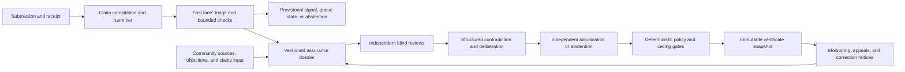

---
context_room:
  id: research.verification-engine.governance-workflows
  depends_on:
    - research.verification-engine.assurance-model
    - research.verification-engine.architecture
    - research.verification-engine.verification-protocol
    - research.verification-engine.evidence-base
    - research.verification-engine.threat-model
---

# Governance and verification workflows

## Summary

The proposed engine needs two deliberately different service lanes: a fast,
explicitly provisional lane for triage and bounded warnings, and a slower
assurance lane for reproducible research, independent review, contradiction,
adjudication, and certificate issue. A fast result never becomes a strong
result through elapsed time, model agreement, vote count, or cross-group
consensus. It becomes stronger only after every gate in the applicable method
profile has passed.

Governance separates evidence work, expert judgment, community participation,
policy, issuance, appeals, rights and safety, operations, and audit. Reviewers
form their first judgments independently before seeing other verdicts, then
deliberate against explicit objections. Community participation improves
discovery, coverage, wording, and procedural legitimacy; it cannot grant
epistemic assurance. Every decision remains scoped, versioned, contestable,
measurable, and reversible through a new status event rather than historical
editing.

This document is an active research proposal. It does not describe implemented
Parallax behavior or an accepted standalone-product policy.

## Defines

The proposed user contracts, two-speed service model, role and independence
rules, review protocol, community and expert boundaries, selection policy,
separation of powers, appeals, correction propagation, transparency model,
anti-manipulation governance, open-source governance, metrics, tests, and
falsifiers for the verification engine.

## Does not define

Claim-family assurance ceilings, the certificate schema, storage topology,
the exact request schema, pipeline stage contracts, lifecycle state machine,
security-control implementation, deployment-specific legal duties, final user
interface, staffing levels, prices, or accepted service-level objectives. Those
subjects belong respectively to the [assurance model](./assurance-model.md),
[architecture](./architecture.md),
[verification protocol](./verification-protocol.md),
[threat model](./threat-model.md), and later deployment-specific owners.

## Research status and dependencies

- **Status:** `active` — research proposal; no governance recommendation is
  accepted yet.
- **Baseline date:** 2026-08-12.
- **Corpus position:** this file belongs to the
  [verification-engine research dossier](./INDEX.md), not accepted Parallax
  product truth.
- **Assurance dependency:** changing public outcomes, harm tiers, review gates,
  or abstention rules in the [assurance model](./assurance-model.md) requires
  reconsidering this workflow.
- **System dependency:** changing canonical authority, issuance, task, event, or
  notification boundaries in the [architecture](./architecture.md) requires
  reconsidering role separation and handoffs here.
- **Protocol dependency:** changing request, stage, lifecycle, or service-
  velocity contracts in the
  [verification protocol](./verification-protocol.md) requires reconsidering
  the user and governance commitments here.
- **Evidence dependency:** the governance recommendation rests on the limits
  and practitioner findings in the [evidence base](./evidence-base.md).
- **Threat dependency:** identity, privacy, capture, Sybil, denial-of-review,
  and incident controls must remain compatible with the
  [threat model](./threat-model.md).

All numerical thresholds, service objectives, quorum rules, sampling fractions,
and error budgets must be preregistered for a named domain and harm tier before
evaluation. They must not be selected after observing whether a desired result
passes.

## Constitutional boundary: consensus is not truth

A consensus is a property of a set of responses under an aggregation rule. A
factual conclusion is a claim about the relation between evidence, inference,
and the world. The same unanimous response can occur when a claim is true or
false because participants may share one source, dataset, model, incentive,
institution, blind spot, or coordinated strategy.

The engine therefore keeps epistemic, workflow, lifecycle, challenge, and
community state independent. A UI may compose them for display but canonical
records never collapse them into one status:

| State family | Question answered | Permitted effect |
| --- | --- | --- |
| Certificate epistemic outcome | How strongly do admissible evidence and warranted inference support the scoped claim under the declared profile? | Immutable once issued; may determine only the profile-limited outcome of that certificate. |
| Verification workflow state and `VerificationRun.run_disposition` | Workflow state answers whether the run is queued, active/in-review, blocked, or preparing a terminal object. `run_disposition` is null until terminal, then exactly `certificate_issued`, `abstained`, `refused`, or `failed`. | Workflow controls execution; the terminal disposition records only the final run result. Neither is a certificate lifecycle state or epistemic outcome. |
| Certificate lifecycle | Is an issued certificate `current`, `needs_review`, `stale`, `restricted`, `superseded`, or `withdrawn`? | Controls serving and reuse through append-only events; never rewrites the issued epistemic outcome. |
| Challenge overlay | Is a versioned appeal or material objection absent, open, under independent review, resolved, or dismissed? | Exposes contest and can trigger restriction or review. `contested` is not an epistemic outcome or lifecycle value. |
| Inter-reviewer robustness | Do initially independent, qualified assessments remain stable after challenge? | May trigger adjudication, narrower wording, more research, or abstention. |
| Cross-perspective usefulness | Do people with materially different histories find the explanation clear, relevant, and non-misleading? | May change presentation and expose missing objections; cannot raise assurance. |

Community Notes demonstrates that bridging can select explanations considered
helpful across historical rating differences, but its own algorithm optimizes
helpfulness rather than truth. Peer-reviewed studies find useful displayed
notes and meaningful post-display effects, while also finding low or selective
coverage, material delay, and under-moderation of polarizing content. Wikipedia
likewise defines consensus as an editorial process and verifiability as support
by published sources, not correspondence with reality. Wikidata ranks preserve
preferred, normal, and deprecated source-backed statements without treating
rank as an accuracy probability.

These systems justify collaborative discovery, transparent disagreement, and
provenance-rich records. They do not justify `agreement -> true`,
`no objection -> supported`, or `many URLs -> independent evidence`.

## User contracts

Every user-facing interaction must preserve the difference between a service
receipt, a provisional signal, and an issued certificate.

### Universal contract

Every accepted submission returns:

- a stable case identifier and exact submitted claim or artifact;
- the compiled scope or a typed request for clarification;
- the selected claim family and harm tier, or the reason routing failed;
- the current workflow state and whether any public conclusion exists;
- the applicable method-profile version and maximum possible outcome;
- the known research, access, expertise, capacity, and monitoring gaps;
- the expected next decision, responsible role, and target service window;
- the appeal, rights, safety, and abuse routes available at that state; and
- a subscription route for material status changes.

No response may imply that an unselected, unreviewed, overloaded, expired, or
inaccessible case is accepted. `No certificate` means no current certificate,
not “no problem found.”

### Actor-specific contract

| Actor | The engine owes | The actor may | The actor may not |
| --- | --- | --- | --- |
| Submitter | Receipt, scope confirmation, routing reason, visible status, and challenge route. | Clarify, supply evidence, withdraw a request, or appeal intake. | Select the profile, reviewer, outcome, or publication timing. |
| Person or organization directly affected | Notice when lawful and safe, a correction/rights route, opportunity to provide evidence, and protection against retaliatory disclosure. | Challenge identity, context, evidence, procedure, privacy, or foreseeable harm. | Suppress a supported public-interest conclusion merely through disagreement. |
| Evidence contributor | Provenance receipt, decision on use, attribution choice where lawful, and protection rules. | Add support, counterevidence, corrections, provenance, or limitations. | Convert submission volume or reputation into epistemic weight. |
| Reviewer or expert | Exact task, profile, evidence access, conflict process, workload limit, compensation terms, and protected dissent. | Abstain, request scope repair, disclose conflicts, record judgment, and change a view with reasons. | Hide material conflicts, consult prohibited peer verdicts during blind review, or alter canonical evidence. |
| Appellant | Standing decision, case-specific grounds, independent assignee, status, reasoned outcome, and notice receipt. | Introduce new evidence or allege a material evidentiary, procedural, rights, or safety defect. | Reopen indefinitely without a new ground, harass participants, or mutate the challenged record. |
| Community participant | Clear task boundary, contribution receipt, moderation protection, and explanation of how input was used. | Propose claims, sources, objections, local context, translations, and clarity ratings. | Vote a claim into a stronger assurance status or infer reviewer identity. |
| Downstream consumer | Immutable certificate ID/version, current status, scope, expiry, change feed, and machine-readable reason codes. | Render a narrower summary and subscribe to changes. | Relabel the result as universal truth, omit material scope, or keep serving a superseded result as current. |
| Auditor | Authorized replay package, policy and release versions, sampled cases, and protected access where justified. | Test conformance, selection, calibration, manipulation, and correction claims. | Publish restricted evidence or silently become the policy or appeal authority. |

The interface must preserve the assurance model's separate certificate
epistemic outcomes, `VerificationRun` dispositions, certificate lifecycle, and
challenge overlay ([assurance model](./assurance-model.md)). Terms such as “AI
verified,” “community proven,” or an unqualified green truth badge are outside
the contract.

## Two-speed service model

The two lanes answer different questions. They may share acquisition and case
records, but they must not share presentation language that hides their
different assurance. This section owns their user and governance boundary; the
exact stage, state, retry, and transition contracts live in the
[verification protocol](./verification-protocol.md#two-service-velocities).

The diagram explains governance handoffs. Component and persistence authority
remain defined by the [system architecture](./architecture.md).

### Fast lane

The fast lane exists to reduce time-to-useful-warning without disguising
incomplete research. It may:

- deduplicate a submission and locate an existing current certificate;
- compile scope, classify harm, and reject prohibited processing;
- acquire and identify artifacts under the security and rights policy;
- check hashes, signatures, exact quotations, known corrections, retractions,
  expiry, and declared closed-register predicates;
- expose an obvious citation mismatch, unavailable artifact, or unresolved
  scope;
- generate support and refutation search candidates;
- issue a short-lived `provisional` notice visible only inside the authorized
  private research workspace, with its exact basis; and
- queue the case, report capacity failure, or abstain.

A provisional notice is not a public object and is not a certificate outcome.
It cannot be syndicated, indexed, exported as a verdict, or rendered on public
content. It must display its missing gates, expiry, and prohibition against
irreversible use. The only exception is
a bounded `T0` case for which the complete applicable profile, including its
per-case human authority and the additional independent sampled re-audit rule,
is genuinely satisfied inside the fast path. It is then a completed narrow
certificate, not a relaxed fast certificate.

The fast lane cannot:

- infer truth from model agreement, source count, contributor reputation, or
  social consensus;
- silently fall back to a generic method when a profile is unavailable;
- use timeout, queue age, or absence of objections as a positive result;
- publish a material allegation before the rights and harm gates; or
- auto-promote a notice when its timer expires.

### Assurance lane

The assurance lane must complete, as applicable:

1. exact claim compilation and meaning approval;
2. method-profile, ceiling, harm, rights, and retention selection;
3. preregistered support, refutation, correction, archive, and stopping search;
4. evidence-use validation and origin-lineage analysis;
5. initially independent review by the required roles;
6. structured disclosure of disagreements and counterarguments;
7. additional research or an independent adjudicator where required;
8. recorded dissent, uncertainty, calibration, and applicability limits;
9. deterministic kernel checks and typed abstention on any unmet gate;
10. immutable issue plus audit and notification events; and
11. monitoring, expiry, appeal, and correction subscriptions.

The assurance lane may take longer than public-information half-lives. The
service must therefore publish both time-to-first-provisional-signal and
time-to-profile-complete-result, rather than using one latency average that
hides the trade-off.

### Promotion and downgrade rules

- Fast-lane material opens or enriches a dossier; it never grants a shortcut.
- Community agreement may improve wording or prioritize review; it never raises
  the certificate ceiling or outcome.
- Reviewer disagreement cannot be averaged away. It triggers clarification,
  more evidence, adjudication, a narrower outcome, or abstention.
- New counterevidence creates `needs_review`; it does not automatically invert
  the prior conclusion.
- Expiry stops current serving. Refresh requires the current profile rather
  than grandfathering an old workflow.
- A weaker replacement may supersede a stronger historical certificate when
  evidence or method quality falls.

## Roles, competence, independence, and conflicts

### Authority matrix

| Role | Positive authority | Required separation |
| --- | --- | --- |
| Intake and safety triage | Accept, reject, restrict, classify, and route a request under published rules. | Cannot choose the desired factual outcome or issue a certificate. |
| Research analyst | Execute the search plan, preserve candidates, propose evidence uses, and document exclusions. | Cannot independently approve their own evidence synthesis. |
| General evidence reviewer | Check citation fidelity, ordinary scope, procedure, and provenance. | Cannot waive a domain-expert gate. |
| Domain-method expert | Assess specialist method, uncertainty, applicability, and evidence quality. | Credentials do not permit policy change, hidden assumptions, or undisclosed conflicts. |
| Adversarial reviewer | Search for counterexamples, alternative explanations, source dependence, and scope defects. | Cannot rewrite the claim to manufacture failure or suppress favorable evidence. |
| Adjudicator | Resolve a defined disagreement under the existing profile or require abstention. | Must not have researched, reviewed, or advocated the same case. |
| Policy council | Version method profiles, ceilings, harm tiers, sampling, and publication rules. | Cannot alter an issued snapshot or secretly exempt a case. |
| Assurance kernel and issuer | Enforce deterministic invariants and atomically issue a profile-conforming snapshot. | Cannot make open-world judgments or waive policy. |
| Appeal panel | Decide a versioned challenge and order review, restriction, withdrawal, or supersession. | Must be independent of the original case and relevant policy conflict. |
| Rights and safety officer | Restrict exposure, handle privacy/source-harm requests, and preserve due process. | Temporary protection does not decide the epistemic merits. |
| Community moderator | Enforce participation rules and preserve legitimate dissent. | Moderation status cannot determine factual status. |
| Operator | Run infrastructure, queues, backups, keys, and incident controls. | Production access does not grant policy, review, or appeal authority. |
| Independent auditor | Test samples, metrics, conformance, security, and capture risks. | Cannot audit only cases selected by the operator or become a hidden issuer. |

No person may research, independently review, adjudicate, change the governing
profile, and issue the same material certificate. Critical policy, key, bulk-
restriction, and incident-resumption actions require two-person control across
different authority groups.

### Competence contract

Competence is task-specific, time-bounded, and evidenced. A method profile
defines:

- required subject-matter and methodological knowledge;
- language, jurisdiction, population, and cultural-context requirements;
- accepted qualifications and equivalent demonstrated experience;
- calibration or anchor tasks resolved outside the engine's own consensus;
- minimum recent practice, continuing education, and expiry;
- permitted claim families and harm tiers;
- maximum concurrent workload and fatigue controls; and
- conditions requiring consultation, reassignment, or abstention.

One prestigious credential is not global authority. Methodological competence
and domain familiarity are recorded separately. The system must also measure
whether adding expert review reduces material error on prospective cases; if it
does not, the affected tier is narrowed or stopped rather than retaining an
expensive ceremonial gate.

Qualified work should be compensated under disclosed rules whenever the
service depends on predictable expert capacity. An unpaid pool can be useful
for voluntary community discovery, but it must not be presented as a stable,
representative, or exploitation-free expert service.

### Independence and conflict-of-interest contract

Independence is assessed for the current case, not inferred from job title or
political grouping. The record distinguishes:

- personal and household interests;
- employment, client, litigation, advocacy, and institutional relationships;
- funding, gifts, equity, royalties, and publication interests;
- co-authorship, supervision, close collaboration, or public commitment;
- shared dataset, witness, experiment, model, search index, or source lineage;
- prior participation in the case, policy, complaint, or appeal; and
- coercion, retaliation, or safety constraints that could affect judgment.

Each assignment receives a structured disclosure, automated relationship
checks where lawful, a recusal decision, and a public conflict summary that
does not expose unnecessary personal data. Undeclared or newly discovered
material conflicts create review work and may invalidate the role, but do not
automatically prove the conclusion wrong.

Reviewer identity may be verified privately and presented publicly through a
stable pseudonym or role when safety requires it. Political “camp” inference is
not a competence signal and should not be stored unless a narrowly justified,
consented research protocol establishes necessity and proportionality.

### Typed independence and capture gates

Independence is a versioned `MethodProfileVersion` contract, not an informal
reviewer note or a hidden platform heuristic. Each profile version declares
typed fields for:

- required role slots and `minimum_independent_assessments`;
- forbidden same-case role combinations and disqualifying relationship types;
- lineage dimensions that must be checked: person, institution, funding,
  dataset, witness, model, search index, source origin, and prior case work;
- the evidence and maximum age accepted for each qualification, relationship,
  and recusal decision;
- treatment of `independent`, `dependent`, `disputed`, and `unknown` findings;
- the allowed response for unresolved dependence: recusal, new assignment,
  additional independent review, ceiling reduction, or abstention;
- capture metrics by authority surface, cohort, and time window, including
  assignment concentration, sponsor/customer concentration, common-origin
  influence, cohort-removal outcome sensitivity, administrator/key control,
  appeal-panel reuse, and random-audit coverage; and
- for each metric, denominator, predeclared warning and critical threshold,
  minimum sample, measurement query, owner, response, and expiry/review date.

Numbers are profile-specific and frozen before the relevant prospective data
are inspected. Missing relationship data, an unknown metric version, an expired
qualification, a denominator below the declared minimum, or a failed check is
`independence_unresolved`; it never defaults to independent. The profile must
then apply its explicit lower ceiling or abstention rule. Any credible critical
capture trigger immediately suspends new issuance and current reuse for the
affected profile, role cohort, source cohort, or issuer interval pending an
independent impact review. Resumption requires the profile's recorded recovery
proof, not an operator override.

## Blind first, deliberate second

The review protocol prevents early social influence without pretending that
isolated judgment is sufficient.

1. **Preregister.** Freeze the claim version, method profile, questions,
   evidence packet or discovery permissions, independence requirements, and
   decision rubric before reviewers see a result.
2. **Assign.** Randomly assign qualified reviewers within declared availability
   and conflict constraints. Do not allow requester selection or forum
   shopping.
3. **Review independently.** Reviewers cannot see vote counts, other verdicts,
   reputation scores, public status, or deliberation text. Each records sources
   consulted, reasoning, uncertainty, objections considered, and change-of-mind
   conditions.
4. **Reveal structured disagreement.** The system compares dimensions rather
   than one scalar verdict and presents conflicting claims, evidence uses,
   assumptions, and lineage questions.
5. **Deliberate.** Reviewers answer the strongest objections, may request new
   research, and submit a reasoned revised assessment. Every change is retained.
6. **Adjudicate or abstain.** A new qualified actor decides only the unresolved
   questions under the existing policy. Material unresolved conflict lowers the
   result or produces abstention.
7. **Publish dissent.** A serious minority analysis remains attached with the
   response it received; aggregation does not erase it.

Blind review is itself a hypothesis. It must be compared prospectively with
immediate deliberation for accuracy, counterevidence discovery, conformity,
time, and reviewer experience. Identity masking must not prevent reviewers
from detecting a necessary methodological or institutional conflict.

## Community participation and expert review

This section is a **post-v1 design target**, not an enabled feature of V0, the
MES, or the closed pilot. Those phases may run consented, non-public user
research and invite named test participants to submit fixture feedback, but no
open contribution, public profile, public comment, ranking, election, or user-
content dissemination is authorized. Public community participation remains
disabled until the DSA/publication classification, terms, moderation, abuse,
notice-and-action, privacy, accessibility, staffing, and appeal gates in the
[threat model](threat-model.md) are approved for the exact deployment.

| Activity | Community contribution | Qualified-review authority |
| --- | --- | --- |
| Candidate discovery | Propose claims, sources, archives, translations, local context, and duplicates. | Validate admissibility, provenance, scope, and rights. |
| Contradiction | Submit counterexamples, missing context, alternative hypotheses, and correction signals. | Determine whether the objection changes an assurance dimension. |
| Communication | Rate clarity, relevance, respectful wording, and whether limitations are understandable. | Ensure wording remains faithful to the certificate. |
| Prioritization | Express public need and surface emerging topics. | Apply harm, coverage, capacity, and fairness policy. |
| Specialist method | Identify potential experts or point to domain standards. | Evaluate method quality, uncertainty, and applicability. |
| Governance | Comment on proposed policies, audit public artifacts, and elect or nominate eligible community seats where adopted. | Cannot exempt a case from the approved profile. |

Community signals must expose self-selection and concentration. Ratings are
collected independently before aggregate display where possible; hyperactive
contributors cannot dominate through volume; and assigned random or stratified
control samples remain analytically separate from spontaneous participation.

Cross-perspective helpfulness may be published as a communication-quality
signal. It cannot be renamed balance, neutrality, expertise, independence, or
truth. A polarizing but well-supported claim must not be suppressed merely
because it cannot obtain symmetrical approval.

## Selection, prioritization, and coverage

Selection is editorial power and must be governed as carefully as adjudication.
The engine maintains three protected queues:

1. **Urgent safety queue:** plausible immediate harm, active source compromise,
   rights restriction, or widely served invalid certificate. This queue can
   restrict exposure provisionally but cannot issue a rushed factual outcome.
2. **Risk-and-value queue:** cases ranked by prospective harm, exposure,
   evidence decay, public value, tractability, uniqueness, and available
   competence.
3. **Random coverage queue:** a preregistered sample from the eligible universe,
   protected from popularity and requester influence, used to estimate missed
   errors and selection bias.

Priority is a vector rather than one secret engagement score. The record
includes:

- candidate universe and deduplication rule;
- source of nomination and self-selection status;
- risk, exposure, freshness, public-value, equity, and feasibility factors;
- languages, regions, domains, and populations under-covered by current work;
- queue chosen, decision time, reason, and responsible policy version;
- estimated review cost and required competence;
- rejected, deferred, overloaded, prohibited, and sampled-out counts; and
- whether the case was ever publicly visible before selection.

No topic is positively scored because it favors a political position. Protected
capacity for low-resource languages, low-attention consequential claims, new
contributors, and random audit prevents virality and affluent participation
from defining the truth agenda.

Public dashboards expose denominators and delay distributions without
publishing exact real-time thresholds that would make queue manipulation
trivial. Any withheld selection detail needs a stated threat, owner, review
date, and auditor access.

## Separation of powers

### Governance bodies

- **Method and policy council:** maintains the public constitution, method
  profiles, harm tiers, ceilings, sampling rules, and change process.
- **Case operations:** acquires evidence, runs research, assigns reviews, and
  executes policy without changing it for a case.
- **Independent review and adjudication pool:** performs evidence and method
  judgment with protected dissent.
- **Appeals body:** reviews certificate-specific challenges and procedural
  complaints without reporting to the original case owner.
- **Rights, safety, and ethics function:** can order narrow temporary
  restriction while a separate process resolves merits.
- **Security and reliability operations:** protects infrastructure and can stop
  issue or serving, but cannot create epistemic outcomes.
- **External audit function:** samples accepted, rejected, abstained, and
  unselected cases; tests governance and publishes findings.

No sponsor, customer, government, maintainer, administrator, or contributor
class receives unilateral power over policy, case outcome, appeal, and public
history. Funding sources, institutional relationships, and material service
customers are disclosed at governance level even when case reviewers have no
direct conflict.

### Evaluation progression authority

The evaluation protocol owns the meanings, measurements, and frozen automatic
threshold consequences of `GO-SHADOW`, `PAUSE`, `NARROW`, and `KILL`. This
section is the canonical **Progression Panel contract**: it owns panel
composition, incompatibilities, quorum, voting/concurrence rules, conflicts,
stop/resumption authority, and signed decision records. Case operations, the
experiment team, product leadership, and a sponsor cannot declare their own
success. Evaluation links here rather than duplicating those governance rules.

For the same evaluation tranche, the following bindings are incompatible with
a voting Progression Panel seat: protocol amendment after freeze, experiment
execution, reference adjudication, metric computation with unblinded outcomes,
independent audit, and unblinding-custodian duty. Every candidate discloses
employment, funding, authorship, operational, customer, and outcome interests.
A material conflict requires recusal and replacement; it cannot be cured by
adding another favorable voter.

The panel has five eligible voting seats from distinct authority groups:

1. an evaluation/method chair independent of the execution and adjudication
   teams;
2. a product/user-harm lead;
3. a rights/privacy/safety lead;
4. a security/reliability lead; and
5. an operations/economics lead who is not the commercial sponsor.

Quorum requires all five roles filled and non-recused. No organization that
operated the tranche, customer, or funding sponsor holds more than one seat.
The external replication lead signs whether the independent decision agrees but
does not vote or cure an internal failure. The independent audit lead presents
the audit and may require correction of the record, but does not vote on the
tranche they audited. Serious dissent is attached rather than averaged away.

Decision rules are fail-closed:

- A frozen automatic `PAUSE`, `NARROW`, or `KILL` trigger takes effect
  immediately when its validated measurement fires; the panel records and
  scopes the consequence but cannot vote it away.
- Any named evaluation, safety/rights, security/reliability, or independent-audit
  stop authority may order an immediate `PAUSE` on credible critical evidence.
  Resumption requires correction of the trigger, fresh audit evidence, full
  quorum, and affirmative concurrence from the evaluation/method,
  user/harm-rights, and security/reliability seats.
- `GO-SHADOW` requires every mandatory gate to pass, no unresolved critical
  finding, full quorum, **unanimous concurrence of all five seats**, a signed
  no-blocker statement from the rights/privacy/safety and security/reliability
  leads, and the independent replication decision required by evaluation.
  Product value cannot compensate for a safety or validity failure.
- A discretionary `NARROW` where no automatic trigger specifies the exact scope
  follows the evaluation protocol's preregistered decision table under full
  quorum. The narrowed protocol starts a new preregistered tranche; it cannot
  discard difficult cases from the old analysis.
- `KILL` is mandatory when a frozen kill criterion fires and its stated
  confirmation rule is met. Reversal follows only the criterion's predeclared
  fresh-evidence route; a new panel vote alone is insufficient.

The signed progression record binds the tranche and protocol hashes, data
cutoff, unblinding receipt, analysis-release identity, metric queries and
denominators, thresholds, gate results, audit report, conflicts/recusals,
individual votes, required concurrences, dissent, action scope, successor
tranche if any, notification receipts, and effective time. Missing quorum,
input, audit, or signature yields `PAUSE`, never implied approval.

### Policy change

A material change requires:

1. a public proposal and threat/impact analysis;
2. affected claim families, users, historical certificates, and metrics;
3. counterproposal and dissent period;
4. independent technical, domain, rights, and security review as applicable;
5. recorded decision, votes or objections, rationale, version, and effective
   date;
6. prospective or shadow evaluation before raising an assurance ceiling;
7. migration, rollback, and historical-interpretation rules; and
8. notice to reviewers, clients, auditors, and affected certificate owners.

Policy applies by version and effective time. A case cannot choose an obsolete
profile to obtain a stronger outcome, and a new policy does not rewrite what an
old certificate claimed at issuance.

### Emergency power and capture recovery

Emergency authority may pause acquisition, review, issue, serving, or one
source/provider class. It must be narrow, time-limited, two-person authorized,
logged outside the affected boundary, automatically reviewed, and incapable of
creating a positive certificate.

The capture plan includes alternate maintainers and signing control, off-site
evidence and policy snapshots, an external whistleblowing route, term limits
and rotation for sensitive roles, independent re-review of affected samples,
and the ability to mark a policy interval or issuer unauditable. Continuity of
the institution is subordinate to preventing false authority.

## Appeals, complaints, rights requests, and moderation

Different disputes need different objects and decision-makers.

| Route | Object challenged | Eligible grounds | Independent owner | Possible result |
| --- | --- | --- | --- | --- |
| Intake or selection appeal | Refusal, harm tier, scope route, or persistent deferral | Misclassification, inconsistent policy, material public interest, or missing capability | Intake appeal officer outside original queue | Recompile, reroute, keep refusal, or publish capacity gap |
| Epistemic appeal | Exact certificate or abstention | Omitted evidence, false lineage, citation/scope/method error, new evidence, invalid assumption, or wrong profile application | New qualified appeal panel | Uphold, reopen, narrow, restrict, supersede, or withdraw |
| Procedural complaint | Assignment, conflict, discrimination, delay, retaliation, or policy breach | Documented process failure or unequal treatment | Governance/ethics body independent of case line | Remedy process, reassign, sanction, audit cohort, or reject with reason |
| Rights or safety request | Personal data, confidentiality, source safety, copyright, defamation risk, or disproportionate exposure | Applicable right or plausible serious harm | Rights and safety officer with legal escalation | Temporary restriction, redaction, access change, deletion workflow, or refusal |
| Abuse or moderation report | Harassment, doxxing, impersonation, Sybil, brigading, or appeal spam | Conduct or platform-integrity evidence | Trust and safety function | Protect, rate-limit, suspend, preserve evidence, or clear report |
| Policy challenge | Method, ceiling, selection rule, or governance constitution | New evidence, inequitable effect, unmeasured risk, or design defect | Policy change process, not a case panel | Versioned policy change or reasoned rejection |

An epistemic appeal has broad public-interest standing when it supplies a
material, checkable ground; it is not limited to the original author. A rights
request may require narrower legal standing. Abuse controls may require new
evidence before repeated filing, but they cannot block a novel substantive
objection merely because an actor filed unsuccessfully before.

Every appeal is a canonical `AppealCase`, not a mutable support ticket:

| Field group | Required contract |
| --- | --- |
| Identity and chain | Stable `appeal_case_id`; optional `predecessor_appeal_case_id` and `successor_appeal_case_id` for a reasoned reopen or replacement. Closing one case never deletes it. |
| Exact target | `target_type`, `target_id`, and `target_revision_id` for the intake decision, `VerificationRun`, abstention record, certificate, status event, method profile, or policy challenged. |
| Grounds and authority | Standing decision, typed ground, evidence references, requested remedy, governing policy/profile versions, assignee, qualification, conflicts, recusals, and deadlines. |
| State | One of `received`, `jurisdiction_check`, `accepted`, `assigned`, `under_review`, `interim_restricted`, `decided`, `closed`, `withdrawn`, or `dismissed`; every transition is an append-only event with actor and reason. |
| Decision link | Typed decision, rationale, affected dimensions, ordered action, and exact predecessor/successor certificate or record references where a replacement exists. A null successor means none exists yet, not that the predecessor vanished. |
| Receipts | Durable receipt IDs for intake, standing/jurisdiction, conflict checks, assignment acceptance, evidence admission, interim action, decision approval, notification delivery, retries, acknowledgements, and downstream displayed state. |

A credible critical trigger—plausible serious harm, protected-data exposure,
issuer/key/source compromise, a material false-strong outcome, or evidence that
the current trust boundary is invalid—moves the case to
`interim_restricted` and immediately suspends affected serving, reuse, and new
issuance. The scope may be one certificate or a traced cohort. This protective
action is independently reviewable and does not imply that the underlying claim
is true or false. Non-critical disagreement remains visible in the challenge
overlay and follows ordinary review; it does not silently change lifecycle or
epistemic outcome.

## Correction and notification lifecycle

This section owns correction accountability, affected-user communication, and
consumer obligations. The mechanical state and dependency-propagation contract
is owned by the
[verification protocol](./verification-protocol.md#update-and-dependency-propagation).

Corrections emit typed immutable correction or lifecycle events, not silent
edits. Only rows explicitly naming a certificate lifecycle value change that
lifecycle projection:

| Event | Meaning |
| --- | --- |
| `metadata_corrected` | A new immutable metadata revision or overlay corrects a non-semantic record error and carries `corrects_revision_id`; the predecessor remains addressable. No row or issued certificate is edited in place. |
| `needs_review` | New evidence, dependency, conflict, method, source, or monitoring event requires reassessment. |
| `restricted` | Access or serving is limited for rights, safety, integrity, or incident reasons while history remains controlled. |
| `superseded` | A new certificate replaces the current use of an older one. |
| `withdrawn` | The issuer no longer stands behind the certificate because of a material defect or invalid trust boundary. |
| `stale` | Expiry, evidence age, or another profile trigger means the result may no longer be presented as current without refresh. |

Every correction is managed through a canonical `CorrectionCase`:

| Field group | Required contract |
| --- | --- |
| Identity and chain | Stable `correction_case_id`; optional `predecessor_correction_case_id` and `successor_correction_case_id` for a replaced or reopened process. |
| Exact target | `target_type`, `target_id`, and `target_revision_id`, plus initiating evidence and the dependency-impact query/version used. |
| Record succession | Exact `predecessor_record_id` and `predecessor_revision_id`; nullable `successor_record_id` and `successor_revision_id` until a replacement is actually finalized. Metadata-only overlays also require `corrects_revision_id`. |
| State | One of `detected`, `triaged`, `impact_assessing`, `interim_restricted`, `under_review`, `replacement_prepared`, `propagating`, `closed`, or `rejected`; every transition is append-only. |
| Decision and time | Typed reason, responsible and approving roles, affected assurance dimensions, valid time, system record time, public wording, restricted detail, and notification plan. |
| Receipts | Durable receipt IDs for trigger admission, impact-query result, temporary suspension/restriction, review/adjudication, kernel decision, successor finalization, status event, each delivery/retry, consumer acknowledgement, and observed downstream version. |

The same critical-trigger rule used for appeals immediately suspends affected
serving, reuse, and new issuance before the correction's merits are finally
resolved. The suspension receipt and impact set are mandatory. A correction
case may later conclude that no semantic correction was required, but it cannot
erase the protective action or its rationale.

Known consumers receive a signed or authenticated change event through the
versioned API, webhook, feed, or export channel they registered. Delivery,
retry, failure, acknowledgement, and final displayed version are distinct
records. The engine can promise that it sent a notice under a declared protocol;
it cannot promise that every copy on the open Web was corrected.

Conforming consumers must:

- retain the exact certificate ID and version they used;
- check current status before consequential display or reuse;
- show `as_of`, expiry, and stale/unavailable states;
- consume idempotent correction events;
- acknowledge or expose propagation failure; and
- avoid caching a stronger label after restriction or supersession.

A changed premise marks dependent dossiers for review. It never silently flips
all downstream conclusions because applicability and alternative support must
be reassessed per dossier.

## Transparency and confidentiality

Transparency is tiered by purpose rather than treated as universal publication.

| Access layer | Normally included | Normally excluded |
| --- | --- | --- |
| Public | Claim and scope, issuer, outcome and assurance vector, profile/policy version, admissible public sources, reasons, limitations, dissent summary, status history, appeal route, aggregate metrics, and software release identity. | Unnecessary identity, confidential sources, raw personal data, security secrets, sealed evidence, and exploitable live anti-abuse thresholds. |
| Controlled auditor/reviewer | Licensed or confidential evidence needed for the task, private qualification proof, detailed conflict record, selection samples, manipulation telemetry, and replay material. | Data unrelated to the authorized audit or review purpose. |
| Sealed rights/security | Whistleblower identity, legal-hold material, abuse intelligence, key-recovery detail, and highly sensitive evidence under dual control. | Routine product analytics, broad staff access, public logs, and model-provider prompts. |

Every confidentiality exception records its purpose, authority, access list,
retention, expiry, review date, and effect on reproducibility. If material
evidence cannot be independently inspected, the assurance ceiling falls or the
result abstains. A protected independent auditor may verify a sealed property
without making the underlying content public, but the public certificate must
state the resulting limitation.

Transparency-log commitments contain certificate statements or salted/batched
commitments where appropriate, not raw source content. Public reviewer identity
is minimized when naming creates coercion or safety risk; accountability is
preserved through verified internal identity, stable role records, conflicts,
auditor access, and case history.

## Anti-manipulation and Sybil governance

The anti-manipulation objective is to stop artificial participation from
creating legitimacy, suppressing objections, exhausting capacity, or capturing
governance. It is not to prove that every participant is one natural person or
that identified people are truthful.

Required controls include:

- identity assurance proportional to harm, with pseudonymous public output;
- rate, maturity, case, and concurrency limits;
- random qualified assignment and hidden initial verdicts;
- separation of spontaneous ratings from assigned control samples;
- influence caps for hyperactive accounts and tightly correlated cohorts;
- timing, text, source-lineage, device/infrastructure, funding, and social-
  relationship anomaly analysis where lawful;
- canary cases, random accepted-case audits, and cohort-removal counterfactuals;
- two-person control and rotation for policy, moderation, issuer, and appeal
  administration;
- freezes and fresh-panel replay when coordination is plausible; and
- calibrated false-positive review and appeal for anti-abuse actions.

No vote count directly changes epistemic assurance. Removing a coordinated
cohort may change the published usefulness or legitimacy signal, but any
certificate change still requires evidence and profile review.

Reputation is multidimensional and domain-specific. It may include performance
on externally resolved anchors, citation quality, calibrated abstention,
discovered corrections, appeal reversals, procedural conduct, and information-
lineage diversity. It must not be based only on agreement with later community
verdicts, transferred globally between domains, bought through volume, or used
to bypass current-case evidence.

Strong identity requirements can exclude whistleblowers, marginalized groups,
shared-device users, and people under coercion. Anti-Sybil evaluation therefore
measures both attack success and false-positive burden by language, region,
account age, anonymity, disability/access pattern, and contributor group.

## Open-source governance

Open code is necessary for inspectability but insufficient for reproducibility
or institutional legitimacy. The public release should include, subject to
rights and security limits:

- assurance-kernel, workflow, policy-validation, and export code;
- certificate, event, policy, method-profile, and replay schemas;
- human-readable constitution and change process;
- tagged and signed releases, dependency manifests, build instructions, and
  deployed-version attestations;
- deterministic public test cases, adversarial fixtures, and licensed benchmark
  subsets;
- algorithm and metric definitions, known limitations, and compatibility rules;
- security policy, private vulnerability route, incident-disclosure policy, and
  supported-version window; and
- decision records, maintainer roles, terms, conflicts, funding, and material
  sponsor relationships.

The public repository does not expose personal data, confidential evidence,
private keys, live abuse signatures, exploitable thresholds, or provider
secrets. Withholding needs a named threat, narrow scope, independent auditor
access where possible, and a disclosure or review date.

Governance of the repository requires:

- public proposal and review for material semantic or policy changes;
- protected code ownership for the small assurance kernel and schemas;
- at least two independent approvals for release and trust-boundary changes;
- term limits or rotation for high-authority maintainers;
- reproducible-build and software-supply-chain checks;
- public release hashes tied to the production version actually serving a
  certificate;
- a fork and continuity plan if the operator becomes captured or disappears;
- no trademark, hosting, or sponsor power that silently overrides the published
  constitution; and
- external audits that include production conformance, not only source review.

A fork inherits code, not issuer trust, historical custody, qualifications,
privacy authority, or certificate legitimacy. Every issuer and trust root must
be identified independently. “The algorithm is open source” is not an acceptable
substitute for proving which code, policy, data, and configuration ran.

## Metrics and accountability

No single score may combine evidence quality, popularity, speed, coverage,
fairness, and governance. Metrics retain their denominators, claim family,
harm tier, language, region, time window, and uncertainty.

| Metric family | Required measures | Failure hidden by a success-only metric |
| --- | --- | --- |
| Epistemic performance | Precision, recall, calibration where meaningful, abstention quality, counterevidence recall, citation fidelity, lineage accuracy, and later reversal against independently resolved cases. | High precision among a tiny selected set can coexist with poor coverage. |
| Selection and coverage | Eligible universe, selected/unselected counts, nomination source, random-sample results, topic/language/region/harm coverage, and missed consequential claims. | Published-case accuracy says nothing about ignored cases. |
| Time | Time to receipt, scope, provisional signal, qualified assignment, complete result, appeal, restriction, correction, and downstream acknowledgement. | Fast notes after peak diffusion may have little total effect. |
| Review quality | Agreement before and after deliberation, justified change rate, unresolved dissent, workload, competence gaps, recusals, and adjudicator overrides. | Consensus can be manufactured by conformity or attrition. |
| Appeals and corrections | Appeal rate, ground, standing acceptance, reversal, time, responsible cause, dependency impact, delivery, acknowledgement, and stale exposure. | A correction policy page does not prove correction propagation. |
| Manipulation | Influence concentration, correlated cohorts, Sybil simulation success, strategic abstention, queue attacks, false-positive enforcement, and counterfactual stability after cohort removal. | Account removal counts can reward over-enforcement. |
| Fairness and participation | Error, abstention, delay, visibility, recusal, retention, harassment, newcomer return, and appeal outcome across declared groups and access patterns. | Aggregate quality can conceal systematic exclusion. |
| User outcome | Scope comprehension, correct use, uncertainty comprehension, wrong-label susceptibility, decision quality, trust calibration, and accessibility. | Perceived trust may increase while discernment worsens. |
| Governance | Policy-change volume and lead time, unresolved dissent, emergency use, maintainer/sponsor concentration, audit findings, whistleblowing response, and production/source divergence. | Open code can coexist with captured operations. |
| Economics and capacity | Cost and person-time per stage, expert fill rate, backlog age, duplicate work, compensation, update burden, and value relative to a simpler dossier tool. | A technically sound service can still be operationally impossible. |

Targets and kill thresholds are declared before a prospective evaluation. The
operator publishes unfavorable slices and confidence intervals, not only a
headline average. Independent auditors receive a random sample of accepted,
abstained, rejected, appealed, and never-selected cases.

## Decisions and falsifiers

| Decision | Current recommendation | Confidence | Counter-hypothesis | Evidence that reverses or narrows it |
| --- | --- | --- | --- | --- |
| Consensus | Keep bridging and consensus outside epistemic assurance. | High | A specified aggregation rule adds independent calibrated evidence beyond the underlying sources. | Preregistered prospective, adversarial, cross-cultural testing beats evidence-only baselines on externally resolved cases without polarizing-selection, Sybil, or expertise failures. |
| Review order | Use blind-first, then structured deliberation. | Medium-high | Immediate discussion discovers more decisive evidence without conformity cost. | Randomized workflow comparison improves material-error and counterevidence recall within the cost/latency budget and does not worsen minority suppression. |
| Community role | Use the community for discovery, contradiction, communication, and governance input, not final specialist judgment. | High | A trained community can safely adjudicate a narrow technical profile. | Prospective results match qualified independent reviewers on external outcomes, remain stable under manipulation tests, and preserve subgroup coverage. |
| Expert review | Require qualified independent review for consequential open-world claims. | High for `T2`; unproven economically | Expert gates may add delay and prestige bias without reducing material errors. | Comparative evaluation shows no net error or decision benefit at viable cost; the tier must then narrow or stop rather than silently automate. |
| Two lanes | Separate provisional speed from completed assurance. | High | Provisional signals cause more anchoring harm than the timing benefit they provide. | User and field experiments show worse decisions, correction uptake, or irreversible action than a delayed-only service; disable the affected provisional class. |
| Appeals | Separate epistemic, procedural, rights/safety, abuse, and policy routes. | High | One unified route is simpler without losing fairness or expertise. | Operational trial shows equivalent independent assignment, time, remedy, user comprehension, privacy, and auditability with materially lower burden. |
| Selection | Protect a random audit queue and publish coverage denominators. | High | Risk/value ranking alone captures all material failures. | Prospective random audits find no additional material error or systematic blind spot over a predeclared period, while their cost prevents higher-value work. |
| Identity | Verify privately and disclose publicly only as needed. | Medium-high | Full naming materially improves accountability more than it increases coercion and exclusion. | Domain-specific safety, trust, and error research supports naming with lawful and proportionate protections. |
| Openness | Open the kernel, schemas, policies, tests, releases, and governance; protect data and live defenses. | High | Partial code disclosure is sufficient and safer. | Independent reproduction shows the open surface does not improve conformance detection while creating unmitigable attack or privacy harm; narrow only the proven risky surface. |
| Standalone governance | Keep the engine institutionally separable from Parallax, conditional on product validation. | Medium-high | The only viable use and governance community is Parallax. | The vertical slice finds no credible external consumer and independent governance/API cost exceeds measured assurance benefit. |

## Tests and acceptance evidence

Before any public certificate tier launches, the project must run and publish,
with preregistered thresholds:

1. **Role and transition tests:** every forbidden role combination, stale
   revision, conflict, missing qualification, expired profile, and attempted
   policy bypass fails closed.
2. **Blind-versus-deliberative trial:** randomized cases compare blind-first,
   immediate discussion, and independent adjudication on externally resolved
   outcomes, counterevidence discovery, conformity, time, and participant harm.
3. **Prospective temporal benchmark:** cases are frozen before resolution;
   external outcomes are collected later so the engine cannot grade itself from
   retrospective consensus.
4. **Selection audit:** a protected random sample estimates recall and error in
   the unselected universe across topic, language, region, harm, and
   polarization.
5. **Source-lineage test:** syndicated pages, shared datasets, circular
   citations, common funding, translations, and one-origin replications are
   collapsed correctly or remain `dependence_unresolved`.
6. **Sybil and collusion red team:** coordinated minorities, hyperactive
   contributors, strategic abstention, rented credentials, brigading, and
   appeal flooding cannot directly move epistemic status; false-positive impact
   on legitimate groups is measured.
7. **Capture exercise:** a maintainer, sponsor, policy owner, administrator,
   issuer, or appeals clique attempts to favor a case. Separation, external
   logs, emergency controls, and recovery must detect or contain the attempt.
8. **Correction cascade test:** a source retraction, key compromise, reviewer
   conflict, policy defect, and rights restriction create the correct status
   events, dependency review, consumer notices, retries, acknowledgements, and
   stale-display behavior.
9. **Wrong-label comprehension study:** users see correct, incorrect,
   provisional, stale, contested, and withdrawn results. The design must meet
   separate thresholds for scope comprehension, decision quality, trust
   calibration, and correction uptake.
10. **Transparency/privacy test:** public, auditor, reviewer, and sealed exports
    disclose exactly their authorized fields; deletion, redaction, tombstone,
    and re-identification risks are exercised.
11. **Open-source reproducibility test:** an independent team builds the tagged
    release, replays public deterministic cases, verifies the deployed release
    identity, and identifies every unavailable input or protected parameter.
12. **Capacity and denial-of-review test:** 10x and 100x workload, duplicate
    floods, unavailable experts, and regional surges preserve protected queues,
    show backlog truthfully, and never turn timeout into acceptance.
13. **External case audit:** independent specialists sample issued, abstained,
    rejected, appealed, and unselected cases rather than reviewing only success
    stories supplied by the operator.

Launch remains blocked until the error and harm budgets, reviewer supply,
appeal independence, correction objectives, comprehension thresholds, coverage
minimums, and incident-resumption proof are approved for the exact tier.

## Residual risks and stop conditions

The design cannot eliminate shared societal error, hidden evidence, coercion,
expert disagreement, source fraud, unknown common origins, institutional
capture, privacy inference, or the authority effect of a polished certificate.
Its controls can also create new harms: contributor exclusion, chilling of
legitimate dissent, expensive delay, surveillance through identity checks,
over-removal by anti-abuse systems, and unequal coverage for low-resource
languages or regions.

The project must stop, narrow, or remove a tier when any of these persists
beyond the preregistered remediation window:

- a small coordinated cohort can materially change certificate outcomes;
- polarizing or low-attention supported claims have systematically lower recall
  without an evidence-based reason;
- false positive labels cause more decision harm than the service prevents;
- users cannot reliably distinguish provisional signals, provenance, source
  support, and scoped assurance;
- independent source lineage cannot be established at the promised tier;
- qualified, independent reviewers and appeal panels cannot be supplied and
  compensated sustainably;
- appeal assignment, interim protection, or decision timing lacks an
  enforceable independent path;
- correction events do not reach or replace the result in material integrated
  consumers;
- public transparency causes unmitigable source, privacy, safety, or
  manipulation harm;
- production behavior cannot be tied to the published code, policy, model, and
  configuration versions;
- governance or funding concentration defeats separation of powers; or
- the complete service does not materially outperform a narrower evidence-
  dossier and citation-audit tool at comparable cost and harm.

## Direct sources

### Official mechanisms, policies, and professional methods

- X Community Notes ranking algorithm, bridging, thresholds, safeguards, and
  stabilization: [Ranking notes](https://communitynotes.x.com/guide/en/under-the-hood/ranking-notes).
- X Community Notes code and public data tooling:
  [twitter/communitynotes](https://github.com/twitter/communitynotes).
- X Community Notes request for additional review, including the absence of a
  guaranteed review or outcome change:
  [Additional review](https://communitynotes.x.com/guide/en/contributing/additional-review).
- X Community Notes admitted participation and manipulation challenges:
  [Challenges](https://communitynotes.x.com/guide/en/about/challenges).
- Wikipedia's distinction between published-source support and editor belief:
  [Verifiability](https://en.wikipedia.org/wiki/Wikipedia:Verifiability).
- Wikipedia's consensus procedure and its separation from voting:
  [Consensus](https://en.wikipedia.org/wiki/Wikipedia:Consensus).
- Wikipedia's source-weighting and due-weight rules:
  [Neutral point of view](https://en.wikipedia.org/wiki/Wikipedia:Neutral_point_of_view).
- Wikipedia's separate content-dispute path:
  [Dispute resolution](https://en.wikipedia.org/wiki/Wikipedia:Dispute_resolution).
- Wikipedia's anti-manipulation policies:
  [Sockpuppetry](https://en.wikipedia.org/wiki/Wikipedia:Sockpuppetry) and
  [Canvassing](https://en.wikipedia.org/wiki/Wikipedia:Canvassing).
- Wikidata's multi-value, qualifier, provenance, and consensus model:
  [Statements](https://www.wikidata.org/wiki/Help:Statements/en).
- Wikidata's warning that rank is not an accuracy judgment:
  [Ranking](https://www.wikidata.org/wiki/Help:Ranking).
- Cochrane's independent duplicate selection and data-collection controls:
  [Chapter 4](https://www.cochrane.org/authors/handbooks-and-manuals/handbook/current/chapter-04)
  and
  [Chapter 5](https://www.cochrane.org/authors/handbooks-and-manuals/handbook/current/chapter-05).
- Cochrane's risk-of-bias judgment framework:
  [Chapter 8](https://www.cochrane.org/authors/handbooks-and-manuals/handbook/current/chapter-08).
- IFCN organizational transparency, methodology, and corrections commitments:
  [Code commitments](https://ifcncodeofprinciples.poynter.org/the-commitments)
  and [external assessment/application](https://ifcncodeofprinciples.poynter.org/application-process).
- EFCSN evidence, independent editing, corrections, complaints, privacy, and
  external assessment rules:
  [Code of Standards](https://efcsn.com/code-of-standards/).
- Open-source supply-chain threat and provenance model:
  [SLSA threats](https://slsa.dev/spec/v1.0/threats).
- Standardized security-contact disclosure for an open project:
  [RFC 9116, security.txt](https://www.rfc-editor.org/rfc/rfc9116.html).

### Original research, audits, and contradictory evidence

- Displayed Community Notes accuracy in a narrow COVID-19 vaccine sample:
  [JAMA 2024](https://doi.org/10.1001/jama.2024.4800).
- Causal estimate of post-display engagement reduction and limited displayed-
  note coverage: [PNAS 2025](https://doi.org/10.1073/pnas.2503413122).
- Display delay, diffusion half-life, cumulative effect, and domain/account
  heterogeneity:
  [Nature Communications 2026](https://www.nature.com/articles/s41467-026-72597-0).
- Cross-ideological bridging and systematic under-moderation of polarizing
  content across countries and elections:
  [Science Advances 2026](https://doi.org/10.1126/sciadv.aee6932), with
  [data and code](https://doi.org/10.17605/OSF.IO/2KP36).
- Different target selection by Community Notes and professional fact-checking:
  [ICWSM 2024](https://doi.org/10.1609/icwsm.v18i1.31387).
- Community Notes' use of professional fact-check material:
  [ACL 2025](https://aclanthology.org/2025.acl-short.42/).
- Social influence reducing diversity without improving group accuracy in a
  controlled estimation experiment:
  [Lorenz et al., PNAS](https://doi.org/10.1073/pnas.1008636108).
- Balanced small crowds compared with professional fact-checkers on a bounded
  headline sample:
  [Science Advances](https://doi.org/10.1126/sciadv.abf4393).
- Ideological diversity and article quality on Wikipedia, with observational
  and proxy limitations:
  [Nature Human Behaviour 2019](https://www.nature.com/articles/s41562-019-0541-6).
- Long-lived governance capture and disinformation in Croatian Wikipedia:
  [ACM 2024](https://doi.org/10.1145/3637338).
- Wikimedia's office action after infiltration and abuse in the Chinese
  community:
  [Wikimedia-l announcement](https://lists.wikimedia.org/hyperkitty/list/wikimedia-l%40lists.wikimedia.org/thread/6ANVSSZWOGH27OXAIN2XMJ2X7NWRVURF/).
- Prepublication review effectiveness and newcomer-retention cost across
  FlaggedRevs deployments:
  [ACM 2022](https://doi.org/10.1145/3555225).
- Expertise matching in an experiment involving 3,974 economists:
  [Management Science 2023](https://doi.org/10.1287/mnsc.2023.4852).
- Anti-vandalism false positives affecting benign Wikidata contributors:
  [Heindorf et al. 2019](https://doi.org/10.1145/3308558.3313507).
- Consumer compliance with inaccurate warning labels and resulting discernment
  harm:
  [Experimental evidence](https://pubmed.ncbi.nlm.nih.gov/40263336/).
- Community framing increasing perceived trust without proving accuracy:
  [Experimental evidence](https://pubmed.ncbi.nlm.nih.gov/38948016/).
- Public correction-record audit across 62 EFCSN sites and 1,555 entries:
  [Beyond compliance](https://misinforeview.hks.harvard.edu/article/beyond-compliance-how-european-fact-checkers-correct-their-own-errors/).
- Systematic synthesis of professional and community fact-checking strengths
  and limitations:
  [Harvard Kennedy School Misinformation Review](https://misinforeview.hks.harvard.edu/article/professional-and-community-based-fact-checking-show-different-strengths-but-neither-performs-strongly-across-trust-scalability-and-impact/).

### Preprints used only as risk signals

- Later loss of displayed Community Notes status:
  [Consensus stability, accepted at WWW 2026](https://arxiv.org/abs/2601.14002).
- Concentration and hyperactive-rater influence:
  [Hyperactive minority](https://arxiv.org/abs/2602.08970).
- Simulation of coordinated strategic raters:
  [Manipulation study](https://arxiv.org/abs/2511.02615).

These preprints justify adversarial tests and monitoring. They do not establish
the prevalence of successful production manipulation or by themselves validate
the proposed controls.
