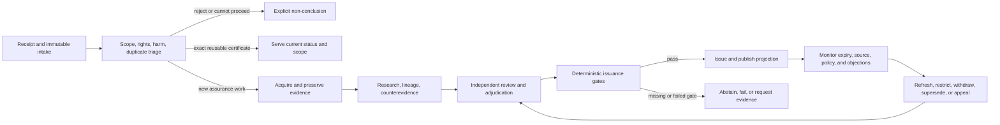

---
context_room:
  id: research.verification-engine.operations-cost
  depends_on:
    - research.verification-engine.architecture
    - research.verification-engine.assurance-model
    - research.verification-engine.threat-model
    - research.verification-engine.verification-protocol
    - research.verification-engine.governance-workflows
    - research.verification-engine.evaluation-vertical-slice
---

# Operations, service levels, and cost model

## Summary

This document is an **active research proposal**, not an approved operating
plan, budget, price list, staffing commitment, or customer SLA. It translates
the proposed [assurance contract](assurance-model.md),
[system architecture](architecture.md), and
[threat controls](threat-model.md) into an operable service hypothesis.

The recommended service is asynchronous and deliberately two-speed. A fast
lane can acknowledge, classify, deduplicate, retrieve an existing certificate,
or return an explicit non-conclusion. A separate assurance lane creates and
reviews a dossier. Queue pressure, a provider outage, or a deadline can never
promote a claim or bypass a mandatory review.

The dominant cost is expected to be qualified human attention, especially
claim scoping, source acquisition, counterevidence search, independent review,
appeals, and refresh. That is an inference to test, not a measured Parallax
fact. Published studies show workloads ranging from tightly bounded hours to
weeks or months, but no source establishes a universal cost per fact-check.
The prospective operator must therefore meter the whole lifecycle before
setting prices, staffing ratios, or contractual turnaround times.

## Defines

The proposed service lifecycle, two-speed service classes, queue and capacity
model, staffing roles, internal SLO framework, SLA boundary, quality budget,
parametric unit economics, build-versus-buy boundary, dependency fallbacks,
observability, backup and recovery requirements, retention-cost model, support
and incident routing, an illustrative post-MES pilot budget scenario, scale
gates, and economic falsifiers. It does not own V0 or MES scope.

## Does not define

Approved headcount, wages, vendor selection, volatile provider prices, final
SLO values, contractual remedies, a legal retention schedule, a DPIA, an
incident runbook, a production deployment, or evidence that customers will pay
for the service.

## Status of the evidence

### What is measured

The measurements below bound the design space. They are not interchangeable:
they cover different domains, methods, eras, and definitions of work.

| Observation | What was measured | Operational use | Limitation |
| --- | --- | --- | --- |
| Professional fact-checking is highly variable | Interviews with 21 professional fact-checkers in 19 countries reported anything from a simple check taking about an hour to difficult investigations taking more than a month; one participant estimated that more than 300 reader requests per day could not be handled manually ([Micallef et al., CSCW 2022](https://doi.org/10.1145/3512974), [open PDF](https://cronfa.swansea.ac.uk/Record/cronfa60585/Download/60585__24694__b1b52c023375424ea644f72b2ab1b58b.pdf)). | Segment by claim family and measure active time separately from calendar time. Intake must shed, deduplicate, or decline work visibly. | Qualitative self-report from a small heterogeneous sample; not a time-and-motion study. |
| Pre-publication science fact-checking consumes material editorial labor | A report based on 91 interviews and 301 survey responses records two outlets' planning estimates: 8–12 hours per article at bioGraphic, and 3–4 hours for a 235-word item up to 25 hours for a 3,100-word feature at Discover. Among 16 editors, reported rates ranged from USD 15–50 per hour; interviewed fact-checkers reported USD 19.28–75 ([MIT Knight Science Journalism / Moore Foundation report](https://www.moore.org/docs/default-source/default-document-library/fact-checking-in-science-journalism_mit-ksj.pdf?sfvrsn=a6346e0c_2)). | Include research and review labor explicitly instead of hiding it inside “AI cost”. | Historical, mainly science journalism, self-reported planning/rate data, and not a current price list. Currency figures must not be used as Parallax rates. |
| Monitoring volume and published output are different workloads | During six weeks around the 2024 UK general election, Full Fact reports more than 450 hours of monitoring by staff fact-checkers and 18 expert volunteers, AI scanning of more than 136 million words across 142,909 items, 217 verdicts including repeats, more than 150 published pieces, and 14 interventions ([Full Fact](https://fullfact.org/blog/2024/jul/general-election-2024-fact-checked/)). | Meter monitoring, candidate generation, investigations, publication, and interventions separately. | Monitoring hours do not include all investigation or review work, so hours per verdict cannot be inferred. |
| Systematic evidence synthesis can be very expensive | A study of 37 meta-analyses conducted by MetaWorks reported a mean of 1,139 person-hours, with search, retrieval, and database work the largest component ([Allen and Olkin, JAMA 1999](https://doi.org/10.1001/jama.282.7.634)). A later environmental-review study estimated about 164 person-days per systematic review ([Haddaway and Westgate 2019](https://doi.org/10.1111/cobi.13231)). | Treat specialist synthesis as a distinct service, not a larger version of an ordinary Web check. | Old and domain-specific samples; neither is a universal tariff. |
| Exceptional rapid-review cases do not establish normal capacity | One prospective case completed a review in 61 person-hours over nine working days using four experienced team members, automation, and protected time ([Clark et al. 2020](https://doi.org/10.1016/j.jclinepi.2020.01.008)). | A fast specialist lane requires explicit scope restrictions, expertise, and reserved capacity. | One unusually favorable case; it must not become a default SLA. |
| Screening strategies have materially different workload and recall | In one 12,477-record case model, derived time conversions estimated about 572 hours for a semi-automated, single-screening strategy at a fixed 95% recall and about 1,090 hours for conventional double screening at 100% recall ([Shemilt et al. 2016](https://doi.org/10.1186/s13643-016-0315-4)). | Record coverage targets, workflow and stop rules together; do not promise exhaustive open-Web search without measuring its workflow. | One review, modelled workflow, historical wage assumptions, and several strategy differences, so the time gap cannot be attributed to recall alone. |
| Individual screening decisions contain material errors | Across 25 health reviews and 139,467 citations, the estimated individual title/abstract screening-decision error rate was 10.76%, with substantial variation ([Wang et al. 2020](https://doi.org/10.1371/journal.pone.0227742)). | Preserve independent review, calibration, adjudication, and audit sampling for applicable work. | One evidence center; this is not the final review error rate, and its reference standard can also contain errors. |
| Corrections are an ongoing operational workload | A 2026 audit of 62 EFCSN members found 1,555 visible correction entries; among 299 coded entries from January 2024 to October 2025, 18.7% materially changed the verdict or method, 36.8% appeared within 24 hours, and 26.1% appeared after seven days or more ([Misinformation Review](https://misinforeview.hks.harvard.edu/article/beyond-compliance-how-european-fact-checkers-correct-their-own-errors/)). | Fund correction ownership, propagation, and severity metrics from launch. | Publicly visible entries only; timing and practice are organization-specific. |
| Appeals can be a high-volume, low-yield queue | An EFCSN submission reports that from October to December 2024 Facebook received 76,161 complaints about fact-check demotions and lifted 2,477, while Instagram received 2,279 and lifted 243 ([EFCSN submission](https://www.oversightboard.com/wp-content/uploads/gravity_forms/1-e2f76a9fb25fb0a6267e3480be5a45a9/2025/08/EFCSN-Comment-Meta-Oversight-Board-case-2025-050-FB-UA-.pdf)). Separately, EFCSN reports that 31 of 34 complaints it received in 2025 did not concern an EFCSN member but platform content-moderation decisions ([EFCSN 2025 report](https://efcsn.com/wp-content/uploads/2026/02/EFCSN-Report-Digital-EU.pdf)). | Separate claim appeals from downstream matched-content disputes and perform standing/jurisdiction triage before expert review. | Platform complaints concern content instances, not unique claim certificates; the two datasets are not directly comparable. |
| Sector finances and staffing are constrained | In an IFCN survey fielded from 3–15 February 2026 about calendar-year 2025, 141 organizations responded; 61.7% reported ten or fewer full-time staff, 74.5% annual budgets below USD 500,000, and 38.3% staff cuts ([IFCN State of Fact-Checkers 2025](https://www.poynter.org/wp-content/uploads/2026/03/2026-State-of-Fact-Checkers-4.pdf)). | Test sustainable labor supply, security support, and diversified revenue rather than assuming volunteer or grant capacity. | Self-reported sector survey; budget cannot be divided by output to obtain a unit cost, and qualified reviewer supply remains unknown. |

### What is inferred

The following are design hypotheses derived from the measurements and the
engine's proposed controls:

- qualified human attention, not model tokens, will dominate the cost of T1
  and T2 work;
- queue tail latency will be driven by ambiguity, expert availability,
  inaccessible sources, external responses, and rework more than by compute;
- deduplication and reuse can improve economics only if scope, time,
  applicability, and source lineage are normalized before matching;
- the service can be fast for receipt, reuse, and bounded deterministic checks,
  but not honestly “instant” for open-world assurance; and
- lifecycle liabilities—refresh, appeal, correction, rights handling, and
  incident replay—can make an apparently profitable initial certificate
  unprofitable.

Each hypothesis must be measured by claim family and harm tier. None is an
accepted product fact.

### What remains unknown

- representative demand and willingness to pay;
- the distribution of touch time, wait time, rework, appeal, and refresh for the
  selected MES positive family;
- the achievable quality/latency frontier relative to skilled human research
  and a browsing language-model baseline;
- loaded labor rates and qualified reviewer availability in launch languages
  and jurisdictions;
- source-access, quotation, retention, and redistribution costs for a real
  deployment;
- the reuse rate after exact scope and temporal applicability checks;
- incident, legal, insurance, harassment, and subject-response workload; and
- whether users understand a scoped certificate without treating it as an
  unconditional truth label.

## Service contract: two speeds, one assurance boundary

### Fast lane: signal and retrieval

The fast lane may return only one of these results:

- a durable receipt and current queue state;
- `out_of_scope`, `prohibited`, `needs_clarification`, `duplicate_candidate`,
  `overloaded`, or another explicit non-conclusion;
- an exact, current certificate already issued for the same claim version,
  scope, method profile, and applicability window;
- candidate sources, decompositions, or objections marked as unreviewed; or
- a deterministic T0 result that still passes the applicable issuance and
  audit-sampling policy.

It may not synthesize an open-world verdict, convert model agreement into
evidence, or issue because a timer expired. Its latency SLO concerns receipt,
routing, retrieval, and status—not truth.

### Assurance lane: dossier and certificate

The assurance lane executes the versioned method profile, records the search
funnel and exclusions, creates exact evidence uses, searches for
counterevidence, resolves lineage, obtains the required independent reviews,
and asks the deterministic issuance kernel to evaluate all gates. A terminal
run has exactly one disposition: `certificate_issued`, `abstained`, `refused`,
or `failed`. A request for more evidence leaves the run non-terminal; withdrawal
is a later certificate lifecycle event, not a run disposition. Calendar time
remains visible even when the case is waiting on a source, expert, appellant,
rights decision, or system dependency.



## Claim and service classes

Harm tiers are governed by the [threat model](threat-model.md#harm-tiers-and-launch-exclusions).
The service class below determines the operating workflow; it never lowers the
harm tier inherited from a consequential use.

| Service class | Eligible work | Human control | Cost shape | Initial availability |
| --- | --- | --- | --- | --- |
| `S0 intake/reuse` | Receipt, eligibility, exact duplicate candidate, current certificate retrieval | Audit samples, escalation for ambiguous matches | Mostly intake, matching, serving, and support; low only when no new assurance is implied | Pilot |
| `S1 bounded` | The single positive T0 family selected for the MES; other V0 families remain unavailable | Every claim-family `MethodProfile` gate applies, including independent reproduction or local-closure proof where required; human audit sampling is an additional control and exceptions receive mandatory review | Acquisition and deterministic validation dominate; reuse can materially reduce marginal cost | MES and later pilot only after selection |
| `S2 standard dossier` | T1 non-sensitive, temporally scoped public claim with stable accessible sources | One investigator and at least one independent qualified reviewer; adjudication on disagreement | Research and review time dominate; variance is claim-specific | Shadow pilot, then limited release only after gates pass |
| `S3 consequential synthesis` | T2 scientific, policy, corporate, historical, identity, or material-reputation work | Investigator plus two independent qualified reviewers; domain expert or adjudicator when the profile requires it | Expert scarcity, corpus screening, external response, legal/privacy review, appeal, and refresh dominate | Research/private service only at first; no self-serve SLA |
| `T3 excluded-public` | High-harm work identified by the threat model | Specialist research/private decision support only under domain, legal, privacy, and safety governance; no autonomous public issue | Not priced as an ordinary product | Excluded from the first public product |
| `T4 prohibited` | Unsupported private allegation, targeted harassment, secret exposure, disproportionate danger, or another prohibited purpose | Refuse processing; retain only the minimum protected incident record when required | Refusal, safety, and lawful incident-handling cost only | Never an assurance product |

These role counts are proposed minimum separations for a case, not FTE ratios
or evidence that they are sufficient. Prospective error and disagreement data
must justify any reduction. Additional reviewers do not manufacture certainty
when they share the same evidence, model, institution, or source lineage.

## Queue topology and capacity

### Separate queues

| Queue | Work | Priority rule | Protected failure behavior |
| --- | --- | --- | --- |
| `Q0 intake` | Idempotency, abuse/file limits, scope, rights, harm, language, duplicate and jurisdiction triage | Safety and legal clocks first; otherwise declared service policy | Rate-limit or stop intake; never imply acceptance or verification |
| `Q1 evidence` | Acquisition, safe parsing, search, source contact, extraction, lineage, counterevidence, dossier assembly | Harm, staleness, customer class, and randomized anti-capture share are explicit fields | Pause or return blocked reason; preserve exact partial work |
| `Q2 review` | Independent review, conflict check, adjudication, issuance request | Qualification and independence before age; reserve capacity for reopened consequential cases | Remain `awaiting_review`; no timeout-to-issue |
| `Q3a correction/appeal` | New evidence, factual/methodological appeal, matched-content dispute, correction and propagation | Correction severity and independently assigned appeal clock | Protected capacity may pre-empt ordinary work; original history remains unchanged |
| `Q3b rights/legal` | Access, rectification, erasure, restriction, objection, right of reply, licensing and other applicable legal requests | Separately identified standing, legal basis, clock, remedy and authorized decision maker | Apply restriction when required; record every delayed legal obligation without merging remedies |
| `Q3c incident/safety` | Security incident, plausible serious harm, key/provider compromise and emergency status action | Incident severity and safety impact | Stop affected planes and restrict cohorts before final adjudication when policy permits |
| `Q4 monitoring` | Expiry, source/retraction/policy/key changes, dependency impact, refresh and propagation | Earliest risk-adjusted deadline; never starved by new intake | Mark affected work stale, review-required, restricted, or status-unavailable according to policy |

Normal intake cannot consume the capacity reserved for `Q3a`–`Q3c` and `Q4`. A
protected randomized allocation within eligible ordinary work reduces the
ability of a single topic or customer to monopolize coverage. The exact
allocation is a governance parameter to validate and publish, not an invisible
ranking heuristic.

### Capacity equations

Capacity is estimated per claim class `j`, event type `e`, and skill/role `k`.
New dossiers, appeals, rights requests, incidents, matched-content disputes,
and corrections are distinct arrival streams. Refresh work is generated by the
supported certificate stock, not only by new intake. All variables come from
the case/event ledger and workforce calendar:

```text
lambda_ej       = observed events of type e and class j arriving per period
                  where e includes intake, new dossier, rework episode,
                  appeal, correction, matched-instance dispute, rights request,
                  incident, and other externally generated work
N_supported,j   = supported certificates of class j during the period
rho_refresh,j   = expected refresh events per supported certificate and period
h_ejk           = distribution of active hours for role k per event e/class j
h_refresh,jk    = distribution of active refresh hours for role k and class j
H_k             = effective productive hours available per person and period
                  after leave and recurring non-case obligations
u_k             = chosen utilization ceiling below 1, validated by queue simulation
B_k             = fixed service-level audit, drill, and improvement hours

required_capacity_k =
  sum_j (
    sum_e (lambda_ej * h_ejk)
    + N_supported,j * rho_refresh,j * h_refresh,jk
  )
  + B_k

required_FTE_k = required_capacity_k / (H_k * u_k)
```

`lambda_ej` counts episodes, so repeated appeals, corrections, and incident
tasks are measured rather than compressed into one probability per new case.
`H_k` excludes leave and recurring administration, training, calibration, and
supervision; `B_k` retains service-wide audit, drill, and improvement labor in
the capacity requirement. Incident and rights labor remains in its own measured
arrival stream. Reviewers are not scheduled at 100% productive utilization:
doing so leaves no capacity for arrival variance, rights clocks, incidents, or
disagreement. The value of `u_k` must come from pilot distributions and queue
simulation; this document intentionally does not invent a “safe” percentage.

Under Little's stated finite-mean, strict-stationarity, and
metrically-transitive arrival assumptions, average work in progress `L`,
arrival rate `lambda`, and average time in system `W` satisfy
`L = lambda * W` ([Little 1961](https://doi.org/10.1287/opre.9.3.383)). The
operational inference for this proposal is narrower: the identity does not show
that adding people will cause a chosen latency. Capacity planning must model
service-time distributions, blocking, and queue tails, because averages hide
expert bottlenecks and long blocked cases.

### Admission and overload policy

Before public launch, each class has:

- a maximum admitted work-in-progress level derived from staffed capacity;
- a per-submit and per-tenant cost/file limit;
- a maximum unsupported language, format, and source-access envelope;
- an explicit priority and fairness rule;
- a visible `overloaded`, `waitlisted`, or `declined` response; and
- a rollback rule that reduces admission before reducing assurance controls.

Load tests at 10× and 100× expected intake must prove that critical status,
restriction, and rights paths retain their declared SLO and that every
unreviewed claim remains an explicit non-conclusion. These are stress factors
from the [threat model](threat-model.md#threat-register), not expected demand
forecasts.

## Staffing and competence

### Named roles for the pilot

| Role | Accountable work | Independence constraint | Coverage requirement |
| --- | --- | --- | --- |
| Service and case owner | Admission policy, queue health, customer status, workload and cost ledger | Cannot waive method or issuance gates for delivery | Named primary and backup |
| Evidence investigator | Scope proposal, search plan, acquisition, evidence uses, lineage and counterevidence | Cannot independently approve own material conclusion | At least one qualified owner per active claim family |
| Independent reviewer | Re-performs critical evidence checks and challenges conclusion | No authorship, disqualifying conflict, or shared hidden work on that case | Enough distinct people to satisfy class rules and leave/incident coverage |
| Domain expert/adjudicator | Resolves specialist method or substantive disagreement | Not selected by the case author alone; conflict recorded | On-call pool for enabled S2/S3 profiles |
| Method-profile owner | Owns versioned profiles, ceilings, gates and change review | Cannot approve a policy change alone or adjudicate an appeal about that change | Separate proposer and approver for critical policy changes |
| Issuance operator/kernel custodian | Submits a completed canonical case to the deterministic kernel, operates signing, and records the atomic result | No discretionary override; cannot author, review/adjudicate, or approve the applicable profile for the same case | Named primary and backup; kernel remains the only grant authority |
| Rights/privacy/legal owner | Source permissions, data rights, subject response, restriction and launch blockers | Separate from commercial pressure and initial case conclusion | Named professional route before affected features launch |
| Security/operations owner | Access, dependencies, incident response, backup, restore and key recovery | Restore and critical-key procedures require an independent second person | Primary, backup, and tested escalation |
| Support/correction owner | Complaint triage, correction case, notices and propagation receipts | Material appeals receive a fresh qualified reviewer | Protected time, primary, and backup |
| Independent audit/evaluation owner | Gold/reference adjudication, blinded audits, red-team exercises, calibration envelopes and scale-gate evidence | Cannot audit own case work or report through the owner whose decision is challenged | Budgeted capacity or contracted independent coverage before a tier is maintained |

One person may hold multiple organizational roles in a small pilot, but the
authorization layer rejects these pairings on the same case: investigator with
independent reviewer or adjudicator; investigator/reviewer/adjudicator with
issuance operator; case subject/appellant with reviewer or adjudicator; and
commercial case owner with final review or issuance authority. A critical
profile change requires a separate proposer and approver, and neither can use
the change to bypass the review already required for a case. Every binding is
recorded and checked before transition. “On call” is not 24/7 support unless a
rota, response window, handoff, and compensating capacity have been staffed and
exercised.

### Qualification and calibration

Each method profile declares required domain knowledge, research skill,
language, source-access competence, safety clearance, and conflict rules.
Qualification has an expiry and evidence. Calibration uses blinded common
cases, measures disagreement by dimension rather than only a final label, and
records coaching without allowing managers to force consensus. Repeated
disagreement triggers profile clarification, retraining, narrower permissions,
or independent adjudication—not majority-vote truth.

Workforce metrics must be reviewed for burnout, harassment exposure, unsafe
content, concentrated expert dependency, and systematic allocation bias. The
service cannot claim sustainable capacity while relying on unpaid hidden labor
or a single irreplaceable expert.

## SLOs, SLAs, and the quality budget

An SLO is a target value or range for a service level measured by an SLI. It may
be internal or published; this proposal keeps it non-contractual until an
explicit agreement turns selected commitments and remedies into an SLA. Google
SRE guidance likewise distinguishes service indicators, objectives, and
agreements
([SRE workbook](https://sre.google/workbook/implementing-slos/),
[SRE book](https://sre.google/sre-book/service-level-objectives/)).

### Proposed two-speed SLI/SLO catalogue

| Surface | SLI | Proposed objective form before numbers exist | Failure response |
| --- | --- | --- | --- |
| Intake | Time from accepted request to durable receipt; duplicate request idempotency | `p99 <= T_receipt` and `100%` of replayed request IDs produce no duplicate case | Shed new load, preserve rights/incident lanes, show degraded state |
| Fast retrieval | Time to return the current status of an exact certificate; status age | `p99 <= T_status` while freshness is provable | Serve explicit status-unavailable or safely cached signed state with age; never guess currentness |
| Triage | Time to initial class, scope, harm and route; audited routing error rate | Class-specific percentile and error ceiling fixed before pilot | Correct route, examine affected cohort, narrow automation |
| Assurance flow | Active touch time, wait time, and end-to-end age by class and blocked reason | Separate percentile targets per class after representative pilot data | Reduce admission, add qualified capacity, or narrow service; do not remove gates |
| Issuance integrity | Certificates issued without all kernel invariants, exact versions, reviews, or audit commit | Zero-tolerance policy target: every issued certificate passes; any violation is an incident | Stop issuance, restrict affected interval, reconstruct and re-review |
| Overload safety | Claims promoted because of timeout, dependency failure, or review saturation | Zero-tolerance policy target | Stop affected transition path and incident-review the cohort |
| Urgent safety restriction | Time to restrict a projection after a plausible serious-harm trigger | Severity-specific operational window fixed with the safety owner before launch | Restrict, escalate, preserve evidence and notify without prejudging final outcome |
| Correction/status propagation | Time from authorized status event to each controlled projection and downstream acknowledgement | Channel- and severity-specific percentiles fixed before launch | Retry, use fallback channel, expose failed delivery and record non-acknowledging recipients |
| Applicable legal clocks | Time from valid request start event to each legally required action, notice, or decision | Compliance with the deadline in the versioned jurisdiction/remedy policy; not tunable from pilot load | Escalate immediately, restrict affected use when required, and record breach/notification action |
| Monitoring | Overdue refreshes; time from detected dependency change to affected-case marking | Class/volatility-specific ceiling | Mark stale or review-required; suspend new reuse |
| Critical invalidation | Time from authenticated critical-trigger acceptance to canonical suspension, then to controlled-channel notification/cache invalidation | Safety-owner targets `T_critical_suspend` and `T_critical_notify`; current unratified experiment hypotheses are p99 60 seconds and p99 five minutes | Block public launch until ratified; on miss, keep affected pointers disabled, expose delivery failure and treat it as an incident |
| Recovery | Restored canonical RPO/RTO, evidence digest integrity, projection rebuild, duplicate issuance count | Capability-specific tested targets derived from impact analysis | Remain read-only/restricted until recovery proof passes |

`T_receipt`, `T_status`, `T_critical_suspend`, `T_critical_notify`, percentile
levels, error ceilings, and operational safety windows are configuration
decisions owned by Operations with the relevant safety authority and must be
preregistered after load and
workflow measurement. Applicable legal deadlines come from the versioned legal
policy and professional decision, never from observed queue capacity. Leaving
unknown operational targets symbolic is safer than presenting invented
precision. The 60-second/five-minute critical-invalidation values are research
hypotheses, not current SLOs or SLAs. The pilot report must populate or replace
them with observed distributions,
target rationale, owner, measurement query, sample size, exclusions, and review
date.

### What an eventual SLA may promise

Only after representative operating periods covering normal load, peak load,
blocked cases, corrections, and refresh cycles demonstrate stable capacity may
a commercial agreement promise bounded operational properties:

- request receipt, API availability, and current status retrieval;
- status updates and customer notification;
- measurable commencement and status-update cadence for an eligible service
  class, plus completion only where a class-specific percentile has been
  demonstrated and contracted;
- retention, export, deletion, restoration, and support processes within a
  declared deployment boundary; and
- service credits or remedies for operational failure.

It must not promise world truth, exhaustive open-Web discovery, source or
claimant response times, expert availability outside the contracted pool,
permanent freshness, downstream deletion outside a controlled contract, or a
strong certificate for every request. If a customer deadline conflicts with
the method, the contractually correct outcome is a scoped non-conclusion.

### Quality budget

A conventional availability error budget can govern operational misses. It
cannot authorize false-strong issuance. The unsafe-issuance target is zero as a
policy and control objective, while the public contract must still acknowledge
that undetected human, source, protocol, and system errors remain possible.

Quality debt is tracked explicitly:

- overdue refresh or source-status checks;
- unresolved material objections or reviewer disagreements;
- missing counterevidence work or uncertain lineage;
- projection lag and unacknowledged corrections;
- audit findings, reopened cases, and known calibration gaps; and
- untested restore, failover, deletion, or dependency fallback paths.

Each debt class has a hard admission or issuance gate. Capacity shortage may
consume an operational error budget; it may not spend epistemic quality for
velocity. A material issuance-gate bypass, false-strong audit finding, or
uncontained stale-status incident pauses the affected service class until the
scope, cause, and recovery proof are established.

## Parametric unit economics

### Cost object and denominators

The primary cost object is one submitted claim across its supported lifecycle,
not merely the moment a certificate is first issued. The ledger reports at
least:

- cost per submission, including declined and abusive requests;
- cost per eligible new dossier;
- cost per explicit abstention or refusal;
- cost per issued certificate;
- cost per served reuse after applicability validation;
- cost per appeal/correction and per matched-content dispute;
- cost per refresh and supported certificate-month; and
- cost by claim family, harm tier, service class, customer, language, and
  source-access pattern.

Publishing only “cost per certificate” would reward unsafe rejection of hard
cases and hide support, abstention, and maintenance liabilities.

### Lifecycle formula

For claim class `j`, compute expected lifecycle cost using measured quantities:

```text
C_lifecycle,j =
    C_intake,j
  + C_acquisition,j
  + C_compute_and_tools,j
  + C_storage_and_transfer,j
  + sum_k (h_jk * R_loaded,k)
  + E[n_rework,j]       * C_rework,j
  + E[n_adjudication,j] * C_adjudication,j
  + E[n_appeal,j]       * C_appeal,j
  + E[refreshes_j]  * C_refresh,j
  + C_status_distribution,j
  + A_platform,j + A_security,j + A_legal_privacy,j
  + A_support,j + A_observability,j + A_continuity,j
  + E[C_incident,j]
```

Where:

- `h_jk` is measured case-specific productive time for role `k`, including
  case communication but excluding recurring training and calibration already
  absorbed into the effective-hour denominator;
- `R_loaded,k` is fully loaded labor cost divided by effective productive
  hours, not salary divided by nominal hours;
- expected event counts and refresh frequency come from prospective cohorts,
  not intuition, and may exceed one per supported case;
- `A_*` allocates shared costs through a documented causal driver such as case
  count, active hours, storage, tenant, risk tier, or supported lifetime; and
- `E[C_incident,j]` is modelled as disclosed conservative low/base/high
  scenarios over an explicit support horizon, using incident exercises,
  insurance quotations, or analogous evidence. A material unknown is not set
  to zero: it makes the economic gate unproved.

Expected cost alone is insufficient for admission or pricing. The prospective
cohort must generate the full `C_lifecycle,j` distribution and report at least
median, p90, **p95 total lifecycle cost**, maximum observed cost, and interval or
scenario uncertainty over the declared support horizon. The p95 total includes
initial work, rework, refresh, appeals, corrections, status serving, customer
support, rights handling, allocated continuity/security/legal cost, and a
separately visible support-and-incident reserve. Sparse incident history does
not justify a zero reserve; until exercises or external evidence support a
conservative scenario, the economic gate remains open.

Touch time and calendar latency are separate outputs. A case waiting seven days
for a source reply may consume little labor but still fail a customer latency
expectation.

### Technical rate card

Volatile prices belong in a dated, versioned deployment rate card, not in this
architecture document. Every provider line records currency, tax treatment,
region, volume tier, free-credit exclusion, effective date, contract minimum,
and unit. The metering ledger records:

| Driver | Meter |
| --- | --- |
| Search and source APIs | requests, returned candidates, premium endpoints, failed/retried calls |
| Language models | input, cached-input, and output tokens by model/version and task; failed calls retained |
| OCR, transcription, translation, and media forensics | pages, minutes, characters, files, resolution and reruns |
| Safe fetch and parsing | requests, bytes, CPU/memory time, sandbox failures and quarantines |
| Canonical database and queues | storage, transactions, I/O, retained events, messages and replay work |
| Evidence vault | hot/cold byte-months, versions, operations, egress, restore reads and deletion propagation |
| Search/vector/graph projections | indexed units, rebuild time, replicas and query load; always separable from canonical cost |
| Identity, signing, timestamping, secrets and KMS/HSM | active identities, authentications, signatures, key operations and protected-key minimums |
| Observability and security | ingested/retained logs, traces, metrics, alerts, vulnerability scans and incident forensics |
| Notifications and exports | messages, webhooks, retries, acknowledgements, bandwidth and support follow-up |

The pricing workbook must be reproducible from immutable metering events and a
rate-card version. It reports provider cost both including and excluding
temporary free credits, because subsidized pilots do not establish sustainable
unit economics.

### Cost drivers by service class

| Driver | S0 | S1 | S2 | S3 |
| --- | --- | --- | --- | --- |
| Claim ambiguity/decomposition | Low when exact match; otherwise escalates | Low–medium | High | High |
| Corpus size, inclusion yield, and counterevidence | Minimal | Bounded by register | Variable/open | Potentially systematic-review scale |
| Media, OCR, translation, inaccessible or paywalled evidence | Exception | Exception–medium | Medium–high | High |
| Lineage and independence resolution | Match validation | Usually bounded | Material | Material and specialist |
| Human investigation/review | Retrieval-only work creates no new issue; every new T0 issue requires the profile's per-case human authority plus independent sampled re-audit | Every new T0 issue requires the profile's per-case human authority plus independent sampled re-audit and exception review | Dominant hypothesis | Dominant hypothesis plus scarce expertise |
| Legal/privacy/subject response | Low only for permitted data | Usually low | Context-dependent | Often material |
| Appeal/correction exposure | Match/support | Low–medium | Medium | High |
| Volatility and refresh | Retrieval check | Register-dependent | Claim-dependent | Evidence-field-dependent |
| Retained bytes and replay burden | Low | Low–medium | Medium | High |

Claim type, not word count alone, determines cost. An exact numerical lookup in
a versioned complete register can be cheap and strong; a short causal,
identity, safety, or reputational claim can be expensive and still require
abstention.

### Revenue and viability equations

For each paid class:

```text
contribution_j = net_price_j - variable_lifecycle_cost_j

period_result(q_1 ... q_n) =
  sum_j (q_j * contribution_j)
  - fixed_cost_for_capacity_step(q_1 ... q_n)
```

`net_price` excludes collected tax, refunds, payment fees, discounts, and bad
debt. `variable_lifecycle_cost` includes a funded reserve for expected refresh,
appeal, correction, status serving, and incident scenarios. The sold mix
includes every enabled class; a loss-making class is removed or explicitly
subsidized rather than silently excluded from an “average positive” margin.
Shared research, engineering, security, legal, insurance, audit, support, and
minimum provider commitments remain fixed or step costs, so break-even is
calculated piecewise at each capacity threshold rather than as one universal
volume.

A positive initial-check margin is not viability. The service is viable only
if real customers value the scoped dossier or assurance workflow above a free
search/LLM alternative, qualified capacity meets queue tails without weakening
gates, and the whole supported lifecycle has a positive contribution after
uncertainty and incident reserves. Public summaries may be subsidized by a B2B,
API, research, or high-assurance service, but that is a market hypothesis.
Advertising or one platform funder should not become the sole economic control
over claim selection or correction.

### Value and economic acceptance gate

Before the MES or pilot is selected, evaluation freezes a **minimum worthwhile
effect** against the official-source and simple structured evidence-dossier
baselines. It names the primary user decision, harm-weighted quality measure,
acceptable non-inferiority conditions, minimum sample, uncertainty rule, and
the smallest improvement worth the engine's additional authority and operating
burden. Favorable exploratory metrics cannot substitute for the frozen effect.

Commercial discovery then tests two value routes without double counting:

- **Willingness to pay (`WTP`)** requires a priced choice, paid discovery,
  deposit, signed pilot commitment, or equivalent behavior at the proposed
  service envelope. Stated enthusiasm without a price and alternative is not
  WTP evidence.
- **Avoided cost** is the measured loaded cost and harm avoided relative to the
  same user's current baseline, minus work merely shifted to integration,
  review, support, appeal, compliance, or incident response. Estimated time
  savings are validated against observed work rather than respondent guesses
  alone.

The gate passes only when the minimum worthwhile effect is met and conservative
WTP or independently measured avoided cost exceeds p95 total lifecycle cost,
including the support-and-incident reserve, by the approved uncertainty margin.
If quality improves but value does not cover cost, keep a funded internal
capability only with an explicit sponsor. If the engine misses the worthwhile
effect or costs more than the value route, pivot to the simple evidence-dossier
and citation-audit workflow or stop; do not lower assurance gates to recover
margin.

## Build, buy, and dependency fallback

### Build and own as the assurance core

The logically standalone assurance bounded context and its accountable
operator must own the semantics and portable records for:

- claim, scope, time, applicability, alias, and version identity;
- method profiles, ceilings, mandatory gates, and abstention rules;
- evidence uses, exact locators, lineage, independence, rights and uncertainty;
- case workflow, role separation, review, dissent, adjudication, and issuance;
- certificate, status, expiry, correction, appeal, dependency impact, and
  propagation receipts;
- deterministic validation/issuance kernel, canonical events, replay packages,
  and portable exports; and
- the versioned API boundary presented to Parallax and other consumers.

Outsourcing any of these would make a vendor's opaque behavior part of the
assurance claim.

### Buy or adopt as replaceable infrastructure

Managed relational storage, object storage, queues, identity, KMS/HSM,
monitoring, backups, safe parsing, Web search, OCR, transcription, translation,
and model inference can be bought when doing so improves isolation and
operability. A build-versus-buy decision records security boundary, data use,
region, rights, reliability, export, unit meter, minimum commitment, switching
cost, and tested exit path. No vendor badge becomes evidence quality.

### Dependency and fallback matrix

| Dependency | Normal use | Required fallback | Forbidden fallback |
| --- | --- | --- | --- |
| Search/source provider | Candidate discovery and source retrieval | Alternate connector, direct primary-source route, or manual search with recorded coverage gap | Treat cached/model memory as exhaustive current evidence |
| Model provider | Extraction, translation, query and objection proposals | Pinned alternate adapter or manual workflow using retained inputs | Let another model self-approve or silently change semantics |
| OCR/media processor | Derived text or forensic proposal | Retain original, use alternate isolated processor, or qualified manual review | Certify from unchecked derived text |
| Canonical database | Transactional authority | Point-in-time restore and tested replica/failover under one canonical writer | Promote a search/vector/graph projection to authority |
| Evidence object store | Exact retained artifacts | Versioned replica/backup and digest-verified restore | Replace missing bytes with a newly fetched page under the old identity |
| Queue/worker plane | Asynchronous work | Transactional outbox replay, idempotent job recovery, manual safe hold | Retry issuance without idempotency or status checks |
| Identity/qualification provider | Authentication and eligibility evidence | Preapproved secondary verification or pause protected actions | Anonymous break-glass issue authority |
| Signing/KMS/timestamp/log | Certificate integrity and external receipts | Pause issuance, rotate/recover under dual control, serve accurately scoped historical status if safe | Unsigned or locally fabricated “temporary” certificate |
| Notification/webhook provider | Correction and status delivery | Alternate channel, durable customer status API, retry and manual escalation | Mark propagation complete without a receipt or recorded failure |
| Observability provider | Detection and forensic telemetry | Minimal independent security/audit stream and local runbook | Continue high-risk issue when critical detection is blind |

Every external call retains the lawful raw request/response or a documented
reason it cannot, provider/version, timestamp, purpose, cost meter, validation
result, and affected objects. If lawful retention is impossible, the method
profile must explicitly permit `live_retrieval_only` with a lower replay ceiling;
otherwise the missing link lowers the assurance ceiling or forces abstention.
A provider outage produces degraded service or abstention, not a weaker
certificate.

## Observability and management metrics

Dashboards are projections over canonical events and metering records. They
must not leak source, reviewer, appellant, or subject data. Each metric has an
owner, unit, event/query definition, dimensions, expected delay, alert, and
decision it informs.

| Family | Required measures |
| --- | --- |
| Demand and coverage | submissions by class/tier/channel/language; eligible, duplicate/reused, declined, prohibited, abusive, overloaded and unreviewed counts; claim/topic selection distribution |
| Flow | arrivals, departures, WIP, queue age p50/p90/p99, active touch versus wait, blocked reason/owner, handoffs, rework loops, first response, completion and abandonment |
| Assurance quality | false-strong outcomes under independent adjudication, abstention, citation/locator mismatch, missed decisive counterevidence, lineage error, reviewer agreement by dimension, audit overturn, reopen, stale exposure and correction severity |
| Human system | hours by phase/role, calibration result, reviewer load, conflict/recusal, expert wait, disagreement, harassment/safety exposure, single-person dependencies and leave coverage |
| Economics | cost per lifecycle denominator and class; labor versus provider versus allocated cost; rate-card version; contribution; free-credit dependence; forecast versus actual |
| Lifecycle | refresh due/overdue, source/retraction/policy/key change, dependency fan-out, time to mark affected cases, propagation latency/acknowledgement, expiry and unsupported certificate age |
| Reliability/security | intake/status/issue availability, failed jobs, idempotency conflict, projection lag, authorization denial, suspicious provider divergence, key use, incident cohort and detection/recovery time |
| Continuity/privacy | backup completion, restore proof, digest mismatch, RPO/RTO observed, deletion/restriction receipts, restored-object suppression, export and legal-hold expiry |
| Support and rights | complaints by standing and type, claim appeal versus matched-instance dispute, urgent restriction, right of reply, rights deadline, resolution/reversal, repeat contact and satisfaction with process |

Quality evaluation uses fresh temporal cases and independent adjudicators.
Internal reviewer agreement or model agreement is not ground truth. Metrics are
reported with denominator, confidence interval where appropriate, missingness,
and cohort shift. Averages never replace tail and worst-case inspection.

## Backup, restore, and disaster recovery

RPO and RTO are impact decisions per capability. They remain symbolic until a
business-impact analysis identifies the maximum tolerable data loss and outage
for intake, status serving, issuance, restrictions, rights, and internal
research. One global RPO/RTO would hide materially different harms.

The minimum recovery design follows the
[architecture recovery contract](architecture.md#operations-and-recovery-baseline):

1. **Canonical database:** the operator requires encrypted, access-separated
   backups. For PostgreSQL, implement and test continuous archiving and
   point-in-time recovery using a base backup and a continuous sequence of
   archived WAL files
   ([PostgreSQL continuous archiving and PITR](https://www.postgresql.org/docs/18/continuous-archiving.html)).
2. **Evidence vault:** versioned inventory plus independent backup/replica where
   lawful. Restore verifies every content digest and rights/retention state.
3. **Derived projections:** rebuild from canonical state and retained lawful
   artifacts; compare checksums/counts before serving. They are not restoration
   authorities.
4. **Jobs and issuance:** replay transactional outbox events idempotently and
   prove no duplicate certificate or missing committed status transition.
5. **Keys:** recover or rotate signing, encryption, timestamp and trust-bundle
   material under dual control; mark uncertain signature intervals explicitly.
6. **Deletion and restriction:** apply the current suppression/deletion ledger
   before restored data becomes searchable or public. Backup restore must not
   resurrect ordinary use of deleted or restricted payloads.
7. **Runbooks:** a trained person who did not write the procedure performs a
   scheduled restore exercise; evidence includes timings, hashes, discrepancies,
   decisions and remediation.

Before any public pilot, a full restore must demonstrate no acknowledged
canonical write lost in the tested restore, an observed recovery position that
meets the declared RPO, no evidence digest change, no duplicate issuance, exact
current status, successful projection rebuild, and correct suppression of
deleted/restricted objects. A regional or provider failure exercise must
demonstrate the declared degraded mode.

During degradation, the system may accept nothing, serve a read-only historical
certificate with its signed scope and last-known status time, or serve an
explicit status-unavailable response. It may not present a stale projection as
current. Issuance remains paused whenever canonical state, mandatory evidence,
keys, policy, reviewer authorization, or critical detection cannot be trusted.

## Retention and its cost

Retention is purpose-, rights-, harm-, and object-specific. Public visibility,
canonical metadata, exact evidence bytes, audit events, support records,
backups, and legal holds have independent schedules. The
[threat-model planes](threat-model.md#privacy-and-data-protection-architecture)
remain authoritative for privacy boundaries.

Each retention rule records object class, purpose/legal or contractual basis,
start event, duration or review trigger, owner, public visibility, permitted
users, encryption/key domain, derivative index, backup behavior, deletion
method, hold override, and proof query. A legal hold is scoped, access-separated,
reviewed, and expiring; it does not restore public visibility.

Retention cost includes:

- hot and cold byte-months, object versions, database/index replicas, and logs;
- egress and compute for audits, exports, restore drills, reindexing and replay;
- provider deletion requests and verification across caches, projections,
  models, exports, replicas and backups;
- legal/rights review, subject communication, holds, and destruction evidence;
- cryptographic key retention/rotation and long-term signature validation; and
- continuing refresh, status serving, monitoring and incident exposure for as
  long as the certificate is supported.

The unit ledger therefore links every retained object to its supporting case
and purpose. Unattributed storage is an operational defect, not free overhead.

## Support, appeals, corrections, and incidents

One intake surface may route requests, but the case types and clocks remain
separate:

| Case type | Initial owner | Immediate safe action | Final authority |
| --- | --- | --- | --- |
| Product/support question | Support | Explain scope/status without changing it | Service owner |
| Factual or case-method appeal | Fresh reviewer | Open canonical `AppealCase` with stable ID, exact target/revision, predecessor/successor chain, state event, and intake receipt; preserve original and apply immediate suspension on a critical trigger | Independent adjudicator with no authorship or ownership of the challenged case/profile |
| Challenge to the method profile itself | Governance intake | Freeze disputed profile changes and identify affected cases | Independent policy-change panel; the profile owner supplies evidence but does not adjudicate alone |
| Matched-content dispute | Support/consumer integration owner | Detach or hold the disputed match without rewriting the certificate | Matching-policy reviewer |
| Correction/new evidence | Correction owner | Open canonical `CorrectionCase` with stable ID, exact target/revision, predecessor/successor record links, state event, trigger receipt, and impact set; immediately suspend the affected cohort on a critical trigger | Qualified reviewer and issuance kernel |
| Data-subject access, rectification, erasure, restriction, objection, portability, or automated-decision request | Privacy owner | Verify identity proportionately and restrict affected use when required | Authorized privacy decision maker under the applicable jurisdiction/remedy policy |
| Publication complaint or right of reply | Editorial/legal owner | Preserve the publication and service record; restrict when plausible serious harm requires it | Authorized editorial/legal decision maker under the applicable publication policy |
| Copyright, database, source-licence, or takedown request | Rights/legal owner | Stop new acquisition/export and quarantine affected use when required | Authorized rights decision maker under the source-operation policy |
| Security/safety incident | Incident commander | Stop affected acquisition, model tools, issue, or serving plane independently; preserve forensics outside the suspected boundary | Incident and assurance owners jointly for resumption |
| Suspected personal-data breach | Privacy incident owner | Open `PersonalDataBreachCase`, preserve controller-awareness time, contain exposure, restrict affected access, notify controller/DPO immediately, and start jurisdictional clocks | Controller-authorized DPO/counsel decision for supervisory-authority and data-subject notice; incident and privacy owners jointly for technical resumption |

The original certificate is never edited in place. Canonical `AppealCase` and
`CorrectionCase` contracts—including allowed states and receipts—are owned by
the [governance workflow](governance-and-workflows.md#appeals-complaints-rights-requests-and-moderation).
Restriction, withdrawal, supersession, and correction are typed status events
with reason, actor, affected dependencies, public notice, consumer delivery,
and acknowledgement. A plausible serious-harm, protected-data, key/issuer/
source-compromise, false-strong, or invalid-trust-boundary trigger immediately
suspends serving, reuse, and new issuance for the traced object or cohort; final
merits remain independently reviewable. Support cannot promise a substantive
outcome merely to close a ticket.

Incident operations follow NIST SP 800-61r3's Cybersecurity Framework 2.0
framing: Govern, Identify, and Protect support preparation; Detect, Respond,
and Recover constitute incident response; and Improvement carries lessons
across all functions
([NIST SP 800-61r3](https://csrc.nist.gov/pubs/sp/800/61/r3/final)).
Every service class has stop authority, incident severity, notification route,
resumption proof, and post-incident review. The impact index must query affected
certificates by input, source, origin, model, policy, reviewer, key, provider,
parser, index, and time interval. A target such as continuous urgent response
is publishable only when the rota, qualification, handoff, tools, and sustained
capacity exist.

The personal-data breach lane separately tracks the GDPR Article 33
supervisory-authority decision and, where applicable, the 72-hour outer clock,
plus the Article 34 high-risk data-subject communication decision. It records
why either notice was or was not required; a generic consumer incident email is
not a substitute. This is a deployment-specific legal/DPO gate and must be
exercised before any pilot processes personal data.

## Illustrative pilot operating and budget scenario

### Scope

Scope ownership is deliberately split:

- the
  [evaluation protocol](evaluation-and-vertical-slice.md#four-benchmark-tracks)
  owns the V0 architecture-falsification corpus and all four tracks;
- the [roadmap](roadmap-and-decisions.md#first-vertical-slice) selects the MES
  after discovery: exactly one positive T0 family plus the paired open-world-
  negative safety suite; and
- operations owns only the later pilot budget and service envelope, after the
  MES passes, for one source or register, one domain, one language, one
  jurisdiction, one user decision, and one foreseeable-use boundary.

The numerical/date example below is therefore an illustrative budget scenario
for the **declared-register lookup** candidate, not the canonical V0 corpus, the
MES selection, or evidence that this family will be chosen. It assumes one
official, versionable, lawfully usable public register. If the roadmap selects a
different positive family, replace this scenario rather than combining
families.

Examples include an exact value, membership, status, count, or date recorded in
the named snapshot; derived calculations are outside this scenario. Exclude
health, legal advice, finance actions,
elections, conflict, criminal allegations, private persons, and claims whose
value depends on unrecorded interpretation.

The evaluation set size is chosen before data collection from required
subgroups and statistical power, not from a convenient round number. It must
include ordinary cases and deliberately seeded conditions:

- exact duplicates, paraphrases, scope collisions and reused certificates;
- missing, unavailable, changed, stale and corrected source versions;
- ambiguous units, dates, populations and calculation rules;
- two apparently independent pages with one common origin;
- a false but schema-valid upstream response;
- source schema drift and provider outage;
- a rights/retention change and verified deletion/suppression;
- expiry, refresh, appeal and downstream correction propagation; and
- backup restore, projection rebuild and idempotent in-flight job recovery.

### Comparison

Run five blinded prospective paths on the same frozen cases:

1. skilled human Web research under a documented protocol;
2. a professional fact-checking or research-review workflow appropriate to the
   case family;
3. a simple structured evidence-dossier and citation-audit baseline with no
   automated verdict;
4. a strong browsing language model with its normal citations; and
5. the proposed engine with the same source-access envelope.

An independent adjudication protocol, created before results are seen, scores
scope correctness, reference answer where local closure permits one, citation
fidelity, decisive-counterevidence capture, lineage, calibrated abstention,
replay, comprehension, and false-strong outcomes. It also records all human
minutes by role/phase, calendar waits, provider units, bytes, rework, appeals,
refreshes, restoration work, and support contacts. Baseline errors are retained
rather than silently repaired after seeing engine output.

### Scenario sequence after MES selection

1. **Offline replay:** prove schemas, exact artifacts, kernel gates, metering,
   export, deletion, and recovery on frozen cases.
2. **Shadow operation:** process live arrivals without public certificates;
   observe coverage, queue distributions, source drift, reviewer disagreement,
   cost, and user comprehension.
3. **Limited internal issue:** issue only S1 certificates to named internal
   consumers with explicit status handling and simulated appeals/incidents.
4. **External bounded pilot:** only after preregistered quality, capacity,
   rights, security, recovery, comprehension, and economic gates pass; no
   public SLA or high-harm work.

The pilot lasts for enough independent arrivals and refresh cycles to estimate
tail behavior. A fixed number of weeks without those events is not evidence.

## Proof required before scale

Each gate has a named owner, predeclared target, measurement query, minimum
sample or event coverage, independent reviewer, decision date, and failure
action. Targets are fixed before the relevant result is inspected.

| Gate | Required proof | Failure action |
| --- | --- | --- |
| Assurance | No direct or bypass route from untrusted input, model, timeout, outage, or queue saturation can issue; issuance occurs only after canonical validation, required independent review, role checks, and deterministic kernel gates. False-strong, citation, lineage, counterevidence and abstention metrics meet preregistered bounds against baselines | Narrow the claim family or stop |
| Replay/audit | Exact claim, profile, evidence, transformations, reviews, kernel decision and public projection are reproducible; an external auditor can follow the package | Repair the contract before more cases |
| Human value | Independent review materially detects or prevents errors at a cost justified by harm; users understand scope, date, limits and appeal better than a simple label | Redesign presentation/workflow or abandon certificate framing |
| Capacity | Representative arrival/service distributions remain stable under planned utilization; correction, rights, monitoring and incident capacity is protected; no hidden unpaid labor | Reduce admission/service classes or staff qualified capacity |
| Continuity/security | Restore, deletion-safe recovery, provider failure, key incident, poisoned retrieval, parser attack, false API response, 10×/100× intake and status propagation exercises pass | No public launch of affected capability |
| Legal/rights | Deployment role/purpose matrix, source classes, retention, provider transfers, public fields, DPIA and professional blockers are resolved | Exclude the affected data/source/jurisdiction |
| Economics | The frozen minimum worthwhile effect is met; prospective median and p95 total lifecycle cost are known by class and support horizon; support-and-incident reserve is funded; behavioral willingness to pay or independently measured avoided cost exceeds conservative p95 cost by the approved uncertainty margin; contribution remains positive without temporary free credits | Pivot to the simple evidence-dossier/citation-audit workflow, change the funded internal scope, or stop |
| Independence/governance | The selected `MethodProfileVersion` has typed, preregistered independence and capture metrics, denominators, warning/critical thresholds, fail-closed unknown handling, and tested suspension/resumption; reviewer supply, conflicts, policy change, commercial influence, appeal and audit routes work without one person or funder controlling a conclusion | Suspend the affected cohort on a critical trigger; do not scale governance-sensitive service |

## Falsifiers and stop conditions

The standalone service hypothesis should be rejected, narrowed, or kept as an
internal evidence tool if any of these persist after a bounded remediation
attempt:

- median or tail human hours remain comparable to specialist manual work while
  quality, replay, correction, or user value does not materially improve;
- the engine does not outperform the skilled-human and browsing-model baselines
  on predeclared false-strong, citation, counterevidence, lineage, abstention, or
  update outcomes;
- expert supply or external source response dominates latency and prevents a
  sustainable service class;
- source access, licensing, retention, provider terms, or privacy obligations
  prevent exact replay or a lawful portable dossier;
- applicability checking makes certificate reuse too rare to support the
  expected economics;
- p95 total lifecycle cost, including appeals, corrections, refreshes, rights,
  support and incident reserve, exceeds measured willingness to pay or avoided
  cost;
- the engine misses the predeclared minimum worthwhile effect over the simple
  evidence-dossier/citation-audit baseline;
- users continue to interpret scoped outcomes as universal truth despite
  presentation changes, or wrong-label tests show unacceptable harm;
- no non-Parallax buyer demonstrates willingness to pay and no credible
  independent consumer demonstrates measured avoided cost or better decisions;
  Parallax-only value supports an internal module, not the standalone-product
  hypothesis;
- the safe S1 scope is too narrow to create value while S2/S3 cannot pass
  quality, legal, staffing, or unit-economic gates; or
- a small team cannot repeatedly operate restore, deletion, key recovery,
  incident, appeal, and status propagation without bypassing controls.

Stopping is a valid research result. The reusable outcome may be a narrower
claim registry, evidence-dossier workspace, citation auditor, provenance API,
or correction-propagation service rather than a general verification engine.

## Decisions pending evidence

| Question | Current proposal | Confidence | Evidence that changes it |
| --- | --- | --- | --- |
| Service shape | Asynchronous two-speed service | Medium-high | Prospective narrow claims can safely and reproducibly issue inside a fast interactive budget, or users derive no value from delayed assurance |
| First commercial surface | B2B/API/research workflow before mass consumer promise | Medium | Consumer pilots show comprehension, sustainable acquisition/support economics, and low capture risk; or B2B buyers show no value |
| Human review | Independent review for S2; two reviewers plus specialist route for S3 | Medium | Prospective controlled comparison shows a narrower rule achieves equal or better harm outcomes without it |
| Pricing | Full-lifecycle class-based price above conservative p95 total cost, with funded refresh, support, appeal, correction, and incident reserve | Medium-high | Actual contracts and cohorts support a different causal cost object without hiding liabilities |
| Infrastructure | Own assurance semantics; buy replaceable commodity services | High | A provider proves portable, inspectable semantics and equivalent failure containment at lower lifecycle cost |
| SLA timing | No investigation-completion SLA before representative operations | High | Multiple stable periods, dependency contracts, and staffed queues demonstrate the target percentiles and remedies |
| Scale | Gate on quality, demand, capacity, rights, security, recovery, and economics together | High | No single dimension may reverse this; the gate set can only become stricter after new harm evidence |
