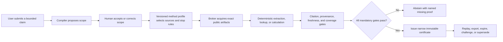

---
context_room:
  id: research.verification-engine.roadmap-decisions
  depends_on:
    - research.verification-engine.assurance-model
    - research.verification-engine.evidence-base
    - research.verification-engine.architecture
    - research.verification-engine.threat-model
    - research.verification-engine.verification-protocol
    - research.verification-engine.governance-workflows
    - research.verification-engine.operations-cost
    - research.verification-engine.evaluation-vertical-slice
status: active
document_type: research-proposal
---

# Verification engine roadmap and decision register

> **Authority:** active research proposal. This document authorizes further
> research and falsification only. It does not authorize production coding,
> public verification claims, data collection at scale, or a standalone launch.

## Summary

The current recommendation is a **conditional go** for a narrow, evidence-led
feasibility program and a **no-go for implementation today**. The proposed
engine should be treated as a scoped assurance and evidence-dossier system, not
as a machine that proves arbitrary statements true. Its first candidate
vertical is chosen from low-harm claims that can be closed over declared public
records: document attribution and version, membership in a declared complete
register, or deterministic calculation over retained inputs. All three appear
in the V0 falsification corpus; exactly one may become the MES.

The engine should be designed as a logically standalone bounded context, while
remaining in Parallax's research documentation until non-Parallax demand,
governance independence, and the cost of separation are demonstrated. The
physical repository split is therefore a later evidence-gated decision, not a
starting assumption.

Every phase below has a proof gate. Failure does not automatically invite more
engineering: it triggers a stop, a narrower product, a return to Parallax, or
abandonment. “Universal verification” is specifically falsifiable. The system
may retain a universal dossier envelope only if domain-specific method profiles
can share it without collapsing important distinctions into one truth score.

## Defines

This document owns:

- the conditional go/no-go recommendation;
- the adoption decision and the physical repository, service, team, and
  organizational boundary between a standalone engine and Parallax; the
  architecture owns the logical data/API responsibility contract;
- the V0/MES/pilot scope hierarchy and evidence-gated roadmap;
- the target documentation architecture for a future repository;
- build, adopt, adapt, and defer choices;
- the cross-cutting architecture and product decision register;
- prioritized open questions, owners, and next tests;
- kill, stop, and pivot criteria;
- external dependencies and assumptions; and
- the definition of “ready to code.”

## Does not define

This document does not define:

- an accepted product strategy, business model, budget, or launch date;
- implementation tasks, production schemas, APIs, infrastructure, or vendor
  contracts;
- a deployment-specific legal opinion, DPIA, security acceptance, or incident
  runbook;
- a universal scientific, medical, legal, financial, or electoral method;
- permission to process private allegations or publish high-harm conclusions;
- proof that the market needs a standalone product; or
- proof that any certificate is equivalent to truth.

Those responsibilities remain with the future accepted product, system,
operations, assurance, legal, and domain-method documents. The current
assurance boundary is defined in [assurance-model.md](./assurance-model.md), the
evidence in [evidence-base.md](./evidence-base.md), the proposed technical
structure in [architecture.md](./architecture.md), and the safety boundary in
[threat-model.md](./threat-model.md).

## Decision posture

### Recommendation now

| Decision | Recommendation | Why | Authority granted now |
| --- | --- | --- | --- |
| Continue researching the concept | **GO** | The dossier identifies a coherent bounded problem: reproducible claim scope, exact evidence, explicit methods, abstention, review, expiry, and correction. | Complete Phase 0 and the non-production work in Phase 1. |
| Build the production engine | **NO-GO** | Demand, first-profile validity, usable certificate semantics, reviewer economics, legal basis, and prospective error rates are not established. | None. “Ready to code” must be met first. |
| Claim 100% real-world truth verification | **NO-GO** | Open-world completeness, truthful sources, valid inference, future change, and unknown unknowns cannot be guaranteed. | None. Only named bounded machine properties may reach 100%. |
| Design a reusable engine boundary | **CONDITIONAL GO** | Claim/evidence/certificate lifecycle is meaningfully different from debate and position lifecycle. | Document logical boundaries and portable contracts; do not split infrastructure yet. |
| Create a standalone repository or company-facing product | **DEFER** | Separation has cost and there is no proven non-Parallax consumer yet. | Reassess after Phase 1 discovery and benchmark evidence. |
| Publish T2–T4 conclusions | **NO-GO** | Consequential and high-harm claims need domain, legal, safety, reviewer, and incident evidence that does not exist. | Research-only analysis under later approved governance. |

### Meaning of the conditional go

The go applies only while all of the following remain true:

1. the product promise says what was checked, by which method, against which
   evidence and time boundary, rather than “this is true”;
2. the first claim families remain within `T0 bounded-low-harm`;
3. every strong result is replayable from retained or lawfully re-acquirable
   inputs;
4. abstention is a first-class successful terminal run disposition with its
   own attestation, never an epistemic outcome or low-confidence certificate;
5. an evaluation compares the proposal with a simpler evidence-dossier and
   citation-audit baseline;
6. public presentation passes false-authority and wrong-label comprehension
   tests; and
7. any failed phase gate invokes the corresponding stop or pivot criterion.

## Standalone engine versus Parallax

### Current recommendation

Keep the research dossier in Parallax for now. Design the verification engine
as a **logical standalone bounded context with portable contracts**, but create
a separate repository only after the standalone triggers below are met.

This preserves the logical responsibility contract owned by the
[architecture](architecture.md#logical-data-and-api-boundary-with-parallax),
summarized here only to explain the adoption decision:

| Verification engine owns | Parallax owns |
| --- | --- |
| Claim identity, exact scope, evidence artifacts and uses, provenance, method profiles, evaluations, review, certificates, expiry, appeals, corrections, and replay. | Debates, positions, arguments, steelmanning, values, trade-offs, opinion journeys, social deliberation, and presentation of contested viewpoints. |

The integration contract should remain small: Parallax can submit a scoped
claim, receive an immutable certificate reference or unresolved status, show
the limits, and subscribe to expiry/correction events. Parallax must not grant
assurance through votes, camps, agreement, or argument quality.

### Triggers to create a standalone repository

A physical split becomes the preferred option only when all mandatory triggers
and at least one demand trigger are evidenced.

**Mandatory triggers**

- A stable domain boundary and versioned export/API contract survive at least
  two full benchmark iterations without depending on Parallax debate entities.
- Independent access control, retention, reviewer governance, audit, incident,
  and release responsibilities are demonstrably required.
- An export/import exercise reproduces the complete dossier, identifiers,
  relationships, hashes, applicable method, and certificate status without a
  Parallax database.
- The operational and security cost of a split is budgeted, owned, and lower
  than the expected risk of keeping the trust boundary inside Parallax.

**Demand triggers — at least one**

- Two materially different non-Parallax workflows need the same certificate
  contract and pass a prototype usefulness test.
- One external organization commits to a time-bounded pilot with its own claim
  intake and downstream consumption path.
- A public or internal API consumer demonstrates repeated use where debate
  context is absent and the simpler evidence-dossier baseline is insufficient.

### Triggers to keep or fold it into Parallax

- Parallax remains the only credible consumer after the discovery sample.
- More than half of useful cases require debate-specific context to define the
  claim or present the result.
- Users value evidence links and citation alignment but do not use the
  certificate lifecycle, method profile, replay, appeal, or monitoring.
- Separate operations materially increase cost or incident surface without
  improving independence, safety, interoperability, or adoption.
- The only viable product is “evidence assistance for a debate,” not a reusable
  assurance service.

### Trigger to abandon both standalone and embedded forms

Abandon the engine concept if a transparent, narrower evidence dossier cannot
outperform existing source-linking and human review on material error,
reproducibility, correction, or user decision quality at sustainable cost.

## First vertical slice

“First slice” is not one overloaded scope. The proposal uses three nested,
sequential scopes with different owners:

1. **V0 architecture-falsification corpus.** The
   [evaluation protocol](evaluation-and-vertical-slice.md#four-benchmark-tracks)
   owns this four-track corpus: bounded document attribution/version,
   complete-register lookup, deterministic calculation, and open-world-negative
   abstention. V0 exists to falsify shared semantics, invariants, time fields,
   replay, and abstention before implementation. It is not the product scope.
2. **Minimum executable slice (`MES`).** After product discovery, source audit,
   and V0 evidence are frozen, the roadmap selects **exactly one** of the three
   positive T0 families above. The MES implements only that family. A paired
   open-world-negative safety suite is mandatory to prove fail-closed
   abstention, but it is a test obligation rather than a second product family.
3. **Operational pilot scope.** Only after the MES passes does operations bind a
   pilot to exactly one source or register, one domain, one language, one
   jurisdiction, one user decision, and one foreseeable-use boundary. The pilot
   may narrow the MES; it cannot combine the other candidate families.

No document may call all three positive families “the first implementation.”
They remain candidates until the selection record identifies one and rejects or
defers the other two. This hierarchy is intentionally less ambitious than
general fact-checking. It exercises shared mechanics without pretending that
source authenticity proves the source's assertion true. C2PA makes the same
essential distinction for media provenance: valid provenance is not a value
judgment about factual truth
([C2PA explainer](https://spec.c2pa.org/specifications/specifications/2.2/explainer/Explainer.html)).

### MES selection rule

The Phase 1 decision record ranks the three positive T0 candidates and selects
one only if it has:

- a repeated user decision and a measured failure in the official-link or
  simple-dossier baseline;
- a defensible exact-artifact or closed-source boundary;
- lawful access, retention, quotation, and replay conditions;
- an independently adjudicable reference property and acceptable harm budget;
- feasible reviewer, support, refresh, and incident capacity; and
- measured willingness to pay or avoided cost capable of covering conservative
  p95 lifecycle cost after the predeclared minimum worthwhile effect is met.

If no candidate passes every gate, there is no MES. The project pivots to the
simple evidence-dossier/citation-audit baseline or stops; it does not combine
weak candidates to manufacture scope.

### Shared V0 flow envelope



### Included in V0 and required of the selected MES where applicable

- public, low-harm, non-personal records with documented access and retention;
- one frozen method profile for each V0 benchmark track, then one accepted
  positive-family profile for the MES;
- exact artifact/version capture or an explicit replay limitation;
- evidence-use locators and transformations;
- recorded positive and negative search paths;
- bounded local-closure statements for negative register results in that V0
  track, without carrying them into another family;
- deterministic certificate issuance and abstention;
- expiry, source-change monitoring, challenge, restriction, supersession, and
  export/replay paths; and
- the profile's human authority on every newly issued T0 case; and
- an independent sampled re-audit in addition to that per-case authority.

### Excluded from V0, the MES, and the pilot

- causal, predictive, normative, counterfactual, or interpretive claims;
- arbitrary Web search presented as complete;
- medical, legal, financial, safety, active-election, conflict, criminal,
  employment, credit, or eligibility uses;
- private persons, minors, protected attributes, allegations, leaks, secrets,
  or doxxing-risk material;
- scientific synthesis, media-authenticity verdicts, crowdsourced truth, and
  autonomous AI issuance; and
- green “verified” badges, global confidence scores, or unqualified truth
  labels.

### Baselines and proof set

The evaluation protocol owns the V0 corpus, sample design, and complete
comparator matrix. Before production code, it builds a versioned evaluation
pack containing:

- unambiguous in-scope positives and negatives;
- ambiguous and malformed claims that must be rejected or repaired;
- stale, superseded, deleted, inaccessible, and partially changed records;
- mirrors, syndication, circular citations, and duplicate origins;
- validly signed or official artifacts containing false assertions;
- typosquats, compromised-source simulations, schema-valid upstream lies, and
  parser/prompt-injection fixtures;
- wrong formula, unit, timezone, locale, rounding, and version cases;
- privacy/right-to-delete and restricted-retention cases; and
- challenge, correction, replay, key-rotation, restore, and projection-rebuild
  cases.

Its complete comparator matrix must include at least these three workflows
under the same cases and adjudication:

1. direct official-source lookup by a trained human;
2. a simple structured evidence dossier with no certificate engine; and
3. the proposed workflow.

The proposal advances only if it reduces material error or improves
reproducibility/correction enough to justify its added cost and authority risk.

## Evidence-gated roadmap

Dates are deliberately absent. Advancement depends on proof, not elapsed time.
Each phase produces a decision record and an updated residual-risk statement.

### Phase 0 — resolve the product and assurance contract

**Outcome:** an internally coherent, independently reviewable specification.

**Required artifacts**

- one-sentence product promise and explicit non-promise;
- accepted V0 four-track architecture-falsification corpus, MES selection rule,
  candidate-family exclusions, and harm exclusions;
- claim compiler grammar and semantic-change rules;
- T0 method profiles, closure rules, assurance dimensions, statuses, ceilings,
  abstention, expiry, and appeal rules;
- user and machine certificate wireframes;
- evaluation protocol, adjudication manual, baselines, minimum effects, harm
  budget, and sample-size rationale;
- legal/data-flow inventory and preliminary source-class review;
- security test plan for every non-bypassable invariant;
- cost model and reviewer operating model; and
- resolution of every P0 open question in this document.

**Advance only if** two independent expert reviews find no category error in
the promise or method, inter-reviewer claim-scope agreement meets the
predeclared target, the test corpus can measure false issuance and abstention,
and no T3/T4 path can reach public issuance.

**Otherwise:** narrow the claim family, downgrade the output to an evidence
dossier, or stop.

### Phase 1 — offline falsification and paper prototype

**Outcome:** evidence that the workflow is useful before engineering makes it
expensive to change.

**Allowed work:** manually executed protocols, schema examples, clickable or
paper certificate prototypes, synthetic/adversarial fixtures, and independent
blind review. No production ingestion, public claims, or automated issue.

**Required proof**

- prospective cases collected after the protocol is frozen;
- blinded comparison against both baselines;
- material-error, false-strong-issuance, abstention, time, cost, reviewer
  disagreement, correction, and comprehension results;
- explicit failure analysis by all four V0 benchmark tracks, source, language,
  and ambiguity;
- user tests that include deliberately incorrect labels, because experimental
  evidence shows users can follow inaccurate warnings
  ([wrong-label study](https://pubmed.ncbi.nlm.nih.gov/40263336/)); and
- evidence sufficient to apply every mandatory physical-split trigger and all
  three demand triggers, followed by an explicit decision to keep the
  capability embedded or to record that all mandatory triggers plus at least
  one demand trigger have passed.

**Advance only if** the locked success criteria are met without changing labels
or excluding difficult cases after seeing results, and the decision record
selects exactly one positive T0 family for the MES. The paired
open-world-negative suite remains mandatory but is not counted as a second
product family.

**Otherwise:** simplify to citation audit/evidence dossier, fold into Parallax,
or stop.

### Phase 2 — minimum executable vertical

**Entry condition:** every item in “Ready to code” is satisfied.

**Outcome:** one end-to-end, non-public implementation of the selected positive
T0 family that proves canonical state, exact artifacts, deterministic gates,
abstention, replay, correction, and recovery against its paired open-world-
negative safety suite.

**Scope constraints**

- single deployment, single region, and one deployed tenant; schemas retain the
  namespace/tenant fields required for portable identity and authorization, but
  Phase 2 does not expose or claim tested multi-tenant isolation;
- exactly one positive T0 family; no fallback to either deferred candidate;
- PostgreSQL canonical authority, content-addressed artifact storage, and
  disposable derived search projections;
- no native graph database, public transparency log, general semantic search,
  or autonomous model authority;
- one versioned API/export contract; and
- manually approved issuances used only for evaluation.

**Advance only if** invariant/property tests find zero impossible canonical
states in the declared transition campaign; every retained case replays to the
same canonical certificate bytes; mutation, deletion, reordering, stale-source,
and compromised-upstream tests fail closed; export/import preserves every
identifier, relation, digest, and status; and restore drills meet the approved
RPO/RTO.

**Otherwise:** repair the architecture only if product evidence remains valid;
do not widen scope to justify sunk cost.

### Phase 3 — closed T0 pilot

**Outcome:** prospective evidence from real users under a controlled, revocable
service contract.

**Required controls**

- exactly one source or register, one domain, one language, one jurisdiction,
  one user decision, and one foreseeable-use boundary selected after the MES;
- named operator, incident owner, method owner, data owner, reviewer owner, and
  appeal owner;
- source allowlist and lawful-use/retention decision per source class;
- manual release gate, sampled dual review, rapid restriction, and monitored
  correction delivery;
- published limitations, coverage, abstention, expiry, and service backlog;
- signed pilot terms forbidding high-harm downstream use; and
- independent audit sample and red-team cases mixed into normal work.

**Advance only if** prospective error and comprehension stay within the harm
budget, users act on scope/expiry rather than the badge alone, review and
operations costs fit the approved envelope, and incidents/appeals can actually
restrict and correct downstream use.

**Otherwise:** remain private, narrow the certificate, or terminate public
product plans.

### Phase 4 — limited T0 release and T1 research

**Outcome:** a narrow public T0 service with measured reliability, plus offline
research into one T1 profile.

**Requirements before public T0**

- successful repeated disaster-recovery and key-compromise exercises;
- external security review and deployment-specific privacy/legal review;
- public certificate status, issuer, method, scope, evidence, limits, expiry,
  correction history, and appeal route;
- downstream status-update contract with delivery receipts;
- public aggregate error, abstention, coverage, latency, reversal, and incident
  reporting; and
- no unresolved launch-blocking P0/P1 risk.

T1 remains human-reviewed research until a separate prospective evaluation
establishes a safe route. A stable official source does not by itself establish
interpretive or real-world truth.

### Phase 5 — additional domain profiles

**Outcome:** prove or reject the hypothesis that one dossier envelope can host
multiple domain methods.

Each profile requires its own domain owner, evidence hierarchy, search and stop
rules, reviewer qualifications, conflict policy, ceiling, calibration study,
expiry, harm analysis, legal review, gold/adjudicated test sets, and public
language. Scientific synthesis, for example, cannot inherit T0 controls: the
Cochrane workflow exposes duplicate extraction, risk-of-bias, search, and
update costs measured in months, not a generic Web lookup
([Cochrane Handbook](https://www.cochrane.org/authors/handbooks-and-manuals/handbook/current)).

**Advance only if** cross-profile reuse preserves every harm-critical
distinction and materially reduces work without forcing a universal score or
verdict vocabulary.

**Otherwise:** split domain products or retain only the shared provenance and
case-management substrate.

### Phase 6 — measured specialization and ecosystem features

Add a graph store, specialized vector service, external transparency witnesses,
multi-region operation, or public federation only when a locked workload proves
the current design fails a required capability or a specialized component
produces a material benefit after correctness, privacy, operations, and exit
costs are included.

Before measuring, the workload owner freezes queries/jobs, data volume,
fan-out/depth, concurrency, freshness, failure model, authorization cases,
correctness oracle, p95/p99 latency, availability, rebuild/restore window,
single-node resource ceiling, cost per workload, and maximum acceptable
operational complexity. Promotion is allowed only when the current design
misses a **required** SLO/correctness/recovery property at the approved maximum
vertical scale, scale-up is exhausted or more costly, and the specialized or
distributed candidate passes the same oracle while meeting the frozen target
with at least the preregistered material margin and a funded exit/restore drill.
No observed miss, no promotion.

Default decision rules to ratify before the test are:

- a native graph is considered only for named critical traversals after both
  relational and rebuildable graph-projection baselines fail;
- distributed compute is considered only when a bounded batch/stream workload
  cannot meet its deadline within the approved single-node resource/cost
  envelope, not because the data model “looks big”;
- multi-region canonical writes require a measured regional-failure RTO/RPO or
  jurisdictional need that a tested single-primary/restore topology cannot meet;
- a specialized vector service requires a prospective decisive-evidence recall
  gain at fixed false-selection harm plus tested deletion, isolation, replay,
  and provider exit; and
- any candidate that improves average latency while weakening authorization,
  deterministic rebuild, status freshness, or recovery is rejected.

The exact numeric SLOs and material margins are locked from the selected pilot
and harm/cost budget; inventing universal numbers before that workload exists
would be false precision.

No ecosystem feature may widen the assurance claim. RFC 9943 transparency can
make signed-statement registration and non-equivocation inspectable, but it
does not validate the semantics of an opaque statement
([RFC 9943](https://www.rfc-editor.org/rfc/rfc9943.html)).

## Target documentation architecture for a future repository

The future repository should be created only when the standalone triggers are
met. The tree below is a target ownership model, not an instruction to create
empty files. A document is added only when it has accepted or actively reviewed
content and one canonical owner.

```text
/
├── README.md
├── AGENTS.md
├── CONTRIBUTING.md
├── SECURITY.md
├── docs/
│   ├── INDEX.md
│   ├── product/
│   │   ├── charter.md
│   │   ├── users-and-jobs.md
│   │   ├── assurance-contract.md
│   │   ├── harm-tiers-and-exclusions.md
│   │   └── certificate-experience.md
│   ├── domain/
│   │   ├── claim-model.md
│   │   ├── evidence-and-provenance.md
│   │   ├── review-appeal-correction.md
│   │   └── method-profiles/
│   │       └── bounded-public-records.md
│   ├── system/
│   │   ├── architecture.md
│   │   ├── trust-boundaries.md
│   │   ├── canonical-data-model.md
│   │   ├── components.md
│   │   └── contracts/
│   │       ├── commands-and-events.md
│   │       ├── certificate-schema.md
│   │       └── export-and-interoperability.md
│   ├── assurance/
│   │   ├── requirements.md
│   │   ├── evaluation-plan.md
│   │   ├── benchmark-and-adjudication.md
│   │   ├── security-threat-model.md
│   │   ├── privacy-rights-and-retention.md
│   │   └── risk-register.md
│   ├── operations/
│   │   ├── deployment.md
│   │   ├── observability-and-slos.md
│   │   ├── backup-restore-and-rebuild.md
│   │   ├── incident-response.md
│   │   └── certificate-operations.md
│   └── lifecycle/
│       ├── ROADMAP.md
│       ├── decisions/
│       ├── proposals/
│       └── changes/
├── schemas/
├── tests/
└── tools/
```

### Documentation rules

1. `docs/INDEX.md` is navigation, not a second source of product or system
   truth.
2. Accepted current behavior and target proposals live separately. A proposal
   cannot silently describe planned behavior as implemented behavior.
3. Each stable concept has one canonical owner and a stable ID. Other documents
   link to it instead of copying its normative text.
4. `depends_on` lists only documents whose material change forces
   reconsideration of the dependent document.
5. Every method profile owns its applicability, evidence hierarchy, closure,
   reviewer qualifications, ceilings, abstention, expiry, and evaluation.
6. Every public contract has a human explanation, machine schema, examples,
   invalid examples, versioning rule, and compatibility policy.
7. Every consequential diagram has accompanying prose and is tested against
   the canonical text after changes.
8. Decision records include alternatives, mechanism, trade-offs, confidence,
   counter-hypothesis, falsifier, owner, and revisit trigger.
9. Generated reference material declares its source and generation command; it
   does not become the canonical owner.
10. Documentation readiness is part of each release gate, including changed
    limits, incidents, migrations, deprecations, and recovery procedures.

## Build, adopt, adapt, or defer

| Capability | Posture | Mechanism and rationale | Cost/risk boundary | Exit or proof gate |
| --- | --- | --- | --- | --- |
| Claim compiler and semantic identity | **Build** | Core domain value: convert natural claims into accepted scoped objects while detecting semantic changes. | High epistemic and UX cost; wrong scope invalidates everything downstream. | Human agreement and adversarial ambiguity tests must pass before automation expands. |
| Method profiles, ceilings, and abstention kernel | **Build** | These encode the product's actual assurance promise and claim-family limits. | Requires domain expertise and version governance. | No profile ships without independent method review and prospective evaluation. |
| Evidence-use, origin, independence, and conflict model | **Build** | Existing provenance standards do not supply the engine's evidentiary semantics. | Origin inference can create false independence. | Unknown stays unknown; measured lineage tests gate stronger claims. |
| Certificate, replay, expiry, appeal, and correction lifecycle | **Build** | This is the core trust contract and must remain inspectable and deterministic. | Authority UX, long-term compatibility, and correction duties. | Downgrade to an evidence dossier if users cannot understand or safely consume it. |
| Relational canonical store | **Adopt** | Use PostgreSQL transactions, constraints, ranges, row security where appropriate, backup, and recovery rather than inventing persistence. | Schema discipline and operational competence still required. | Replace only if a locked workload proves a required semantic or reliability gap. |
| Evidence object storage | **Adopt** | Use mature object storage with versioning/immutability options; bind bytes through content identifiers and manifests. | Retention, licensing, privacy, deletion, and regional controls are not solved by storage. | Maintain export, independent hashes, and provider-neutral manifests. |
| Cryptography, signing, timestamps, keys | **Adopt** | Use reviewed libraries, KMS/HSM, standard algorithms, and existing trust services. Never create cryptographic primitives. | Key compromise and external trust-root dependence remain. | Algorithm agility, offline recovery, scoped keys, and provider exit drill are mandatory. |
| Container/parser isolation | **Adopt and harden** | Use maintained sandbox/container primitives with deny-by-default network and bounded resources. | Parser zero-days and host escapes remain possible. | Adversarial parser corpus and independent security review gate each format. |
| W3C PROV-O | **Adapt for export** | Map canonical provenance to an interoperable model. PROV-O describes entities, activities, agents, and derivations, not truth ([PROV-O](https://www.w3.org/TR/prov-o/)). | Lossy mapping or accidental semantics inflation. | Round-trip is forbidden unless full canonical semantics are preserved. |
| JSON-LD and SHACL | **Adapt for export validation** | Provide linked-data packaging and declared shape conformance. | Shape-valid data may still be false or incomplete. | Public language must say “conformant to profile,” never “verified by SHACL.” |
| C2PA | **Adapt when present** | Validate and preserve media provenance assertions separately from factual support. | Credentials may be missing, removed, compromised, or attached to false content. | Absence remains unknown; validated provenance never raises epistemic status alone. |
| ClaimReview/MediaReview | **Adapt as lossy outbound adapters** | Support ecosystem discovery where useful. | They cannot represent the full evidence, method, uncertainty, or appeal contract. | Never import them as canonical certificates. |
| SCITT/Certificate Transparency patterns | **Defer, then adapt** | Add witnesses and non-equivocation only after internal issuance and privacy are proven. | Split views, key compromise, log monitoring cost, and metadata leakage. | Require a privacy model, independent monitor, and failure-recovery drill. |
| Lexical search | **Adopt** | Start with the canonical database's maintained full-text capabilities and deterministic filters. | Language quality and scale limits. | Specialize only after a measured locked corpus misses required SLO or recall. |
| Embeddings/vector retrieval | **Adopt as a derived candidate aid** | Useful for recall and deduplication; never canonical evidence or authority. | Drift, correlated error, privacy leakage, and false semantic matches. | Exact baseline, recall target, version pinning, rebuild, and deletion tests required. |
| Graph database | **Defer** | Relational facts plus derived graph views are sufficient until real traversals prove otherwise. | Premature dual-write, consistency, backup, and expertise cost. | Adopt only for an indispensable graph capability or at least a predeclared material gain on a locked workload. |
| Full event sourcing | **Do not adopt initially** | Keep canonical current state plus immutable transactional domain events/outbox. | Event-only reconstruction increases migration, privacy, and operational complexity. | Reconsider only if audit/reconstruction requirements cannot be met and the event model is demonstrably stable. |
| General LLM orchestration platform | **Adopt narrowly or build thin adapters** | Models propose decomposition, retrieval queries, extraction, and critique behind capability gates. | Provider drift, prompt injection, privacy, cost, and correlated failures. | Provider-neutral fixtures, raw-output capture, versioning, replay limitations, and a manual/degraded path. |
| “Truth score,” blockchain, or vote-based assurance | **Reject** | These collapse distinct uncertainty or add consensus/immutability without semantic validity. | False authority, capture, privacy, and irreversibility. | Reconsider only with independent prospective evidence that the exact mechanism improves material error beyond the underlying evidence and review. |

## Critical decision register

The confidence labels are research judgments, not probabilities. “Reversal
proof” means the evidence required to reopen the recommendation; it does not
mean one favorable anecdote.

### D01 — Product promise: scoped assurance, not truth certification

- **Options:** universal truth verdict; domain-specific fact-check verdict;
  scoped dossier/certificate; evidence dossier without certificate.
- **Mechanism:** bind every result to a claim scope, time boundary, method
  profile, evidence snapshot, assumptions, assurance vector, ceiling, and
  expiry.
- **Cost:** more complex product language, data model, and user education.
- **Risk and failure scenario:** users ignore scope and treat a polished result
  as timeless truth.
- **Recommendation:** scoped dossier/certificate, with the evidence-only format
  as the safe fallback. **Confidence: high.**
- **Non-reversible epistemic boundary:** no experiment can promote this system
  into a universal truth oracle. Evidence may justify a narrower bounded
  statement, a different presentation, or an empirically calibrated risk for a
  declared population; it cannot establish open-world completeness or remove
  the named trust assumptions.
- **Counter-hypothesis:** a simple binary verdict produces better decisions
  without material false-authority harm.
- **Reversal proof:** preregistered, independently replicated tests may justify
  a simpler *bounded presentation* if it improves correct decisions and
  correction uptake while staying inside the same false-label harm budget.
  They cannot authorize the universal-truth option.

### D02 — First implementation: choose one positive T0 family after V0

- **Options:** general Web fact-checking; scientific claims; news/politics;
  media authenticity; bounded public records.
- **Mechanism:** declare the complete source boundary or exact artifact, retain
  the snapshot, run deterministic extraction/calculation, and issue only the
  named bounded property.
- **Cost:** a smaller apparent market and less impressive demonstrations.
- **Risk and failure scenario:** the slice is technically safe but solves no
  meaningful user job.
- **Recommendation:** use attribution/version, complete-register lookup, and
  deterministic calculation as the three positive V0 candidates; after
  discovery and V0 falsification, select exactly one for the MES and pair it
  with the open-world-negative abstention suite. **Confidence: medium-high.**
- **Counter-hypothesis:** a higher-value domain justifies expert review and is
  the only viable entry wedge.
- **Reversal proof:** structured discovery plus prototype tests show no demand
  for T0 while one higher-value profile has qualified reviewers, lawful data,
  a measurable gold/adjudication process, and an acceptable prospective harm
  budget.

### D03 — Organizational boundary: logical standalone before physical split

- **Options:** embed entirely in Parallax; separate module in the same repo;
  standalone repository/service now; logical boundary with deferred split.
- **Mechanism:** define portable claim/certificate contracts and keep debate
  concepts outside the verification domain.
- **Cost:** temporary documentation and integration discipline without full
  operational isolation.
- **Risk and failure scenario:** the logical boundary becomes a permanent
  pseudo-service that inherits Parallax coupling.
- **Recommendation:** logical boundary now, physical split only on the stated
  triggers. **Confidence: medium-high.**
- **Counter-hypothesis:** immediate separation is required for trust,
  governance, and independent development.
- **Reversal proof:** all mandatory physical-split triggers pass and at least one
  demand trigger passes. A single pilot commitment can satisfy only the demand
  side; it cannot waive portability, governance, security, or cost evidence.

### D04 — Canonical persistence: relational authority

- **Options:** PostgreSQL; native property graph; RDF triple store; event store;
  polyglot authoritative stores.
- **Mechanism:** normalized immutable versions, foreign keys, exclusion/unique
  constraints, transactions, policy-version references, and an outbox.
- **Cost:** complex graph questions need derived views or recursive queries.
- **Risk and failure scenario:** relational modeling becomes contorted and
  hides provenance traversal errors.
- **Recommendation:** PostgreSQL as the only canonical authority initially.
  **Confidence: high.**
- **Counter-hypothesis:** provenance traversal is the dominant workload and a
  graph authority materially reduces correctness and operational risk.
- **Reversal proof:** a locked representative workload shows the relational
  design cannot meet a required query or invariant, while a graph design meets
  it with equivalent transactional, backup, privacy, and export guarantees.

### D05 — Artifact persistence: content-addressed evidence vault

- **Options:** URL references only; database blobs; mutable object paths;
  content-addressed versioned object storage.
- **Mechanism:** digest exact bytes, retain acquisition and transformation
  manifests, separate content identity from location, and enforce rights and
  retention per artifact version.
- **Cost:** storage, rights analysis, deletion/restriction complexity, and
  re-acquisition policy.
- **Risk and failure scenario:** immutable retention preserves unlawful or
  dangerous content, or a hash is mistaken for authenticity.
- **Recommendation:** content-addressed vault with purpose-specific retention,
  restricted tombstones, and explicit replay limitations. **Confidence: high.**
- **Counter-hypothesis:** lawful re-acquisition plus metadata is sufficient for
  most cases.
- **Reversal proof:** legal analysis and replay trials show bytes cannot or need
  not be retained while independent reproduction, citation fidelity, and
  correction remain reliable.

### D06 — History: current state plus transactional events

- **Options:** mutable audit columns; full event sourcing; immutable audit log
  beside mutable state; transactional state and domain events/outbox.
- **Mechanism:** commit state transition and typed event atomically; rebuild
  projections, not canonical truth, from the event stream.
- **Cost:** two representations must remain semantically aligned.
- **Risk and failure scenario:** an incomplete event taxonomy makes historical
  reconstruction or correction impact analysis unreliable.
- **Recommendation:** transactional current state plus immutable typed events;
  no full event sourcing initially. **Confidence: high.**
- **Counter-hypothesis:** only event sourcing can satisfy audit, bitemporal,
  and reconstruction requirements.
- **Reversal proof:** a formal reconstruction exercise exposes material history
  that cannot be represented or recovered under the proposed event contract.

### D07 — Graph capability: derived projection

- **Options:** no graph; recursive relational queries; derived graph projection;
  graph as canonical source.
- **Mechanism:** publish versioned nodes/edges from the outbox, expose projection
  lag, and reconstitute the graph from canonical data.
- **Cost:** eventual consistency and a projection pipeline.
- **Risk and failure scenario:** users read stale graph results as current or
  the projection silently omits an origin link.
- **Recommendation:** relational queries first, derived graph only after a real
  traversal need. **Confidence: medium-high.**
- **Counter-hypothesis:** deep lineage and impact analysis are core from day one
  and require a native graph.
- **Reversal proof:** representative depth/fan-out workloads fail the approved
  SLO or correctness tests, and a graph projection/engine demonstrably solves
  them with reliable rebuild and no authority ambiguity.

### D08 — Semantic retrieval: proposal-only derived index

- **Options:** no vector search; local database vectors; specialized vector
  service; model-only search.
- **Mechanism:** use embeddings only for candidate discovery, deduplication, and
  reviewer assistance; persist model/version/query/candidates and verify every
  selected evidence use against exact bytes.
- **Cost:** evaluation, index rebuild, privacy, provider/version drift, and
  additional false candidates.
- **Risk and failure scenario:** a semantically plausible match becomes
  evidence without direct support.
- **Recommendation:** defer until lexical/structured baselines are measured;
  then use a derived, non-authoritative index. **Confidence: high.**
- **Counter-hypothesis:** semantic retrieval is necessary for acceptable recall
  even in the selected MES family.
- **Reversal proof:** a frozen corpus shows a substantial decisive-evidence
  recall gain at fixed false-selection cost, with exact replay and deletion.

### D09 — AI authority: proposals only

- **Options:** autonomous issue; model majority vote; model proposes and human
  approves; model proposes under deterministic/human gates; no model.
- **Mechanism:** capability-limited adapters emit typed proposals; the canonical
  write and issuance kernels independently validate permissions and gates.
- **Cost:** lower automation ceiling, workflow friction, and evaluation of each
  model boundary.
- **Risk and failure scenario:** reviewers rubber-stamp fluent output or a model
  exploits tools through indirect prompt injection.
- **Recommendation:** use AI broadly for reversible assistance but never as
  certificate authority. **Confidence: high.**
- **Counter-hypothesis:** a narrow model/tool pipeline can safely issue T0
  certificates without human release.
- **Reversal proof:** prospective temporal trials and independent adversarial
  audits meet the predeclared false-issue harm budget, including distribution
  shift and prompt-injection tests, without reviewer rescue.

### D10 — Human review: qualified, independent, and measured

- **Options:** no review; single generalist; crowd consensus; qualified single
  review; duplicate review/adjudication by tier.
- **Mechanism:** role and qualification checks, conflict disclosure, blinded or
  independent assignment, disagreement capture, calibration, and random audit.
- **Cost:** latency, wages, recruitment, scheduling, and residual variability.
- **Risk and failure scenario:** review becomes expensive theater, captured by
  one institution, or less accurate than the deterministic route.
- **Recommendation:** in V0, the MES and the first pilot, every newly issued T0
  case receives the claim-family human authority named by its profile;
  independent random re-audit is an additional sampled control. Review is
  mandatory above T0, with duplicate/adjudicated review where the profile
  requires it. A later profile may remove a per-case T0 judgment only after the
  exact judgment has been replaced by a deterministic machine predicate,
  prospective trials meet the original harm budget without reviewer rescue,
  independent adversarial audit passes, and policy governance signs a new major
  profile. **Confidence: medium-high.**
- **Counter-hypothesis:** trained humans do not improve material error enough to
  justify their cost, or a precisely defined T0 judgment can be safely encoded
  as a deterministic predicate after promotion.
- **Reversal proof:** randomized or blinded comparisons show no improvement in
  safety or correction at comparable throughput, and the replacement predicate
  independently passes the same prospective harm, drift, ambiguity and
  adversarial gates. Until then the response is to narrow or stop the tier, not
  silently automate it.

### D11 — Method architecture: shared envelope, domain-owned profiles

- **Options:** one universal method; entirely separate products; shared dossier
  plus domain profiles; free-form reviewer judgment.
- **Mechanism:** a common provenance/case/certificate envelope delegates source
  hierarchy, closure, inference, qualifications, ceilings, expiry, and
  validation to versioned profiles.
- **Cost:** governance and compatibility across profiles.
- **Risk and failure scenario:** the shared vocabulary erases domain-critical
  distinctions and falsely suggests comparability.
- **Recommendation:** shared envelope with strict profile ownership; abandon
  universal verdict semantics. **Confidence: medium-high.**
- **Counter-hypothesis:** even the envelope is too generic to reuse safely.
- **Reversal proof:** two independently designed profiles cannot map their
  evidence, review, status, correction, and expiry without information loss or
  unsafe optional fields.

### D12 — Assurance output: vector plus ceiling, not scalar score

- **Options:** binary label; universal percentage; ordinal star rating;
  dimension vector with public status/ceiling; narrative only.
- **Mechanism:** record independent dimensions, missing requirements, method
  ceiling, abstention reason, and a profile-specific public status.
- **Cost:** explanation and downstream integration are harder than one number.
- **Risk and failure scenario:** consumers construct their own misleading
  scalar or cherry-pick strong dimensions.
- **Recommendation:** dimension vector and bounded public status; no universal
  confidence number. **Confidence: high.**
- **Non-reversible epistemic boundary:** a scalar can only describe a named,
  prospectively validated event rate or decision model in one declared
  population. It can never be a probability that arbitrary claims are true or
  make incomparable claim families commensurable.
- **Counter-hypothesis:** calibrated probabilities improve decisions and can be
  honestly compared across claim families.
- **Reversal proof:** prospective calibration may justify exposing a separate
  bounded reliability statistic when it remains stable under the declared
  shifts, users interpret it correctly, and it improves decisions without
  hiding incomparable uncertainty. No result reverses the ban on a universal
  truth percentage or scalar aggregation across incompatible dimensions.

### D13 — Search assurance: executed bounded protocol, not completeness

- **Options:** top search results; reviewer discretion; fixed source allowlist;
  versioned search/counterevidence plan with coverage reporting.
- **Mechanism:** predeclare queries, sources, dates, inclusion/exclusion, adverse
  routes, stop rules, candidate ledger, selection reasons, and known gaps.
- **Cost:** time, storage, search-provider dependence, and possible procedural
  theater.
- **Risk and failure scenario:** a perfectly logged weak search creates false
  confidence while decisive material remains undiscovered.
- **Recommendation:** guarantee protocol execution only; never guarantee Web
  completeness. **Confidence: high.**
- **Counter-hypothesis:** a simpler primary-source-first search performs just as
  well for the chosen T0 vertical.
- **Reversal proof:** blinded trials show the expanded protocol adds no
  decisive-evidence recall, error reduction, or audit value at sustainable
  cost; simplify the profile.

### D14 — Independence: origin/control lineage, not URL count

- **Options:** count sources; publisher-level deduplication; origin graph;
  manual judgment only.
- **Mechanism:** link publication, observation/data origin, ownership, funding,
  citation, transformation, and uncertainty; cluster common lineages before
  calculating coverage.
- **Cost:** incomplete metadata, entity resolution, disputes, and specialist
  review.
- **Risk and failure scenario:** hidden common origins create false
  corroboration or aggressive clustering erases legitimate independence.
- **Recommendation:** origin/control graph with `unknown` as a first-class
  result. **Confidence: high on principle, medium on automation.**
- **Counter-hypothesis:** publisher-level deduplication is sufficient for T0.
- **Reversal proof:** prospective cases show deeper lineage work does not alter
  any material assurance decision, while its cost or false merges are harmful.

### D15 — Transparency: internal first, external witnessing later

- **Options:** private audit only; public full evidence log; public certificate
  transparency; selective third-party witnessing; blockchain.
- **Mechanism:** immutable internal events first; later commit minimal salted or
  batched certificate statements to independent append-only witnesses with
  monitors and consistency checks.
- **Cost:** privacy design, key operations, witnesses, monitoring, and recovery.
- **Risk and failure scenario:** public commitments leak sensitive claims or a
  split view appears trustworthy because nobody monitors it.
- **Recommendation:** defer external transparency until issuance and privacy
  are proven; never log source content by default. **Confidence: high.**
- **Counter-hypothesis:** public witnessing is required at first launch to
  constrain operator capture.
- **Reversal proof:** threat/privacy analysis shows a minimal safe commitment,
  an independent monitor exists, and user/institutional trust materially
  depends on it.

### D16 — Retention and rights: policy per artifact and purpose

- **Options:** retain everything forever; retain metadata only; delete on fixed
  age; policy by purpose, source rights, sensitivity, and legal need.
- **Mechanism:** record access, terms, rights reservation, purpose, permitted
  transformations, public excerpt, audit access, retention, restriction,
  deletion, and minimal tombstone behavior.
- **Cost:** policy engine, legal review, selective deletion, reindexing, and
  incomplete replay.
- **Risk and failure scenario:** permanent auditability violates rights or
  deletion destroys the ability to explain a certificate.
- **Recommendation:** purpose-specific retention with explicit replay limits
  and restricted tombstones. **Confidence: high.**
- **Counter-hypothesis:** full immutable retention is necessary and lawful for a
  narrow public-record class.
- **Reversal proof:** deployment counsel, safety review, and data-subject
  analysis approve the exact class and show a material audit benefit that
  cannot be achieved through minimized records.

### D17 — Community role: discovery and objection, never truth authority

- **Options:** no community; open voting; bridging consensus; moderated
  discovery/objection; community-selected experts.
- **Mechanism:** accept candidate claims, missing evidence, wording challenges,
  and appeals; rate-limit and cluster coordination; route merit through the
  applicable evidence and review method.
- **Cost:** moderation, Sybil defense, fairness analysis, and appeal load.
- **Risk and failure scenario:** coordinated participation suppresses polarizing
  evidence or creates legitimacy without coverage. Recent Community Notes
  research reports systematic undermoderation of polarizing content
  ([Bouchaud et al.](https://pmc.ncbi.nlm.nih.gov/articles/PMC13322233/)).
- **Recommendation:** community input may alter the queue or open an objection,
  not assurance status. **Confidence: high.**
- **Counter-hypothesis:** a robust crowd mechanism adds independent calibrated
  epistemic information.
- **Reversal proof:** preregistered cross-cultural adversarial evaluation shows
  improvement beyond underlying evidence, with resistance to Sybil, selection,
  polarization, and expert-disagreement failures.

### D18 — Interoperability: lossless canonical package plus lossy adapters

- **Options:** proprietary API only; standards-only canonical model; canonical
  package with adapters; direct database access.
- **Mechanism:** versioned JSON/schema and artifact manifest as the lossless
  contract; PROV-O/JSON-LD, SHACL, C2PA, ClaimReview, and later SCITT adapters
  expose only their supported properties.
- **Cost:** compatibility testing and semantic mapping maintenance.
- **Risk and failure scenario:** a lossy standard export is later imported as
  if it were the complete certificate.
- **Recommendation:** own a lossless canonical export and label every adapter's
  losses. **Confidence: high.**
- **Counter-hypothesis:** adopting one standard as canonical creates enough
  ecosystem value to outweigh missing semantics.
- **Reversal proof:** a mature standard covers claim scope, exact evidence use,
  origin, method, assurance vector, review, expiry, appeal, and correction with
  enforceable compatibility and active implementations.

### D19 — Harm boundary: T3/T4 excluded from initial public product

- **Options:** one workflow for all claims; warning-only high-harm support;
  specialist private support; exclude high-harm public issue.
- **Mechanism:** classify both content and foreseeable use, inherit the higher
  tier from downstream context, and fail closed before acquisition/publication.
- **Cost:** excludes prominent use cases and requires classification and appeal.
- **Risk and failure scenario:** a seemingly low-risk fact is used in medicine,
  policing, employment, credit, or elections and inherits high harm unnoticed.
- **Recommendation:** exclude T3 public issue and refuse T4; allow only later
  governed research/private support. **Confidence: high.**
- **Counter-hypothesis:** one narrow high-harm profile can be safer and more
  valuable than T0.
- **Reversal proof:** independent domain, legal, safety, and user review plus a
  prospective study meets the explicit harm, reviewer, incident, appeal, and
  comprehension budgets.

### D20 — Reliability target: recoverable canonical core, rebuildable projections

- **Options:** best-effort research service; conventional SaaS targets;
  zero-data-loss multi-region; tiered RPO/RTO with fail-closed issuance.
- **Mechanism:** transactional backups and point-in-time recovery for canonical
  data, versioned object storage, off-site copies, isolated keys, outbox replay,
  and deterministic projection rebuild.
- **Cost:** storage, drills, operational ownership, regional duplication, and
  recovery complexity.
- **Risk and failure scenario:** metadata and artifacts recover to different
  points, or availability pressure bypasses issuance gates.
- **Recommendation:** define and test modest pilot RPO/RTO before code; require
  fail-closed/read-only service when consistency is uncertain. **Confidence:
  high.**
- **Counter-hypothesis:** a low-cost best-effort service is sufficient until
  demand is proven.
- **Reversal proof:** the pilot is explicitly non-authoritative, users accept
  unrecoverable cases, and loss cannot create a misleading current status. A
  public certificate service cannot use this exception.

## Prioritized open questions

`P0` blocks “ready to code.” `P1` blocks a closed pilot or materially shapes the
architecture. `P2` blocks later expansion. Owners are accountable roles, not
necessarily existing team members.

| ID | Priority | Open question | Owner | Next test or decision artifact |
| --- | --- | --- | --- | --- |
| Q01 | P0 | What exact user decision improves after seeing a bounded certificate rather than an official link? | Product lead | Interview and task-test at least three user segments with both formats; record changed decisions and failure modes. |
| Q02 | P0 | Which one positive T0 family has enough repeated value to become the MES? | Product + commercial discovery | Rank the three V0 candidates by frequency, consequence, current time/cost, alternatives, willingness to pay or measured avoided cost, and ability to exceed the frozen minimum worthwhile effect; select one or pivot. |
| Q03 | P0 | Can the source boundary legitimately be called complete for negative register claims? | Domain-method lead | Select candidate registers; document owner guarantees, update cadence, omissions, access, snapshots, and adversarial counterexamples. |
| Q04 | P0 | What semantic fields are necessary and sufficient to make a claim stable? | Epistemic lead | Double-annotate ambiguous cases; publish disagreement taxonomy and claim-change tests. |
| Q05 | P0 | What exact statuses and language do users understand without inferring universal truth? | UX research + epistemic lead | Prototype comprehension study including wrong, stale, expired, and abstained certificates. |
| Q06 | P0 | What false-strong-issuance harm budget is acceptable for the selected MES family? | Product risk owner | Predeclare severity-weighted error taxonomy, sample-size rationale, stop threshold, and escalation owner. |
| Q07 | P0 | What minimum improvement over official-source lookup and a simple dossier justifies the engine? | Research/evaluation lead | Freeze baselines and minimum worthwhile effect before collecting prospective cases. |
| Q08 | P0 | Can an independent adjudication set be created without assuming the source is truthful? | Research + domain-method leads | Build a multi-layer gold set separating attribution, register state, calculation, and source assertion truth. |
| Q09 | P0 | Which evidence and metadata may lawfully be accessed, retained, quoted, redistributed, and deleted? | Deployment counsel/privacy lead | Produce source-class matrix, purpose record, controller/processor assessment, lawful-basis candidates, and retention decision. |
| Q10 | P0 | Which threat controls are required before any untrusted URL or file is processed? | Security lead | Turn every high-severity threat into an executable test, owner, alarm, and recovery gate. |
| Q11 | P0 | Who is qualified and independent enough to audit T0 cases, and at what cost? | Reviewer-operations lead | Qualification rubric, conflict model, capacity sample, paid time study, and disagreement calibration. |
| Q12 | P0 | What certificate fields and canonicalization yield deterministic replay across versions? | Data architect + assurance lead | Write schema examples, canonical-byte rules, golden fixtures, and upgrade/invalid-case tests. |
| Q13 | P0 | What are the accepted RPO, RTO, artifact durability, and consistency objectives for a non-public pilot? | SRE + product risk owner | Business-impact analysis and two tabletop restore scenarios; approve costs and stop behavior. |
| Q14 | P0 | Who can issue, restrict, withdraw, supersede, and adjudicate, with which separation of duties? | Governance + security leads | RACI, policy state machine, conflict cases, emergency route, and two-person-control tests. |
| Q15 | P0 | What makes the product standalone rather than a Parallax capability? | Product lead | Apply the mandatory/demand triggers to discovery evidence and record a binding boundary decision. |
| Q16 | P1 | How accurately can origin/control independence be inferred for the chosen sources? | Evidence/provenance lead | Labeled syndication, mirror, ownership, dataset, and hidden-origin corpus; measure false independence and false merge. |
| Q17 | P1 | Does explicit counterevidence search improve T0 decisions enough to justify cost? | Research lead | Randomized paired workflow on prospective cases with decisive-evidence recall and time/cost measures. |
| Q18 | P1 | How will unavailable, changed, removed, paywalled, or legally non-retainable evidence affect replay? | Legal + architecture leads | Exercise each condition and specify certificate downgrade, expiry, restricted audit, and notice behavior. |
| Q19 | P1 | Can users and API consumers act correctly on expiry, restriction, and supersession? | UX + API leads | End-to-end status-change simulation with delivery/acknowledgment receipts and downstream state inspection. |
| Q20 | P1 | What model tasks, if any, improve throughput without increasing material error? | ML evaluation lead | Stage-wise ablation against no-model baseline; include prompt injection, drift, correlated output, and provider outage. |
| Q21 | P1 | Which lexical and structured retrieval baseline is sufficient before embeddings? | Search lead | Locked multilingual candidate corpus; measure recall, precision, latency, cost, and missed decisive evidence. |
| Q22 | P1 | When does a graph projection become necessary? | Data architect | Record real traversal queries and fan-out; benchmark relational recursive queries and projection rebuild before selecting a graph. |
| Q23 | P1 | What appeal standing, evidence, SLA, remedy, and urgent-restriction rules are fair? | Governance + legal leads | Tabletop claimant, source, data-subject, reviewer-conflict, and downstream-harm cases with independent adjudicators. |
| Q24 | P1 | Can correction notices reach and alter downstream decisions? | Product/API lead | Pilot subscriptions, forced supersession, delivery receipts, acknowledgment, and stale-cache detection. |
| Q25 | P1 | Is the public certificate more harmful than a plain evidence dossier when it is wrong? | Safety/UX research lead | Preregistered wrong-label experiment comparing badge, vector certificate, narrative dossier, and no intervention. |
| Q26 | P1 | What is the sustainable per-case cost and capacity under normal and adversarial load? | Finance + reviewer ops + SRE | Instrument manual pilot; model 10x/100x intake, duplicate floods, appeals, expert scarcity, and degraded service. |
| Q27 | P1 | How are policy/profile changes reviewed without rewriting historical conclusions? | Assurance governance lead | Version and migration scenarios; require old replay, new applicability analysis, and explicit recertification rules. |
| Q28 | P2 | Can one assurance envelope serve two domain profiles without false comparability? | Epistemic council | Independently design a second profile, map it losslessly, and run cross-profile comprehension tests. |
| Q29 | P2 | Is external transparency worth its privacy, key, witness, and monitoring cost? | Governance + privacy + security leads | Threat model a minimal commitment; prototype independent monitor and split-view/key-compromise recovery. |
| Q30 | P2 | Which language, jurisdiction, and accessibility expansion is safe next? | Product + localization + legal leads | Replicate claim-scope, source-boundary, user-comprehension, and rights evaluation in the candidate context. |

## Kill, stop, and pivot criteria

These thresholds are proposal defaults. Phase 0 must either ratify them or
replace them before evaluation begins; they cannot be loosened after results are
seen without starting a new preregistered evaluation.

| ID | Criterion and observable trigger | Required action | Evidence required to resume or reverse |
| --- | --- | --- | --- |
| K01 | **Universal verdict failure:** two approved profiles require incompatible meanings for the same public status or score, and mapping them loses a harm-critical distinction. | Kill the universal verdict/score. Pivot to profile-specific statuses over a shared technical envelope, or split products. | Independent semantic review shows a lossless mapping and users do not infer comparability. |
| K02 | **Universal envelope failure:** a second profile cannot represent evidence, review, appeal, expiry, and correction without unsafe optional fields or domain logic in the core. | Stop cross-domain expansion. Keep only reusable provenance/case primitives or separate repositories. | Two independent profiles round-trip losslessly and pass domain-owner review. |
| K03 | **Physical-split gate failure:** any mandatory repository-split trigger remains unproved, or none of the three demand triggers is evidenced after the approved discovery and portability exercises. | Do not create a standalone repository/service; keep the bounded context inside Parallax, fold the useful subset into Parallax, or stop. One user or pilot cannot waive a mandatory trigger. | All mandatory split triggers and at least one demand trigger pass in one recorded decision. |
| K04 | **No advantage over simple dossier:** the proposed workflow does not meet the predeclared minimum improvement in material error, reproducibility, correction, or user decisions over a structured evidence dossier. | Kill certificate-engine development; retain the simpler dossier/citation-audit tool if useful. | A new mechanism, tested prospectively against the same baseline, crosses the locked minimum effect. |
| K05 | **False strong issuance:** any known adversarial or ambiguous test case reaches a strong status contrary to the frozen method, or prospective error exceeds the approved severity-weighted harm budget. | Stop issuance immediately, restrict affected certificates, perform root-cause analysis, and narrow/kill the subtype. | Independent rerun on fresh cases and the full regression suite meets the original budget. |
| K06 | **Unsafe abstention behavior:** the system silently converts missing evidence, overload, timeout, provider failure, or reviewer absence into support; or users consistently read abstention as confirmation. | Stop the affected path and public presentation. | State-machine proof plus comprehension tests show unresolved states remain visibly unresolved. |
| K07 | **Claim-scope instability:** independent trained annotators cannot reach the Phase 0 agreement target, or material semantic changes routinely appear as revisions of the same claim. | Pivot to narrower structured inputs, mandatory author confirmation, or abandon the subtype. | Fresh ambiguous cases meet the locked agreement and semantic-identity tests. |
| K08 | **Closure failure:** the selected register cannot support a defensible complete snapshot, so absence is indistinguishable from access/update failure. | Ban negative certificates for that source; issue only positive attribution or a non-conclusive dossier. | Source owner guarantees plus independent completeness/audit evidence establish bounded closure. |
| K09 | **Origin-independence failure:** known syndicated or common-origin fixtures are repeatedly counted as independent, or hidden origin changes strong statuses beyond the harm budget. | Remove independence-based strength, require manual lineage review, or narrow sources. | A fresh labeled corpus meets the predeclared false-independence threshold and passes adversarial cases. |
| K10 | **Reviewer infeasibility:** qualified independent review cannot meet the approved cost, time, availability, conflict, or agreement thresholds. | Do not automate around the missing control. Narrow to deterministic T0, change service expectations, or kill the tier. | A staffed, paid, calibrated reviewer pool meets the locked operating thresholds prospectively. |
| K11 | **False-authority UX:** users make materially worse decisions from an incorrect certificate than from the simple dossier/no-label controls, or fail the approved scope/expiry comprehension threshold. | Remove the badge/status, restrict public use, and revert to evidence presentation. | Redesigned presentation passes a fresh preregistered harm and comprehension study. |
| K12 | **Rights or privacy infeasibility:** lawful access, retention, public explanation, deletion, source protection, or data-subject rights cannot coexist for the chosen source class. | Stop ingesting/publishing that class; minimize or delete as required; redesign or abandon it. | Deployment counsel and privacy/safety review approve a proportionate data flow that survives deletion/replay exercises. |
| K13 | **Security boundary failure:** untrusted content, a provider, parser, projection, public API, or one privileged actor can directly issue or alter a certificate; or red-team tests achieve unauthorized action/exfiltration. | Stop the affected capability and issuance; preserve evidence and treat as an incident. | Independent retest proves containment, rotation/recovery, impact replay, and closure of the authority path. |
| K14 | **Correction propagation failure:** material supersession/restriction cannot reach known consumers, or stale results continue to be presented as current beyond the approved window. | Narrow the distribution promise, disable unsupported consumers, or stop public certificates. | End-to-end drills demonstrate delivery, acknowledgment/state change, stale-cache detection, and residual-gap disclosure. |
| K15 | **Reproducibility failure:** retained cases cannot regenerate the same canonical result under the frozen inputs/method, or a replay depends on an undocumented model/provider state. | Downgrade affected output to non-reproducible evidence notes and stop deterministic-certificate claims. | Golden and independent replay on fresh infrastructure produce the approved canonical equivalence. |
| K16 | **Recovery or cost failure:** restore drills miss approved RPO/RTO, artifact/metadata points diverge, projections cannot rebuild, or sustainable cost exceeds the approved value envelope. | Remain non-public, reduce scope/availability, change adopted services, or stop. | Two consecutive independent drills and an updated cost model meet the original targets. |
| K17 | **Governance capture:** one actor can alter policy/evidence and issue, conflicts are undisclosed, objections are systematically suppressed, or audit sampling shows targeted inconsistency. | Suspend issuance, rotate authority, independently re-review the affected cohort, and disclose impact. | Separation-of-duty tests, independent audit, governance remediation, and fresh sampling restore the approved control level. |
| K18 | **Scope creep into T3/T4:** a pilot consumer uses T0 output for medicine, law, finance, safety, elections, policing, employment, credit, eligibility, or private allegations. | Terminate or restrict the integration and affected certificates; reassess foreseeable-use controls. | Specialist/legal/safety approval and a separate high-harm program satisfy D19 reversal proof. |

## Assumptions to validate

| Assumption | Why it matters | Current confidence | Validation route |
| --- | --- | --- | --- |
| A bounded public-record workflow has recurring user value beyond a link. | Without it, the safest vertical is not a product. | Low-medium | Q01–Q02 discovery and baseline comparison. |
| At least one register exposes a defensible complete versioned snapshot. | Negative lookup needs local closure. | Medium | Q03 source audit and failure injection. |
| Users can understand scope, time, limits, and expiry. | Otherwise certificates amplify authority rather than judgment. | Low-medium | Q05/Q25 comprehension and wrong-label studies. |
| A common dossier envelope can serve more than T0. | This is the architectural basis for an engine rather than one tool. | Medium-low | Q28 second-profile exercise. |
| Exact evidence bytes or adequate replay metadata can be lawfully retained. | Reproducibility and correction depend on it. | Medium-low | Q09/Q18 legal and technical exercises. |
| Human audit improves T0 safety enough to justify cost. | Sample review is part of the initial control design. | Medium | Q11 randomized/blinded audit study. |
| Source-origin clustering can avoid the worst false independence. | Apparent corroboration is otherwise misleading. | Medium-low | Q16 labeled lineage corpus. |
| Downstream consumers will process expiry and corrections. | A stale certificate can be more harmful than no certificate. | Low | Q19/Q24 integration drills. |
| PostgreSQL plus derived projections meets early workloads. | This keeps the authoritative architecture simple. | Medium-high | Locked query/load/rebuild benchmark. |
| Provider-neutral model assistance is feasible. | Models may improve throughput but must remain replaceable. | Medium | Q20 stage-wise ablation and outage/replay tests. |
| The organization can sustain independent governance. | Technical assurance is insufficient under capture. | Low-medium | Q14 operating model and external audit design. |
| Public metrics can expose error and coverage without creating gaming or privacy harm. | Accountability needs more than success stories. | Medium-low | Threat analysis and pilot publication rehearsal. |

## External dependencies and containment

| Dependency | Needed property | Failure mode | Containment and exit strategy | Proof before reliance |
| --- | --- | --- | --- | --- |
| Public registers/publishers | Stable identity, version/freshness semantics, lawful access, documented completeness where claimed | Omission, silent correction, outage, compromised official endpoint, restrictive terms | Multiple acquisition routes where lawful; retained snapshots; source-specific ceilings; positive-only fallback; no automatic opposite conclusion | Source audit, change/outage simulation, terms snapshot, owner confirmation when available |
| Web/search providers | Candidate discovery and counterevidence routes | Rank manipulation, incomplete results, API drift, cost/outage, query leakage | Multiple routes, query/candidate ledger, primary-source connectors, local corpus, no completeness claim | Cross-provider divergence test and provider outage route |
| Archive services | Historical snapshots | Missing pages, legal removal, wrong capture time, availability | Internal lawful snapshot where permitted, multiple archives, explicit replay limitation | Timestamp/content comparison and unavailable-archive test |
| Model providers | Typed assistance with version and data controls | Drift, correlated errors, prompt injection, retention, outage, price change | Thin provider adapters, no secrets, proposal-only authority, local/manual route, raw output and version record | Data terms, adversarial suite, ablation, outage and provider-switch test |
| Identity/credential providers | Reviewer and operator authentication/qualification evidence | Compromise, false credential, exclusion, privacy leakage | Proportional assurance, multiple issuers, independent qualification checks, emergency revoke | Credential validation/revocation and impersonation exercises |
| Object-storage provider | Durable versioned evidence with access controls | Region outage, accidental deletion, lock-in, inconsistent restore | Provider-neutral manifest, off-site copy, independent hashes, export, key separation | Restore, deletion, corruption, and provider-exit drills |
| KMS/HSM/signing/timestamp services | Protected keys, auditable use, rotation, historical verification | Key theft/loss, trust-root compromise, vendor outage | Scoped short-lived keys, offline root/recovery, algorithm agility, multiple witnesses at later tier | Rotation, compromise interval, revocation, reissue, and disaster exercises |
| Reviewer/expert network | Competence, independence, availability, fair compensation | Scarcity, collusion, capture, inconsistent judgment, burnout | Tier limits, calibration, random audit, conflict rules, published backlog, no timeout-to-support | Paid prospective capacity and agreement study |
| Legal/privacy counsel | Deployment-specific interpretation | Late discovery that access, retention, publication, or profiling is unlawful | Source-class gate before scale; minimization; jurisdiction limits; deletion/restriction paths | Written assessment of actual data flow and terms; DPIA where required |
| Standards/ecosystem owners | Stable interoperability profiles | Version drift, deprecation, semantic mismatch | Version-pin adapters, conformance fixtures, loss labels, canonical internal package | Compatibility matrix and upgrade/rollback tests |
| Independent auditors/witnesses | External challenge to operator claims | Conflicts, shallow compliance, collusion, unavailable monitoring | Rotate/select transparently, publish scope and exceptions, multiple witnesses only where justified | Audit protocol, access, sampling, conflict disclosure, and failure drill |

## Definition of ready to code

“Ready to code” means ready to implement **only the MES in Phase 2**: exactly
one selected positive T0 family plus its paired open-world-negative safety
suite. It does not mean ready for public release, T1–T4 claims, general Web
verification, an operational pilot, or a standalone repository.

All items below are mandatory:

### Product and scope

- [ ] One accepted product promise and non-promise use no unqualified truth,
  certainty, or permanence language.
- [ ] V0 has evaluated all four architecture-falsification tracks, and its
  failures have been resolved or explicitly accepted within the MES ceiling.
- [ ] Exactly one positive T0 family, user, decision, source class, language,
  jurisdiction, and foreseeable-use boundary are accepted for the MES; the
  paired open-world-negative suite remains a safety test, not another family.
- [ ] T1–T4 exclusions and refusal/escalation behavior are testable before
  acquisition and issuance.
- [ ] The direct official-source and simple-dossier baselines are frozen.
- [ ] The repository decision applies all mandatory and demand triggers: a
  split is permitted only if every mandatory trigger and at least one demand
  trigger pass; otherwise the explicit decision is embedded Parallax or stop.

### Method and assurance

- [ ] Claim identity, scope fields, semantic-change rules, and user confirmation
  pass the approved inter-reviewer and ambiguity tests.
- [ ] The method profile fixes applicability, source boundary, closure, search,
  inclusion/exclusion, counterevidence, transformations, reviewer rules,
  assurance dimensions, ceilings, statuses, abstention, expiry, and correction.
- [ ] The certificate distinguishes machine-guaranteed properties from
  evidence-based and human judgments.
- [ ] Every status has valid, invalid, boundary, stale, challenged, and
  superseded examples.
- [ ] The prospective evaluation protocol, minimum worthwhile effect, harm
  budget, sample-size rationale, adjudication manual, and analysis plan are
  frozen before implementation results are inspected.

### Domain and contracts

- [ ] Canonical entities, identifiers, immutable versions, time semantics,
  origin relations, rights metadata, and state transitions have accepted
  schemas and examples.
- [ ] Transactional invariants and non-bypassable security invariants map to
  executable tests.
- [ ] The certificate canonicalization, signature envelope, export package,
  API commands/queries/events, idempotency, error, versioning, and compatibility
  contracts are written.
- [ ] `AppealCase` and `CorrectionCase` schemas fix stable IDs, exact targets,
  predecessor/successor links, allowed states, transition and delivery receipts,
  critical-trigger suspension, and independently authorized resumption.
- [ ] Lossy adapters declare every omitted or weakened semantic.
- [ ] Replay equivalence is defined precisely: byte identity where deterministic
  and named semantic equivalence where environment-dependent.

### Safety, rights, and governance

- [ ] A deployment-specific data-flow and preliminary legal/privacy assessment
  covers access, terms, copyright/database rights, personal data, providers,
  logs, backups, exports, retention, deletion, restriction, and source safety.
- [ ] Every critical/high threat has prevention, detection, owner, alert,
  recovery, and adversarial proof in the test plan.
- [ ] Prompt injection, SSRF, hostile parser, retrieval poisoning, provenance
  laundering, upstream compromise, insider, key, privacy, and denial-of-review
  cases exist in the corpus.
- [ ] Authentication and operator access define phishing-resistant MFA where
  appropriate, session/token expiry and revocation, just-in-time elevation,
  two-person break-glass, authorization matrices, and exercised recovery.
- [ ] The secure-development contract produces a versioned SBOM, dependency and
  vulnerability scans, SAST/DAST where applicable, secret scanning, severity
  ownership, patch/remediation clocks, signed release provenance, and explicit
  release-blocking criteria.
- [ ] Issuer, policy owner, reviewer, auditor, appellant, incident owner, and
  emergency restrictor have documented, non-conflicting authority.
- [ ] Reviewer qualification, conflict, independence, compensation, capacity,
  calibration, and appeal operations are feasible for the MES.
- [ ] The selected `MethodProfileVersion` freezes typed independence and capture
  metrics, denominators, warning/critical thresholds, fail-closed unknown
  handling, immediate suspension scope, and resumption proof.
- [ ] Certificate UX has a preregistered scope/expiry/abstention and wrong-label
  comprehension plan.

### Architecture and operations

- [ ] The logical trust boundaries, canonical store, evidence vault, event
  model, issuance kernel, projections, and external dependencies have accepted
  architecture decision records.
- [ ] Build/adopt/adapt choices include licensing, security maintenance,
  data-region, cost, provider-exit, backup, and recovery evidence.
- [ ] Approved RPO/RTO, artifact durability, issuance availability, projection
  lag, performance, capacity, and cost targets exist with test methods.
- [ ] Backup/restore, artifact-metadata reconciliation, projection rebuild,
  compromised-source/key impact analysis, and provider-outage procedures are
  designed before the first retained case.
- [ ] Observability exposes unresolved work, coverage, abstention, reviewer
  backlog, expiry, projection lag, error, appeal, correction, and incident
  states without leaking protected content.

### Decision closure

- [ ] Every P0 open question in this document is resolved by evidence or an
  explicit scope reduction.
- [ ] Every kill criterion has an owner, measurement source, review cadence, and
  authority to stop work.
- [ ] Two independent reviewers—one domain/epistemic and one
  security/privacy/operations—have challenged the final Phase 0 package.
- [ ] Residual unknowns are visible and none contradict the proposed T0 safety
  or evaluation contract.
- [ ] The accepted documents identify canonical owners and do not describe
  target behavior as current implementation.
- [ ] A machine-readable claim-to-source matrix links every material
  requirement, decision, gate, and quantitative statement to `SRC-*` rows,
  bounded `C-*` families, exact locations, supported propositions, and limits;
  URL proximity alone is not accepted traceability.
- [ ] The citation-to-source manifest is regenerated by a versioned,
  fail-closed documentation test that records its source snapshot and fails on
  unmatched or ambiguous joins; a manually generated receipt is insufficient.

If any box remains open, the project may continue research, examples, or manual
evaluation, but it is not ready to code the engine.

## Immediate next decision sequence

1. Ratify or reject D01 and D02 before discussing infrastructure.
2. Resolve Q01–Q08 through user discovery, source audit, claim annotation, and
   evaluation design.
3. Resolve Q09–Q15 through legal/privacy, security, reviewer, operations,
   governance, and standalone-boundary work.
4. Freeze the Phase 1 protocol, baselines, harm budget, and kill thresholds.
5. Run Phase 1 without production code and publish favorable and unfavorable
   results in the research dossier.
6. Apply the kill/pivot criteria before any “ready to code” review.
7. Only after every readiness item passes, write an implementation plan for the
   MES: one positive T0 family plus its paired open-world-negative safety suite.
8. Define the operational pilot only after the MES passes, binding it to one
   source or register, one domain, one language, one jurisdiction, and one user
   decision.

The strongest acceptable outcome of the current research is not “we found a
way to verify everything.” It is a precise, independently challengeable answer
to four narrower questions: what property was checked, under which closed or
open-world boundary, which failures remain possible, and what evidence would
force the system to retract its conclusion or abandon the product.
