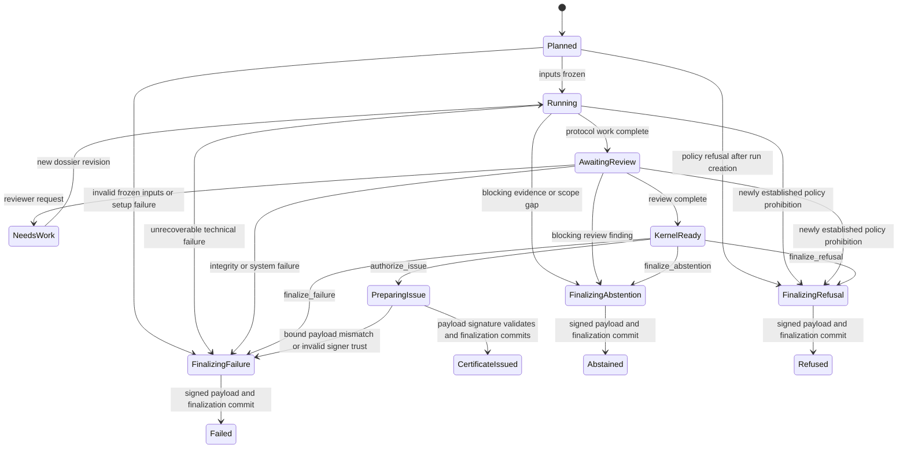

---
context_room:
  id: research.verification-engine.verification-protocol
  depends_on:
    - research.verification-engine.assurance-model
    - research.verification-engine.architecture
    - research.verification-engine.threat-model
---

# Verification protocol and lifecycle contracts

## Summary

The proposed engine is a protocol executor and certificate issuer, not an
oracle. It accepts a precisely scoped verification request, records every
material input and decision, and issues a result only when a deterministic
assurance kernel can prove that the selected method profile's gates passed.
Models and reviewers may supply evidence and judgments; neither may bypass the
kernel or silently change the public claim.

This protocol deliberately separates a fast provisional dossier from a slower
reviewed certificate. They have different states, schemas, labels, and API
routes. A provisional output can help a person investigate; it can never be
rendered as if it had passed independent review.

## Defines

The proposed verification request, pipeline stages, stage contracts, lifecycle
states, transition rules, update propagation, failure behavior, and the narrow
decision surface of the assurance kernel.

## Does not define

An accepted product contract, a user interface, a domain-specific scientific
method, storage topology, staffing levels, or permission to process a real
person's data.

## Status and dependencies

- **Status:** active research proposal; not canonical Parallax behavior.
- **Depends on:** [assurance model](assurance-model.md),
  [recommended architecture](architecture.md), and
  [threat model](threat-model.md).
- **Evaluated by:** the proposed
  [evaluation and vertical-slice protocol](evaluation-and-vertical-slice.md).
- **External methodological boundary:** an open-world search cannot turn a
  missing result into a universal negative merely because the workflow
  completed ([OWL 2 Primer](https://www.w3.org/TR/owl2-primer/)).

## Eight objects, not one mutable verdict

| Object | Purpose | Mutability rule | Public meaning |
| --- | --- | --- | --- |
| `Claim` | Stable identity for one truth condition. | Identity is stable; merge creates an alias, not deletion. | None without an exact revision. |
| `ClaimRevision` | Immutable wording, structured scope, definitions, and assumptions. | Never edited after use; material semantic change creates a new claim. | The proposition actually assessed. |
| `VerificationRun` | One execution of one protocol over frozen inputs. | Append-only work record; failed and superseded attempts remain. | Not a conclusion. |
| `EvidenceDossier` | Versioned evidence, searches, transformations, judgments, and unknowns. | New evidence creates a new revision. | Inspectable basis for a result. |
| `Certificate` | Signed immutable snapshot of a kernel decision under a policy and method profile. | Payload never changes; lifecycle, visibility, and challenge changes are separate signed events and a rebuildable status projection. | The only issuable assurance object. |
| `AbstentionAttestation` | Signed proof that a run ended safely without enough authority to issue. | Immutable and never upgradeable; new information starts a new run. | Explicitly “No certificate issued”; never a truth label or badge. |
| `PreRunRefusalReceipt` or `RefusalReceipt` | Proof that policy prohibited the request, processing, intended use, or publication before an epistemic result could issue. | Immutable; `PreRunRefusalReceipt` binds a request before run creation and has no `run_disposition`; `RefusalReceipt` binds a terminal run with `refused`. Reconsideration starts a new request/run or independent policy appeal. | No implication about the claim. |
| `FailureRecord` | Proof that a trustworthy run could not complete because of a technical or integrity failure. | Immutable; retry attempts remain linked and a changed input starts a new run. | No implication of absence, contradiction, or insufficiency. |

The current certificate pointer is a view. It must never overwrite earlier
certificates or pretend that one claim has a timeless global status.

The [assurance model](assurance-model.md#orthogonal-machine-result-axes) owns the
closed values for `epistemic_outcome`, `run_disposition`,
`certificate_lifecycle`, `visibility`, and `challenge_status`. This protocol
owns their precedence and transition rules. Draft, review, abstention, refusal,
and failure are run states or dispositions: they can never appear in
`certificate_lifecycle`, because no certificate exists before issue finalizes.

A request may end before a `VerificationRun` exists only when canonical request
schema validation succeeds and admission policy deterministically prohibits
creation of a run. That path emits a signed `PreRunRefusalReceipt` and audit
event, but no `run_disposition`. Malformed or integrity-invalid envelopes emit a
boundary `FailureRecord` with no run disposition. Once a run exists, all four
terminal dispositions are represented by one total `KernelDecision`: an early
stage seals the partial dossier and constructs a typed terminal-candidate input
whose unevaluated assurance dimensions are `unknown`, then invokes the same
kernel and terminal-object finalizer. This preserves totality without pretending
that an epistemic review completed or inventing a dossier merely to record a
prohibited request.

## Verification request contract

A request is admitted only when it supplies or explicitly leaves unresolved:

```text
VerificationRequest
  request_id
  submitted_expression
  language
  alleged_speaker_or_source?
  requested_scope
    population? geography? jurisdiction? time?
    quantity? unit? threshold? comparator? definitions?
  intended_use
  requested_assurance_tier
  requested_freshness
  consequence_if_wrong
  requested_visibility = private | restricted | public
  submitter_authority_and_consent_basis
  known_sources_and_counterevidence?
  declared_conflicts?
```

Missing semantic scope may lead to clarification or abstention. Missing
authority, safety, or rights information blocks acquisition or publication;
it is not repaired by lowering epistemic confidence.

## Layer-by-layer protocol

All stages below are proposed contracts. “Responsible” identifies decision
authority, not merely the worker that executes the task.

| Stage | Input | Required control | Output | Material failure | Detection and safe state | Responsible authority and retained proof |
| --- | --- | --- | --- | --- | --- | --- |
| 0. Admission | Request envelope and submitter context | Schema, authorization, intended-use, privacy, harm, and rate-limit checks | Accepted request with `requested_visibility`, or typed pre-run refusal | Unauthorized sensitive allegation, illegal purpose, hidden high-harm use | Policy validation and manual safety escalation; signed `PreRunRefusalReceipt` or accepted request with `requested_visibility: restricted` | Intake policy owner; request, policy version, consent/authority, reason |
| 1. Claim compilation | Original expression and context | Preserve original; atomize polarity, quantifier, modality, scope, definitions, and presuppositions; prohibit silent strengthening | One or more immutable candidate claim revisions plus ambiguity map | Composite claim flattened, changed causal force, omitted qualifier, invented scope | Round-trip comparison, schema checks, contrastive tests, reviewer confirmation; `scope_unresolved` | Claim editor; original capture, transform, diff, model/tool version, approvals |
| 2. Family and risk routing | Candidate revision and intended use | Select claim family, world model, harm tier, method profile, maximum outcome set, reviewer competence, and expiry policy | Frozen protocol plan | Convenient but inapplicable method selected; high-risk case downgraded | Rule-based compatibility matrix and independent spot audit; `outside_method_envelope` or `qualified_review_unavailable` | Method/policy owner; matched rules, profile versions, exceptions |
| 3. Search design | Claim revision and profile | Separate support and refutation hypotheses; define non-lowerable family paths, sources, languages, synonyms, time, filters, inaccessible classes, stop rule, and budget; freeze and obtain adversarial approval before any newly retrieved result is opened or ranked | Immutable approved `SearchPlan` | Confirmation-biased or post-hoc plan, undefined stopping, omitted database or language | Approval/result timestamp ordering, required-field checks, sealed seed sources, and adversarial reviewer; `coverage_plan_incomplete` | Research lead plus independent adversarial approver; full plan digest, approval, sealed inputs, and timestamp |
| 4. Acquisition | Approved search plan and connectors | Network broker, allowlists, SSRF defenses, quotas, exact timestamps, status/headers, pagination completeness, and separate decisions for site policy/robots, contract/terms, licence, copyright/database rights, privacy, and authorized purposes | Candidate captures in quarantine and acquisition ledger | Poisoned page controls tools; 200-empty, 404, 429, or truncation becomes “absent”; public access is mistaken for lawful retention or use | Sandboxed fetch, protocol-aware error states, expected-count/pagination checks, and rights-purpose matrix; `source_unavailable` or `rights_or_safety_block` | Acquisition service plus rights decision authority; requests, responses, errors, rights basis/version/jurisdiction/purposes, receipts |
| 5. Artifact admission | Quarantined bytes or metadata-only record | MIME sniffing, size/decompression limits, malware and active-content isolation, digest, provenance/signature validation, rights classification | Admitted immutable artifact or rejected/quarantined artifact | Parser exploit, fake PDF, invalid signature trusted, digest oracle leaks private content | Independent validators, sandbox telemetry, signature policy, CAS verification; `integrity_failed` or `origin_unresolved` | Artifact admission policy; exact bytes where lawful, digest, validators, rights decision |
| 6. Transformation | Admitted artifact | Versioned OCR, transcription, parsing, translation, normalization; parent retained; no generated text treated as source | Derived artifact linked to parent | Lost footnote, changed negation/unit, hallucinated transcript, spreadsheet formula injection | Format-specific completeness checks, sampling, semantic contrast tests; `transformation_unreliable` | Transformation service and reviewer where required; input/output digests, tool/config/log |
| 7. Evidence localization | Claim revision and admitted artifacts | Exact span/cell/timestamp locator, surrounding context, polarity, applicability, transformation pointer | Candidate `EvidenceUse` objects | Quote exists but does not support claim, wrong table header/version, cherry-picked segment | Deterministic locator resolution and independent entailment/context review; `citation_mismatch` | Evidence reviewer; locator, excerpt, context, individual judgment |
| 8. Origin and independence | Evidence uses and source metadata | Trace mirrors, syndication, shared datasets, witnesses, funders, methods, and unknown links; never infer independence from URL count | Versioned origin assertions and observational clusters | One press release counted many times; circular citation; coordinated models called independent | Provenance graph checks, duplicate/citation analysis, adversarial challenge; `dependence_unresolved` | Provenance reviewer; edges, supporting evidence, confidence, unresolved lineage |
| 9. Counterevidence execution | Frozen pre-results search plan | Execute every family minimum and support/opposition path, retain all result identifiers and ranks where possible, reason every inclusion/exclusion, record inaccessible space and stop event; block on every unresolved material counterelement | Immutable `SearchRun`, candidate set, materiality decisions, and hidden-test lineage | Results or null studies suppressed, query silently changed, search engine drift hidden, material counterevidence dismissed by its finder | Plan/run diff, completeness fields, second-path audit, hidden/adversarial recall suite; `coverage_insufficient` or `material_counterevidence_unresolved` | Researcher plus independent adversarial reviewer; queries, results, exclusions, adjudications, cutoff, costs |
| 10. Method assessment | Evidence uses, origin clusters, claim-family profile | Apply domain rubric to exact outcome/scope; retain item-level answers, uncertainty, COI, disagreements, and missing information | Individual assessments, not a verdict | Generic source reputation replaces method review; tool applied outside licence or competence | Profile compatibility, qualification and independence gates, item validation; `method_below_profile` | Qualified domain reviewer; rubric/tool version, answers, rationale, disclosures |
| 11. Inference and synthesis | Admissible evidence and assessments | Explicit premises, assumptions, alternatives, uncertainty, dependence and sensitivity; no source-count voting | Proposed assurance vector, outcome, objections, and residual unknowns | Correlation promoted to causation, absence to falsity, consensus to truth, uncertainty averaged away | Deterministic ceiling rules, counterfactual tests, independent challenge; `inference_unsupported` or `mixed` | Analyst proposes; adjudicator approves specialist inference; argument record retained |
| 12. Independent review | Complete draft dossier | Blind-first review, competence, explicit disqualifier and COI checks, reviewer workload limits, structured disagreement, then deliberation/adjudication | Signed review decisions and dissent | Rubber stamping, anchoring on current verdict, collusion, unavailable expert | Hidden assignment, agreement and reversal monitoring, random audit; `qualified_review_unavailable` | Independent reviewer/adjudicator; individual pre-deliberation record, changes, dissent |
| 13. Assurance kernel | Frozen dossier and versioned policy | Total deterministic evaluation of typed dimension states, non-lowerable floors, ceilings, temporal validity, rights/safety gates, signatures, and transition authority | Exactly one typed `KernelDecision` for every input envelope | Model or administrator bypasses a `fail`/`unknown`; `not_applicable` used as a skip; stale projection drives issue | Canonical inputs, signed policy tables, exhaustive decision tests, negative vectors, and full decision trace | Deterministic kernel; input/output digest, decision code, ceiling, every predicate and reason |
| 14. Terminal-object sealing | One total kernel decision, except a schema-valid policy refusal before run creation | Idempotent `prepare → external payload sign → final transactional admission → external FinalizationEvent sign → activation`; finalization commits the typed object, disposition where a run exists, audit/outbox and `public_seal_pending`, while activation alone enables delivery | Exactly one internally authoritative terminal object plus validated payload/finalization receipts before external visibility; certificate/current pointer only for issue | Human report differs from machine object; orphan signature or seal-pending object is served; abstention/refusal/failure receives an outcome or badge | Decision/object matrix, digest bindings, access tests, atomic finalization and activation, orphan reconciliation | Issuer or terminal-record service under policy authority; decision, exact bytes, receipts, audit and delivery events |
| 15. Publication and consumption | Externally activated certificate and consumer policy | Validate payload signature and FinalizationReceipt, then render scope, outcome, method/version, evidence cutoff, lifecycle and expiry; no bare “verified”; ETag/version pinning and acknowledgement for machine consumers | Qualified activated certificate or deliberate non-publication | Pending-seal object is served; badge implies universal truth; consumer uses non-current version; absence of certificate implies falsity | Receipt validation, wording lint, comprehension tests, API conformance, dependency and cache monitoring | Publisher/consumer owner; receipt, render version, delivery receipt, cache/version telemetry |
| 16. Monitoring and correction | Watch set, source events, appeals, audits, incidents | Monitor declared channels; on authenticated critical trigger suspend current pointer and badge before reassessment; classify impact, notify consumers, and require independent restoration or replacement | Lifecycle/challenge event plus suspension and delivery receipts | Retraction missed, trigger waits for full review, old badge remains current, appeal edits its target | Canonical p99 suspension SLO, multi-channel monitors, dependency traversal, cache invalidation, delivery receipts, external audit | Lifecycle service plus independent appeal/restoration authority; trigger, impact set, transition, response and receipts |

The pipeline can guarantee only that validated receipts show that every
instrumented stage required by the named profile executed over the recorded
inputs inside the declared trusted computing base. It can separately guarantee
that required judgment attestations are authentic and authorized; that does
not make the attested judgments machine observations or guarantees about the
world. The pipeline cannot guarantee that the chosen protocol captured every
relevant fact. Systematic-review guidance likewise frames exhaustive-looking
searches as extensive, documented attempts constrained by available sources
and resources, not omniscience
([Cochrane Handbook, chapter 4](https://www.cochrane.org/authors/handbooks-and-manuals/handbook/current/chapter-04)).

## The assurance kernel

The kernel is intentionally smaller than the research workflow. It receives
only immutable references and typed judgments. It performs no web search, no
free-text generation, and no subjective domain analysis. It is a total,
deterministic function over the canonical serialization of a versioned input
envelope: every schema-valid envelope produces exactly one typed
`KernelDecision`; the same bytes and policy bundle always produce the same
decision bytes. An envelope that cannot be parsed or whose referenced immutable
objects do not validate is rejected at the boundary with a signed
`FailureRecord`, never left as “no result.”

### Kernel inputs

- exact claim and dossier revisions;
- method, policy, trust-store, rights, and harm-profile versions;
- stage-completion records and their input/output digests;
- typed dimension states and individual judgment attestations with their
  authorities;
- current dependency and freshness snapshot;
- one candidate conclusion containing `epistemic_outcome`, an exact
  `domain_certainty` value and certainty-scale ID when applicable (null
  otherwise), requested tier, requested visibility, and an optional ordered
  `fallback_candidates[]`; every fallback binds that same typed conclusion
  shape, its required signed judgments, and a unique preference rank frozen
  before kernel evaluation; and
- `terminal_intent = issue_candidate | abstain_candidate | refuse_candidate |
  fail_candidate`, the stage and complete diagnostic receipts that authorize
  that intent, and `partial_dossier: true | false`; and
- the exact signed `PublicationPermissionDecision` and authority/status
  snapshot used to validate it; and
- exception or restriction records, if any.

### Typed method profile

Every signed `MethodProfile` is machine-executable and contains:

```text
MethodProfile
  profile_id, version, claim_family, harm_tier
  claim_subtype
  modality_and_causal_force_predicates[]
  applicable_dimension_ids[]
  applicability_predicates[dimension_id]
  required_state[dimension_id] = pass
  failure_reason[dimension_id]
  countersearch_requirements[]
    requirement_id, family, retrieval_path_class, minimum_distinct_paths,
    required_languages_or_rule, required_source_classes,
    required_adversarial_tests, stop_rule_predicate
  independence_requirements[]
    outcome, minimum_observation_clusters, minimum_method_classes,
    unknown_counts_as_zero = true, leave_one_cluster_out_required,
    leave_one_out_minimum_outcome
  reviewer_requirements[]
    decision_type, role, domain, qualification_profile,
    minimum_non_disqualified_approvals, separation_of_duties[],
    prohibited_relationships[], maximum_workload, calibration_valid_through,
    authority_grant_policy_id
  permitted_epistemic_outcomes[]
  outcome_registry_version
  allowed_outcome_track_overlays[]
  certainty_scale_id?
  allowed_certainty_by_outcome[epistemic_outcome]?
  terminal_reason_precedence[]
  freshness_and_expiry_rules
  rights_and_visibility_rules
  required_receipt_types[]
  policy_signature
```

The policy bundle owns one signed `OutcomeRegistry` for the complete canonical
outcome universe `U`, exactly the enum in the assurance model. It maps each
outcome to one or more compatible family/subtype/causal-force/semantic-track
memberships, plus polarity and any within-track strength edges; shared outcomes
such as `supported` therefore have multiple explicit memberships rather than
one ambiguous family owner.

The directed strength graph must be acyclic and transitively unambiguous.
Profiles cannot redefine those mappings. An `allowed_outcome_track_overlay`
may only delete outcomes or strength edges and must cite a domain mapping
version; it cannot add or reorder them. Missing registry version, missing
canonical outcome, unknown code, cycle, or ambiguous strength relation
invalidates the profile. Candidate-specific fallback validity is evaluated
against this compiled registry at runtime; it is not a profile-compilation
property.

Every applicable dimension is `pass | fail | unknown | not_applicable`.
`Unknown` fails closed. `Not_applicable` is accepted only when the profile's
applicability predicate evaluates false and its proof receipt validates;
otherwise it is normalized to `unknown`. Profile compilation fails if a
dimension is missing, duplicated, untyped, or lacks a reason mapping.

The separately signed `TransverseMinima` bundle uses the same typed requirement
schemas and also contains required predicate IDs, minimum count/quorum values,
maximum ages, forbidden relationships, mandatory receipt types, and permitted
outcome sets for claim immutability, receipt integrity, counter-research,
material-counterevidence blocking, independence/leave-one-cluster-out,
qualified review, temporal/dependency currency, replay, and watch/expiry/appeal.

Rights, safety, and rendering remain mandatory transverse predicates, but they
produce the separate publication-permission decision defined below, never a
permitted epistemic-outcome set.

Profile compilation compares each typed field: profile minima must be
numerically greater-or-equal, maximum ages
less-or-equal, forbidden/required sets supersets, and permitted outcome sets
subsets of the transverse constraint. Every referenced predicate declares a
versioned comparison function and canonical test vectors. Incomparable,
missing, or unrecognized requirements invalidate the profile. A profile can
strengthen minima but cannot override, mark inapplicable, or lower them; an
attempt yields `finalize_failure / invalid_method_profile`.

`TransverseMinima` versions form a monotonic signed chain. Each version names
its predecessor digest and supplies a machine diff. Any lower count/quorum,
longer maximum age, smaller required/forbidden/receipt set, larger permitted
outcome set, removed predicate, weaker reason precedence, or changed comparison
semantics is a lowering and is rejected by the kernel. A genuine relaxation
requires a new major assurance contract, new issuer namespace, explicit
non-equivalence marker, independent governance approval, and cannot validate or
restore certificates under the prior contract. Kernel vector `KNEG-03B` tests a
signed transverse bundle that weakens its predecessor and must return
`invalid_method_profile`.

`review_authority_permitted_outcomes` is computed, not supplied. For each
required decision the kernel validates current qualification, domain/language
scope, non-disqualification, workload/calibration window, separation of duties,
and distinct-human quorum against separate signed `AuthorityGrant` objects.
Each grant contains grant ID/version, subject identity, role and permitted
decision types/outcome set, domain/language/harm/tier scope, issuer namespace,
delegation chain, valid/system time, qualification basis, grant-policy digest,
revocation/status-feed pointer, payload digest, signer, and signature. The
independent authority registry defines which issuers may grant which scopes; a
method-profile signer cannot grant itself or expand a role's authority. The
kernel intersects every required current grant. Unknown identity, issuer,
qualification, conflict, delegation, revocation, or quorum contributes the
empty set. AI agents and duplicate identities contribute no human quorum.

Scientific profiles must declare `claim_subtype` at least as association,
causal effect, diagnostic/prognostic performance, intervention effect, safety,
or mechanism; causal-force predicates must reject any mismatch with the frozen
claim AST. They must also bind a versioned domain certainty scale, map every
permitted outcome to allowed certainty levels, and define typed design/risk-of-
bias predicates for that subtype. The kernel computes
`certainty_permitted_outcomes` from those predicates and includes it in the
eligible-set intersection. A causal candidate with only associational designs,
or an outcome/certainty pair missing from the compatibility matrix, yields the
empty set and `outside_method_envelope`.

Until the scientific subtype mapping,
certainty scale, and compatibility tests are signed, every scientific profile
is shadow-only and has an empty issuable outcome set; generic `supported` cannot
bypass that gate.

The scientific policy also freezes mutually exclusive, executable synthesis
predicates. `contradicted` requires that the admissible synthesis crosses the
predeclared contradiction boundary for the exact estimand and direction;
`mixed` requires material admissible results on competing sides while neither
the support nor contradiction predicate dominates under the signed
heterogeneity/sensitivity rule. Both cannot pass on the same frozen synthesis;
if neither predicate or both predicates evaluate true, the outcome set is
empty and the run abstains.

A null-effect, equivalence, or non-inferiority claim
is eligible only when its frozen estimand, margin, direction, error rates,
power/information threshold, uncertainty interval, missing-data rule, and bias
criteria all pass; failure to reject a null is never converted into
equivalence, absence, or contradiction. Canonical conformance fixtures must
reproduce every boundary and exclusivity decision.

### Permitted-set constructors and provenance

Every ceiling operand is a `PermittedOutcomeSet` over the same universe `U`:

```text
PermittedOutcomeSet
  set_id, schema_version, universe_registry_id_and_digest
  constructor_type_and_version
  authorized_constructor_registry_id_and_digest
  constructor_authority_grant_id_and_digest
  source_object_ids_and_digests[]
  predicate_ids_and_versions[]
  evaluated_facts_and_receipts[]
  members[] subset_of U
  exclusion_reasons[outcome][] = one_or_more closed mapped reasons
  evaluation_status = valid | invalid
  computed_at, evaluator_version, set_digest
  signer_identity, trust_policy_digest, signature
```

The deterministic constructors and owners are:

| Operand | Owner/input | Constructor |
| --- | --- | --- |
| `family_permitted_outcomes` | `OutcomeRegistry` plus frozen claim family/subtype/causal force | Select exactly the outcomes registered for that family/subtype; unknown or conflicting routing produces the empty set. |
| `profile.permitted_epistemic_outcomes` | Signed `MethodProfile` | Validate it is a subset of the family set and apply only deletions allowed by the registry/domain mapping. |
| `tier_permitted_outcomes` | Signed harm/assurance-tier policy | Select outcomes authorized for the exact tier and intended-use class. |
| `independence_and_leave_one_out_permitted_outcomes` | Origin clusters, typed independence minima, leave-one-cluster-out receipts | Retain outcomes whose exact minima and robustness predicates pass. |
| `review_authority_permitted_outcomes` | Reviewer requirements, identity/qualification/conflict/quorum receipts | Intersect grants of every required, currently qualified and non-disqualified role. |
| `certainty_permitted_outcomes` | Signed domain certainty scale/mapping and subtype synthesis receipts | For non-certainty families this constructor returns `U` with an explicit `not_applicable` proof; scientific profiles never do. |
| `freshness_and_dependency_permitted_outcomes` | Signed freshness rules and authority-data dependency snapshot | Retain outcomes whose source, method, trust, reviewer, monitor, and validity predicates are current. |

Rights, safety, and requested visibility do **not** construct an epistemic set.
They produce a signed `PublicationPermissionDecision` containing decision ID and
schema version, request/run/claim/dossier digests, processing-rights result,
disclosure-rights result, safety result, requested and maximum visibility,
allowed redaction/view, legal/policy basis IDs and versions, jurisdiction,
valid/system times, expiry, typed reasons, evidence receipts, responsible
authority grant, payload digest, signer identity, trust-policy digest, and
signature. Its closed result is `allowed | restricted | denied`. It may cause
refusal, abstention, lifecycle suspension, or a narrower view, but cannot add,
remove, or change `epistemic_outcome`.

Every set operand is mandatory. Missing/malformed set provenance, registry or
signature mismatch, unknown constructor code, unauthorized signer, or execution
error produces `evaluation_status: invalid` and fails. A semantic fact that a
typed predicate explicitly evaluates `unknown` produces a **valid empty set**,
not an invalid set, and must attach at least one closed primary abstention reason
for every excluded candidate. `exclusion_reasons` is validated against the same
signed reason registry and total precedence as dimension failures; an empty or
unmapped reason list invalidates the set. Thus every valid empty intersection
deterministically abstains with one primary and all retained secondary reasons.

### Non-compensatory ceilings and decision function

```text
KernelDecision decide(InputEnvelope x, PolicyBundle p):
  if !canonical_and_integrity_valid(x, p):
    return finalize_failure(invalid_or_inconsistent_input)
  profile = compile_profile(x.profile, p.transverse_minima)
  if !profile.valid:
    return finalize_failure(invalid_method_profile)
  intent = derive_terminal_intent(x.stage_diagnostic_receipts, p.diagnostic_map)
  if !intent.valid or intent.value != x.terminal_intent:
    return finalize_failure(invalid_or_inconsistent_input)
  if intent == fail_candidate:
    return finalize_failure(intent.mapped_reason)
  if intent == refuse_candidate:
    if !prohibited_request_or_use(x, p):
      return finalize_failure(invalid_or_inconsistent_input)
    return finalize_refusal(intent.mapped_reason)
  if prohibited_request_or_use(x, p):
    return finalize_refusal(policy_reason)
  if x.partial_dossier and intent == issue_candidate:
    return finalize_failure(invalid_or_inconsistent_input)
  candidate = exact_pre_attested_candidate_conclusion(x)
  fallback_validation = validate_fallback_envelope(
    x.fallback_candidates,
    candidate,
    effective_registry,
    profile,
    certainty_scale
  )
  if !fallback_validation.structurally_valid:
    return finalize_failure(invalid_or_inconsistent_input)
  vector = evaluate_all_typed_predicates(x, profile)
  if any non_ceiling_predicate state in {fail, unknown}:
    return finalize_abstention(highest_precedence_reason(vector))
  if intent == abstain_candidate:
    return finalize_failure(invalid_or_inconsistent_input)
  eligible = intersect(
    family_permitted_outcomes,
    profile.permitted_epistemic_outcomes,
    tier_permitted_outcomes,
    independence_and_leave_one_out_permitted_outcomes,
    review_authority_permitted_outcomes,
    certainty_permitted_outcomes,
    freshness_and_dependency_permitted_outcomes
  )
  if candidate.epistemic_outcome not in family_permitted_outcomes or
     candidate.epistemic_outcome not in profile.permitted_epistemic_outcomes:
    return finalize_abstention(outside_method_envelope)
  if !certainty_pair_valid(candidate, profile, certainty_scale) or
     candidate.epistemic_outcome not in eligible:
    reasons = exclusion_reasons_for(candidate, all_operand_sets)
    fallbacks = ordered_valid_fallbacks(
      fallback_validation.items,
      same_track = effective_registry.track_for(
        candidate.epistemic_outcome,
        profile.claim_family,
        profile.claim_subtype,
        claim.causal_force
      ),
      strictly_weaker_than = candidate.epistemic_outcome,
      order = effective_registry.strength_order_by_track,
      member_of = eligible,
      certainty_pair_must_validate = true,
      selection_order = request_preference_rank_ascending
    )
    if fallbacks is not empty:
      candidate = fallbacks[0]
    else:
      return finalize_abstention(
        primary = highest_precedence_reason(reasons),
        all_reasons = reasons
      )
  permission = validate_publication_permission_decision(
    x.publication_permission_decision,
    p.rights_safety_and_visibility_policy,
    x.request_and_dossier_digests
  )
  if !permission.valid:
    return finalize_failure(invalid_or_inconsistent_input)
  if permission == denied:
    return finalize_refusal(policy_reason)
  if permission == restricted and x.requested_visibility == public:
    return finalize_refusal(publication_not_permitted)
  return authorize_issue(candidate, eligible, vector)
```

`terminal_intent` is not trusted caller preference. The kernel derives it from
the complete signed diagnostic receipts and the versioned
`DiagnosticToTerminalReasonMap`, then requires byte-for-byte agreement with the
declared field. `fail_candidate` is accepted only for a diagnostic mapped to
failure, `refuse_candidate` only for a live prohibiting policy predicate, and
`abstain_candidate` only when at least one typed dimension evaluates `fail` or
`unknown`. Candidate-relative ceiling/leave-one-out exclusions are encoded in
their `PermittedOutcomeSet` with reasons rather than as a global dimension
`fail`; that permits an explicitly pre-attested weaker fallback while every
non-ceiling predicate still fails closed. A partial dossier can never carry
`issue_candidate`. Any mismatch is
an integrity failure, not a discretionary reclassification.

For scientific profiles, the issued conclusion is the exact pair
`(epistemic_outcome, domain_certainty)` plus certainty-scale ID/version. The
kernel validates that pair against the subtype compatibility map and carries it
unchanged through fallback, `KernelDecision`, canonical certificate bytes, and
rendering. It cannot infer, omit, or rewrite certainty after review.

Ceilings are set intersections, not one global scalar. Opposite-polarity or
semantically different outcomes such as `supported`, `contradicted`,
`attribution_confirmed`, and `observed_at_time` are incomparable. The signed
`OutcomeRegistry` defines a versioned strength order only within one
compatible track, for example `strongly_supported > supported`; a profile may
only delete members or edges through a valid overlay. The compiler rejects
cross-track ordering, cycles, duplicates, or an outcome with no family mapping.

Excellent provenance cannot compensate for an unsupported inference; many reviewers
cannot compensate for unavailable evidence; low harm cannot turn an open world
into a closed one. The kernel never invents, rewrites, or silently downgrades a
reviewed outcome. A lower outcome is eligible only within the same profile
track, the effective registry's strict order proves it weaker than the candidate,
reviewers already attested that exact fallback, and the request fixed a unique
preference rank before evaluation.

Registry order determines eligibility
(`strictly weaker` on the exact family/subtype/causal-force track); it never
chooses among eligible fallbacks. The request's frozen unique numeric preference
rank is the sole selection authority, and the kernel chooses the lowest rank.

Fallback validation receives the exact primary candidate and evaluates every
supplied item even when that primary would otherwise issue. An unknown code,
missing judgment, cross-track/incomparable candidate, equal-or-stronger
candidate, malformed array or item, duplicate preference rank, invalid
signature/digest, undefined track, or invalid certainty pair invalidates the
entire kernel input as `finalize_failure / invalid_or_inconsistent_input`; one
valid fallback cannot mask one invalid fallback. The kernel never silently
drops an item. If all supplied items are structurally and semantically valid but
merely excluded by current eligible-set operands, the run abstains with the
retained operand exclusion reasons. No fallback is synthesized from the
eligible set.

The decision precedence is exhaustive:

| First matching condition | Kernel decision | Terminal run disposition |
| --- | --- | --- |
| Canonicalization, digest, immutable reference, policy signature, profile/minima/registry compilation, or fallback envelope is invalid | `finalize_failure / invalid_or_inconsistent_input` or `invalid_method_profile` | `failed` |
| Derived `terminal_intent` is invalid or differs from the declared field | `finalize_failure / invalid_or_inconsistent_input` | `failed` |
| Derived intent is `fail_candidate` | `finalize_failure` with its mapped diagnostic reason | `failed` |
| Derived intent is `refuse_candidate` and the corresponding live policy prohibition validates | `finalize_refusal` with mapped reason | `refused` |
| A policy otherwise prohibits request, claimant authority, intended use, or processing | `finalize_refusal` with policy reason | `refused` |
| Partial dossier requests issue, or `abstain_candidate` has no `fail`/`unknown` predicate | `finalize_failure / invalid_or_inconsistent_input` | `failed` |
| Any applicable non-ceiling transverse or profile predicate is `fail` or `unknown` | `finalize_abstention` with deterministic primary and all reasons | `abstained` |
| Candidate outcome is outside the family or profile permitted set | `finalize_abstention / outside_method_envelope`; fallback is forbidden | `abstained` |
| Candidate is inside family/profile but its exact outcome/certainty pair is excluded by another eligible-set operand and no structurally valid, exact-certainty, same-membership-track, strictly weaker, pre-attested fallback is eligible | `finalize_abstention` with operand-derived primary and all reasons | `abstained` |
| Publication-permission object is malformed, stale, unauthorized, or bound to different inputs | `finalize_failure / invalid_or_inconsistent_input` | `failed` |
| Publication permission is `denied`, or is `restricted` while public visibility was requested | `finalize_refusal` with rights/safety/publication reason | `refused`; reviewed epistemic candidate remains unchanged but no requested certificate view issues |
| Every predicate, set, certainty pair, authority, and permission passes and the exact candidate or uniquely ranked valid fallback is eligible | `authorize_issue` | `certificate_issued` only after issue finalizes |

The transverse default total order for abstention reasons is:
`rights_or_safety_block > material_counterevidence_unresolved >
dependency_invalid > replay_failed > qualified_review_unavailable >
scope_unresolved > not_truth_apt > closure_unproven > evidence_inaccessible >
dependence_unresolved > coverage_insufficient > temporal_requirements_unmet >
outside_method_envelope > insufficient_evidence`. A profile's
`terminal_reason_precedence[]` must contain every closed reason exactly once and
may make a stricter risk-specific ordering, but it must keep
`rights_or_safety_block` first and `material_counterevidence_unresolved` second.
Missing, duplicate, or unknown entries invalidate the profile.
All matching reasons are retained; this total order selects only the primary
code. No `KernelDecision` is an issued epistemic conclusion until
`authorize_issue` successfully finalizes as a certificate; finalization never
makes the conclusion universal truth.

### Outcome ceilings enforced by the kernel

| Family | Maximum outcome without an additional profile extension |
| --- | --- |
| Formal proof | `demonstrated_in_system` |
| Deterministic calculation | `reproduced_on_inputs` |
| Bounded source/register | `confirmed_in_bounded_source` or `absent_from_bounded_source`; absence requires a valid predicate-specific closure |
| Attribution | `attribution_confirmed` |
| Artifact authenticity | `integrity_or_provenance_validated` |
| Measurement/statistic | `measured_or_estimated_with_uncertainty` or `reproduced_on_dataset` |
| Current mutable state | `observed_at_time` |
| Open empirical, historical, or scientific | At most `strongly_supported`, subject to all independence, counter-research, method, and certainty floors |
| Official legal or policy text | `official_text_in_force_at_time`; application to a person or case requires a separate interpretation profile |
| Legal or other authority-dependent interpretation | `interpretation_supported`, with conflicts, authority hierarchy, scope, and time exposed |
| Forecast | `calibrated_forecast`, only with a named horizon, reference class, calibration envelope, scoring rule, and shift/freshness checks |
| Open-world negative/universal without valid closure | `no_counterexample_found` or `counterexample_found`; never `absent_from_bounded_source` |
| Norm/preference or authentic self-report | `position_documented` or `attributed`; never a truth label for the underlying value or private mental state |

Domain profiles may expose subtype codes, such as scientific body-of-evidence
labels, only as `domain_assessment` fields with a versioned deterministic map
to one canonical `epistemic_outcome`. An unmapped extension code is
`outside_method_envelope` and cannot be issued. In particular, the current
scientific-profile `body_of_evidence_*` labels remain diagnostic/shadow-only
and non-issuable until a signed mapping table defines, for every label and
claim subtype, its canonical outcome, prerequisites, incompatible outcomes,
certainty field, and mapping-table version. Similar wording is not a mapping.

The policy bundle also contains a complete, versioned
`DiagnosticToTerminalReasonMap`. It enumerates every diagnostic code any
admitted stage, connector, checker, reviewer rubric, or policy module may emit
and maps it to exactly one terminal class (`failure`, `refusal`, or
`abstention`) and, for abstention, exactly one closed primary reason. The bundle
fails compilation if a stage code is missing, mapped twice, mapped to a value
outside the owner registry, or if a deployed component advertises a different
code-set digest. Unknown runtime codes produce `finalize_failure /
invalid_or_inconsistent_input`; they can never be coerced to a generic reason.

### Kernel invariants

No certificate may be issued unless all applicable predicates are true:

1. the exact claim revision is immutable, atomic enough for the profile, and
   within its declared ceiling;
2. every cited locator resolves against the declared artifact digest;
3. every derived artifact names its parent, transformation, version, and
   validation status;
4. every evidence use has polarity, scope applicability, and origin status;
5. the search plan was frozen and independently approved before any newly
   retrieved result was observed; every amendment is prospective and visible;
6. non-lowerable family counter-research paths completed, and every material
   counterelement has an independent signed adjudication;
7. no secondary copy increases observational independence without a supported
   origin assertion;
8. required reviewers pass explicit competence, quorum, disqualifier, and
   independence rules; origin thresholds and leave-one-cluster-out checks pass;
9. all blocking disagreements, objections, rights, safety, and incident states
   are resolved or force abstention/non-publication;
10. an `absent_from_bounded_source` outcome names a valid local closure, and an
    open-world universal negative is bounded to `no_counterexample_found` or
    abstention; scientific null, non-inferiority, or equivalence claims instead
    follow their subtype's estimand, power, margin, uncertainty, and bias rules
    and are never treated as proofs of universal absence;
11. the candidate `epistemic_outcome` does not exceed any applicable ceiling,
    and no outcome, disposition, lifecycle, visibility, or challenge field is
    substituted for another axis;
12. all deterministic replay checks pass;
13. dependencies and trust material are current at the issuance transaction;
14. expiry, watch set, appeal route, and visibility policy are present; and
15. the prepared unsigned canonical certificate digest equals the externally
    signed digest; the final transaction alone admits the signed certificate,
    creates lifecycle `current`, installs the current pointer, and commits the
    audit and outbox records atomically.

An override may restrict visibility, suspend lifecycle, or force more review.
It cannot select any epistemic outcome or fallback that was not already signed
by the required reviewers and admitted by the eligible-set intersection. No
human or administrator override may convert `fail` or `unknown` to `pass` or
raise a result past a failed predicate.

No product schema, renderer, API result, certificate, badge, export, case report,
runtime log message, or human override may contain `100%`, `100 percent`, `fully
true`, or an equivalent unqualified completeness formulation except the exact
receipt-coverage claim defined by the assurance model: 100% of the checks
jointly required by exact
`MethodProfile`, `PolicyBundle`, `TransverseMinima`, `OutcomeRegistry`, trust
snapshot, rights/safety policy, and diagnostic-map versions have validated
receipts for one object digest. The sentence must render every version/digest or
a signed manifest digest that losslessly resolves to all of them. The
conformance suite rejects every other formulation, including “100% confidence,”
“100% verified,” and “100% accurate,” even when all kernel predicates pass.

This product-language ban does not prohibit a preregistered internal test from
requiring 100 percent of a finite, named test denominator to pass. Such a test
receipt must state numerator, denominator, fixture set and failures and cannot
be copied into a certificate or public truth claim.

The constructor registry, authority registry, issuer authorizations, signatures,
comparison functions, and canonical fixtures described above are required
ready-to-code artifacts, not details an implementer may invent. Until their
schemas and signed initial contents exist and pass conformance review, profile
compilation fails and the engine is non-issuable.

### Required kernel and finalizer negative vectors

These vectors are conformance tests, not illustrative suggestions. Each must
return the exact stated decision. A certificate/current pointer is forbidden
unless the row explicitly requires `authorize_issue`:

| Vector | Perturbation | Required decision |
| --- | --- | --- |
| `KNEG-01` | One applicable dimension changes from `pass` to `unknown`. | `finalize_abstention` with that dimension's mapped reason. |
| `KNEG-02` | A dimension is `not_applicable` without a false applicability-predicate proof. | Normalize to `unknown`; abstain. |
| `KNEG-03` | A profile attempts to lower a transverse minimum or omit its counter-research floor. | `finalize_failure / invalid_method_profile`. |
| `KNEG-03B` | A signed transverse-minima version weakens its predecessor inside the same assurance contract/issuer namespace. | `finalize_failure / invalid_method_profile`. |
| `KNEG-04` | Bounded-source absence is requested without a valid predicate-specific completeness assertion. | `finalize_abstention / closure_unproven`. |
| `KNEG-05` | A material counterelement exists without independent adjudication. | `finalize_abstention / material_counterevidence_unresolved`. |
| `KNEG-06` | Three URLs resolve to one observation cluster but the profile requires two independent clusters. | `finalize_abstention / dependence_unresolved`. |
| `KNEG-07A` | `strongly_supported` passes by count but leave-one-cluster-out yields `mixed`; no fallback candidate was supplied. | `finalize_abstention / insufficient_evidence`. |
| `KNEG-07B` | Same input, with a valid uniquely ranked and pre-attested same-track `supported` fallback that belongs to the eligible set. | `authorize_issue / supported`. |
| `KNEG-07C` | A fallback is cross-track, incomparable, equal to, or stronger than the primary candidate. | `finalize_failure / invalid_or_inconsistent_input`, even if the primary candidate is eligible. |
| `KNEG-07D` | The array contains one valid fallback and one invalid or unsigned fallback. | `finalize_failure / invalid_or_inconsistent_input`; the valid item cannot mask the invalid one. |
| `KNEG-07E` | Two otherwise valid fallbacks share one preference rank. | `finalize_failure / invalid_or_inconsistent_input`. |
| `KNEG-08` | A receipt is validly signed but binds a different input digest, checker version, or policy. | `finalize_failure / invalid_or_inconsistent_input`. |
| `KNEG-09A` | Rights necessary to acquire, retain, or process indispensable evidence remain semantically `unknown`. | `finalize_abstention / rights_or_safety_block`; the epistemic workflow cannot lawfully complete. |
| `KNEG-09B` | Evidence processing is permitted and all epistemic gates pass, but public disclosure permission is `unknown` or `restricted`; a public view was requested. | `finalize_refusal / publication_not_permitted` for that requested visibility. The candidate remains non-authoritative inside the protected dossier. A restricted certificate is available only if a separately authorized visibility request starts a new run and finalizes its own certificate; the refused run never exposes an epistemic result directly. |
| `KNEG-10` | Intended use is prohibited by admission policy. | `finalize_refusal`; no epistemic outcome. |
| `KNEG-11` | Scientific extension code has no map to the canonical enum. | `finalize_abstention / outside_method_envelope`. |
| `FNEG-01` | The kernel authorizes issue, then the external signing response covers different bytes. | Quarantine the orphan response and abort the issue intent. Start a separate `FailureRecord` terminal intent bound to the mismatch; the run remains nonterminal in `terminal_sealing_pending` until that payload is validly signed and finalized, and nothing is delivered before its finalization receipt is activated. This tests the finalizer, not the pure kernel. |
| `KNEG-13` | A lifecycle value is supplied as `epistemic_outcome`, or an abstention requests a badge. | `finalize_failure / invalid_or_inconsistent_input`. |
| `KNEG-14` | Same canonical envelope and policy are evaluated twice. | Byte-identical `KernelDecision` and trace digest. |
| `KNEG-15` | Both `rights_or_safety_block` and `material_counterevidence_unresolved` are present, followed by lower-priority coverage and insufficiency reasons. | `finalize_abstention` with primary `rights_or_safety_block`; `all_reasons` preserves all four in the signed deterministic order. |
| `KNEG-16` | A valid empty permitted-outcome set omits or uses an unmapped exclusion reason. | `finalize_failure / invalid_or_inconsistent_input`; no fallback or generic coercion. |

## End-to-end trust flow

```mermaid
sequenceDiagram
    participant U as "Requester"
    participant I as "Intake and claim compiler"
    participant Q as "Quarantined acquisition"
    participant R as "Research and evidence workspace"
    participant H as "Independent reviewers"
    participant K as "Assurance kernel"
    participant C as "Certificate registry"
    participant P as "Parallax or another consumer"

    U->>I: scoped request and intended use
    I-->>U: clarification, refusal, or immutable claim revision
    I->>Q: approved search and acquisition plan
    Q->>R: admitted artifacts and captured failures
    R->>R: evidence, origin, countersearch, method, synthesis
    R->>H: frozen dossier revision
    H->>H: blind decisions, challenge, adjudication
    H->>K: signed judgments and dossier references
    K-->>H: total typed KernelDecision
    alt authorize_issue
        K->>C: prepare canonical certificate digest
        C->>C: sign payload externally; finalize internally as public_seal_pending
        C->>C: sign FinalizationEvent externally; atomically activate allowed view
        C->>P: qualified certificate and separate status projection
        P-->>C: receipt and subscribed dependency state
        C-->>P: later stale, restriction, supersession, or withdrawal event
    else finalize_abstention
        K->>C: prepare/sign/finalize/seal/activate AbstentionAttestation
        C-->>U: no certificate issued; typed reasons and next action
    else finalize_refusal
        K->>C: prepare/sign/finalize/seal/activate RefusalReceipt
        C-->>U: request refused; policy reason and route
    else finalize_failure
        K->>C: prepare/sign/finalize/seal/activate FailureRecord
        C-->>U: no conclusion; typed technical failure
    end
```

## Object lifecycles

### Claim revision lifecycle

| State | Entry condition | Permitted next states | Prohibited shortcut |
| --- | --- | --- | --- |
| `candidate` | Original expression captured. | `needs_clarification`, `compiled`, `superseded` | Evaluation before semantic scope exists. |
| `needs_clarification` | Blocking ambiguity or compound structure. | `candidate`, `superseded` | Model guesses the missing scope. |
| `compiled` | Round-trip and required semantic fields pass. | `frozen`, `superseded` | In-place semantic edit. |
| `frozen` | Referenced by a verification run. | `superseded` | Reuse after material scope change. |
| `superseded` | New revision or claim corrects it. | Terminal as a revision. | Deletion of historical uses. |

Cosmetic expression, translation, or typo fixes can create another expression
for the same proposition. A change to polarity, quantifier, causal force,
population, geography, time, measure, threshold, assumptions, or operative
definition normally creates a new claim linked by a typed relationship.
Alias, equivalence, and redirect are immutable versioned
`ClaimIdentityAssertion` relationships between still-existing claim IDs. They
are not `ClaimRevision` states, do not merge histories, and never transfer a
certificate to another claim.

### Evidence-dossier lifecycle

| State | Entry condition | Permitted next states | Prohibited shortcut |
| --- | --- | --- | --- |
| `collecting` | A run creates the stable dossier container and first draft revision. | `frozen_for_review`, `terminal_candidate` | Public use or issue-authorizing kernel evaluation. |
| `frozen_for_review` | Exact evidence uses, searches, transformations, assessments, and inputs are sealed by digest. | `under_review`, `superseded_revision`, `terminal_candidate` | In-place evidence or judgment edit. |
| `under_review` | Qualified reviewers accept the frozen revision. | `kernel_ready`, `superseded_revision`, `terminal_candidate` | Self-approval or hidden amendment. |
| `kernel_ready` | Required review attestations and objections are sealed. | `consumed_by_kernel`, `superseded_revision` | Reusing the revision after a material dependency change. |
| `terminal_candidate` | Work stops early; the partial revision is sealed with all unevaluated dimensions as `unknown` and a requested refusal/abstention/failure class. | `consumed_by_kernel` | Issue authorization; a partial dossier can only reach a non-certificate terminal decision. |
| `consumed_by_kernel` | A total `KernelDecision` references this exact dossier revision. | Terminal for that revision. | Re-evaluation under changed inputs or policy as the same run. |
| `superseded_revision` | New evidence or correction creates a successor dossier revision. | Terminal for the old revision. | Deletion or certificate inheritance. |

An `EvidenceDossier` is never itself a verdict. Exactly one immutable dossier
revision is consumed by one kernel evaluation; a new evidence item, search
result, material counterelement, judgment, method/policy version, or correction
creates a successor revision.

### Verification-run lifecycle



Every arrow into `FinalizingAbstention`, `FinalizingRefusal`, or
`FinalizingFailure` means “seal the partial dossier, construct the typed
terminal-candidate envelope, and obtain the corresponding total
`KernelDecision`”; it is not a bypass around the kernel. If corruption prevents
construction or validation of that envelope after run creation, the trusted
boundary finalizer starts a distinct `FailureRecord` intent bound to the run,
original input digest, corruption evidence, and failed kernel-boundary receipt.
The run remains nonterminal until the frozen failure payload is externally
signed and the failure finalization transaction commits; an unavailable signer
therefore leaves `terminal_sealing_pending`, not an unsigned synthetic failure.
The no-run-disposition boundary-failure path is permitted only before run
creation.

A transient research or certificate-issue attempt can retry only inside
`Running` or `PreparingIssue` against the same immutable inputs and idempotency
key; every attempt remains. `FinalizingAbstention`, `FinalizingRefusal`, and
`FinalizingFailure` may retry only the generic sealing phases over their exact
frozen terminal payload, never reopen research or change the terminal intent.
The four terminal run states map exactly to `run_disposition:
certificate_issued | abstained | refused | failed`. Supplying missing
information after abstention, or changing any input, policy, method, model,
claim, search plan, or judgment, starts a new run with a new dossier revision
and a `predecessor_run_id`; it never transitions the terminal run back to
`Planned`.

The diagram ends a run at the internal finalization commit. External delivery
is an orthogonal terminal-object service state:
`prepared -> payload_signed -> public_seal_pending -> externally_active`.
`CertificateIssued`, `Abstained`, `Refused`, and `Failed` may therefore exist in
the canonical store while still being non-servable; only a validated signed
`FinalizationReceipt` and activation transaction permit delivery. Payload-
signer or status-signer outage never changes the epistemic decision or invents
another terminal disposition.

### Terminal-object finalization

| Kernel/issue result | Required atomic terminal write | Forbidden fields or side effects |
| --- | --- | --- |
| `authorize_issue` plus successful payload sign/finalize | `Certificate`, `run_disposition: certificate_issued`, lifecycle event `current`, internal current pointer, `public_seal_pending`, audit and outbox. | No external visibility before finalization-receipt validation and activation; no signature response or internal pointer alone constitutes a servable issue. |
| `finalize_abstention` | Payload-signed `AbstentionAttestation`, `run_disposition: abstained`, failed/unknown dimensions and all reason codes, `public_seal_pending`, audit and outbox. | No external delivery before activation; no `epistemic_outcome`, certificate ID/lifecycle, current pointer, or badge. |
| `finalize_refusal` | Payload-signed `RefusalReceipt`, `run_disposition: refused`, policy reason, reconsideration route, `public_seal_pending`, audit and outbox. | No external delivery before activation; no evidence judgment or implication that the claim is false. |
| `finalize_failure` | Payload-signed `FailureRecord`, `run_disposition: failed`, typed technical reason, affected attempts, safe retry/new-run rule, `public_seal_pending`, audit and outbox. | No external delivery before activation; no claim about absence or insufficiency; no certificate/badge. |

The unsigned canonical payloads for `PreRunRefusalReceipt`, `RefusalReceipt`,
and `FailureRecord` share a base schema: object and schema IDs/versions, request
ID, optional run/claim/dossier IDs only when they already exist, authorized
terminal intent, typed primary/secondary reasons, exact policy and diagnostic-
map digests, authority, `prepared_at`, disclosure class, and reconsideration,
appeal or retry route. They contain neither their own digest/signature nor the
future finalization time, disposition, audit IDs or outbox IDs.

A `FailureRecord` payload additionally binds stage, attempt, affected input
digests, observed error class, retry safety, and incident ID. A refusal payload
binds the prohibited actor/use/operation category without unnecessarily
disclosing sensitive policy inputs. The external payload `SignatureEnvelope`
binds signer and algorithm. The later `FinalizationEvent` is projected into
unsigned canonical `FinalizationReceiptPayload` bytes binding the actual
terminal class/disposition where a run exists, `finalized_at`, terminal
payload/signature digests and audit/outbox event IDs. A separate
`FinalizationSignatureEnvelope` covers those bytes; the complete
`FinalizationReceipt` also carries the algorithm-tagged digest and frozen
signer-trust snapshot. Its payload never contains its own digest/signature or a
later activation fact. All run terminals and pre-run refusals follow this
layering; no unsigned narrative is a terminal receipt.

“Atomically” refers to the final database commit, not to the external signature
operation. Every terminal object follows the generic `TerminalObjectIntent`
prepare/sign/finalize/seal/activate saga in the architecture. If the independent
terminal-payload signer is unavailable or its trust is indeterminate before
finalization, the frozen intent remains `terminal_sealing_pending`; the
run/request is not terminal and only authorized operators see
`pending_terminal_receipt`. No disposition exists until that signature validates
and the terminal write commits.

After the commit, the run may be terminal inside canonical authority while its
separate finalization receipt is still `public_seal_pending`. Signer outage at
that stage blocks external serving or delivery but does not roll back or hide
the internal terminal disposition. Retry at either stage reuses its exact intent
and idempotency key; a changed payload creates a linked replacement and preserves
the old one. This avoids recursively requiring the failed certificate-signing
path to sign its own failure record while keeping every externally authoritative
terminal receipt signed.

The primary abstention reason must be one of the assurance model's closed enum:
`scope_unresolved`, `not_truth_apt`, `evidence_inaccessible`,
`insufficient_evidence`, `closure_unproven`, `coverage_insufficient`,
`dependence_unresolved`, `material_counterevidence_unresolved`,
`outside_method_envelope`, `qualified_review_unavailable`,
`rights_or_safety_block`, `dependency_invalid`, `temporal_requirements_unmet`,
or `replay_failed`. Stage-local codes such as `citation_mismatch`,
`integrity_failed`, `origin_unresolved`, and `method_below_profile` remain
secondary diagnostic codes and deterministically map through the complete
signed `DiagnosticToTerminalReasonMap`. They must not expand the primary enum
at runtime.

### Certificate lifecycle

| Transition | Automatic action | Human or policy action still required |
| --- | --- | --- |
| `current → needs_review` | Any authenticated critical dependency, correction, retraction, key/method defect, or material objection immediately removes the current pointer and invalidates the badge before reassessment. | Determine effect and issue a replacement, record an independent restoration event, restrict, or withdraw. |
| `current → stale` | TTL or declared monitoring deadline expires; current pointer and badge are removed. | Fresh search and a replacement certificate before current use. |
| `current → restricted` | Rights, privacy, safety, court, or incident control blocks access; current pointer is suspended. | Review lawful access, restriction lift, replacement, and retention. |
| `current → superseded` | A replacement certificate finalizes and links backward. | None beyond the replacement's independent review/kernel authorization. |
| `current → withdrawn` | A decisive defect or authorized issuer action invalidates continued use. | Reason, impact notice, and appeal route. |
| `needs_review → superseded` | A replacement certificate commits and links backward. | Reviewer/kernel approval of the replacement. |
| `needs_review → current` | A signed `restored` event records that the trigger was false or immaterial under unchanged frozen inputs, method, and policy. | Independent reviewer plus fresh kernel check; no original sole approver restores alone. |
| `needs_review → restricted` | Access must be constrained while substantive review continues. | Rights/safety authority determines lawful resolution. |
| `needs_review → withdrawn` | A material defect defeats the certificate and no replacement is justified. | Authorized withdrawal, reason, impact notice. |
| `stale → superseded` | A refreshed replacement certificate commits. | Full applicable refresh review/kernel decision. |
| `stale → withdrawn` | Refresh cannot support continued historical availability under policy. | Authorized rationale. |
| `restricted → current` | A signed restriction-lift event proves the restriction no longer applies and substantive inputs are unchanged. | Independent rights/safety approval and fresh kernel check. |
| `restricted → superseded` or `withdrawn` | A lawful replacement commits or continued availability is forbidden/defeated. | Corresponding review and impact notice. |

`challenge_status` transitions independently: `none → open` when a qualifying
challenge is accepted, then to `resolved_upheld`, `resolved_changed`, or
`dismissed`. If preliminary triage finds plausible material impact, the
critical-trigger rule separately transitions lifecycle `current →
needs_review`; `open` is never a lifecycle value and does not itself decide the
epistemic outcome.

Canonical suspension is governed by the Operations-owned
`T_critical_suspend`; online consumer notification and badge/cache invalidation
use `T_critical_notify`. The current p99 60-second and p99 five-minute values are
unratified experiment hypotheses, not accepted SLOs or SLAs. Delivery remains
pending and incident-visible until a signed receipt exists. A timeout cannot
preserve or restore `current`.

Lifecycle is the projection of event-backed conditions in strict precedence:
`withdrawn > superseded > restricted > stale > needs_review > current`.
Therefore a new condition can produce `needs_review → stale`, `needs_review →
restricted`, `stale → restricted`, or any nonterminal state → `superseded` or
`withdrawn`; lifting a restriction reveals the highest remaining state among
`stale`, `needs_review`, and `current`. `Withdrawn` is terminal. `Superseded` is
terminal except for a later `superseded → withdrawn` transition when a material
defect is proven. These derived transitions use the same controls as the rows
above. Every other transition is prohibited. A lower-priority event remains
recorded even while a higher-priority lifecycle value is projected.

Historical certificate bytes remain immutable where lawful. Retention,
discoverability, and access are separate controls; append-only history is not a
licence to expose personal or restricted evidence forever.

## Update and dependency propagation

An update propagates **review obligation**, not automatic truth inversion.
For an authenticated critical trigger, “review obligation” is fail-closed:
suspension of the canonical current pointer and badge happens first, within the
declared SLO, and epistemic reassessment happens afterward.

| Trigger | Deterministic propagation | Forbidden inference |
| --- | --- | --- |
| Artifact bytes or publisher version changed | Mark evidence uses of the old manifestation for comparison; retain old bytes if lawful. | New page automatically invalidates or confirms the old statement. |
| Correction, expression of concern, or retraction received | Find all dependent evidence uses and certificates; a plausibly material authenticated trigger immediately moves current certificates to `needs_review` and suspends pointers/badges. | Retraction makes every cited claim false. |
| Registry delta or current-state observation | Expire current-state certificates whose window intersects the change. | A new value proves the old historical value never held. |
| Claim revision corrected | Prevent issue against the obsolete revision and discover dependent uses. | Different wording is automatically equivalent. |
| Method or policy defect | Suspend affected tier/version and enumerate all certificates issued under it. | New method silently recomputes historical public truth. |
| Model, parser, embedding, or search index change | Invalidate derived artifacts or calibration where specified; schedule comparison. | Same product/model name means reproducible output. |
| Reviewer disqualification or undisclosed conflict | Mark only decisions in the affected authority/time/domain envelope. | Every other reviewer or result is compromised. |
| Signing key compromise | Invalidate trust after the proven boundary; apply compromise policy and re-sign only after substantive validity check. | Re-signing repairs a false dossier. |
| Appeal or counterexample | Preserve evidence; set `challenge_status: open`; if plausibly material, immediately transition lifecycle to `needs_review`, suspend pointers/badges, and route independent review. | An appeal vote changes epistemic outcome. |

Every impact traversal records the authority snapshot and projection watermark.
A derived graph may propose the impact set, but the canonical system confirms
it before changing certificate state.

## Two service velocities

| Property | Provisional research dossier | Reviewed certificate |
| --- | --- | --- |
| Purpose | Help an authorized user investigate quickly. | Communicate a scoped assurance result to an authorized consumer. |
| Typical automation | Claim candidates, retrieval, parsing, evidence candidates, origin hypotheses, draft objections. | Same assistance plus all applicable deterministic, human, domain, and policy gates. |
| Required review | None to view privately; unreviewed state is prominent. | Exactly the competence and independence required by claim family and harm tier. |
| Public result | None. May expose `unreviewed_candidate` only inside the private research surface. | One qualified `epistemic_outcome` from the assurance model, only while lifecycle and visibility permit. |
| Failure behavior | Partial results remain inspectable with errors and missing steps. | Fail closed; issue nothing when a mandatory gate or atomic transaction fails. |
| Time promise | Budgeted response, not correctness promise. | Queue/SLO tied to tier; high assurance may take days or longer. |
| Reuse | Inputs and candidate work can seed a reviewed run after validation. | Certificate is version-pinned and monitored. |

No CSS treatment, API default, export adapter, or consumer convenience may
collapse these modes. Practitioner research favors AI assistance for search,
translation, and preparation much more than autonomous final authority; the
engine should validate that division rather than assume it
([Micallef et al.](https://par.nsf.gov/servlets/purl/10410750)).

## What must remain manual before automation

The first vertical slice should perform these actions manually and record them
before attempting to automate them:

1. approve claim meaning, scope, family, and harm tier;
2. approve the search plan and its stopping rule;
3. decide whether a source is admissible and legally retainable;
4. adjudicate borderline citation context and semantic applicability;
5. assert or reject local closed-world completeness;
6. establish observational lineage where metadata is insufficient;
7. resolve domain-method judgments and material disagreements;
8. approve public wording, safety restrictions, and residual limitations;
9. hear appeals independently from the original decision; and
10. decide whether measured error, coverage, workload, and harm justify any
    later automated authority.

Automation is promoted stage by stage only after a hidden, prospective test
meets the predeclared risk gate. A strong model benchmark is not promotion
evidence if the end-to-end stage still fails or if the benchmark shares its
training distribution.

## Failure, retry, and resume rules

- Each stage consumes immutable inputs and writes immutable attempts with an
  idempotency key.
- A worker may run at least once; duplicate completion with the same canonical
  output is a no-op, and conflicting output is an incident.
- External calls never remain inside a database transaction. Their complete
  request/response envelope is captured before controlled promotion.
- A result arriving after its expected input revision is retained as a
  `stale_attempt_result` and cannot update the current dossier; this diagnostic
  is not certificate lifecycle `stale`.
- Retrying a transient fetch does not turn repeated failure into absence.
- Partial acquisition, parser warnings, truncated pagination, failed rights
  checks, or missing review remain typed blockers.
- A queue or projection failure cannot change canonical state. Issue uses
  authority data or pauses.
- Resuming after an incident requires a named known-good checkpoint, trust
  bundle, affected-object query, and proof that mandatory controls are active.

## Decisions and falsifiers

| Decision | Recommendation | Confidence | Counter-hypothesis | Evidence that reverses or narrows it |
| --- | --- | --- | --- | --- |
| Pipeline authority | A deterministic kernel alone grants issue transitions. | High | Qualified reviewers can safely publish directly. | A formal policy analysis and prospective audit show direct publication cannot bypass any invariant and improves material outcomes; the resulting mechanism is effectively still a kernel. |
| Speed model | Separate provisional private dossiers from reviewed certificates. | High | One synchronous experience can be both fast and maximum-assurance. | Real workload data shows the same bounded latency and controls across target cases without hidden queues, review debt, or label confusion. |
| Review order | Blind individual judgments before deliberation. | Medium-high | Immediate collaboration improves all decisions. | Randomized evaluation shows lower critical error and equal independence without anchoring, conformity, or dissent suppression. |
| Propagation | Dependency changes trigger review, not automatic verdict inversion. | High | Certain dependency changes deterministically reverse outcomes. | A method profile proves a logically closed dependency where inversion follows; the rule is limited to that profile and proof. |
| Manual-first | Observe every critical judgment before granting automation authority. | High | Existing benchmarks establish readiness. | A prospective stage-specific evaluation in the exact deployment envelope meets risk, coverage, comprehension, and incident gates without hidden manual repair. |
| Public mode | Provisional output is never a public certificate. | High | Clear labels make public unreviewed results safe. | A powered user and harm study shows no implied-truth, automation-bias, defamation, or action error versus evidence-only presentation. |
